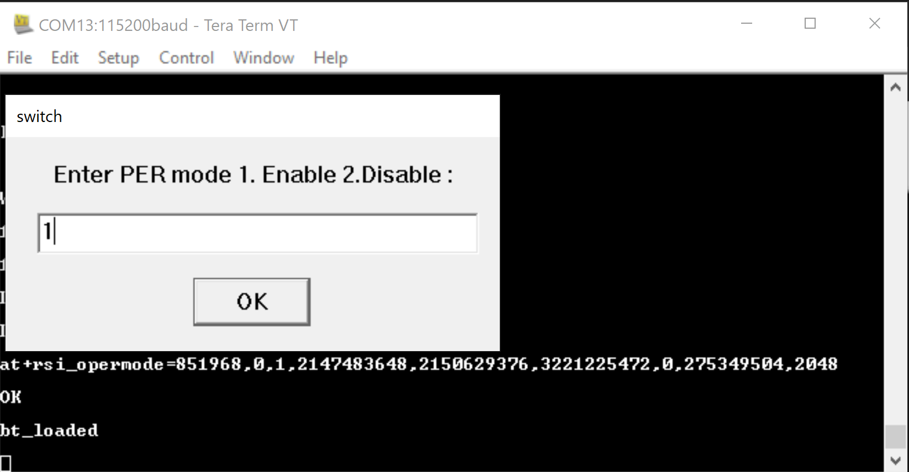
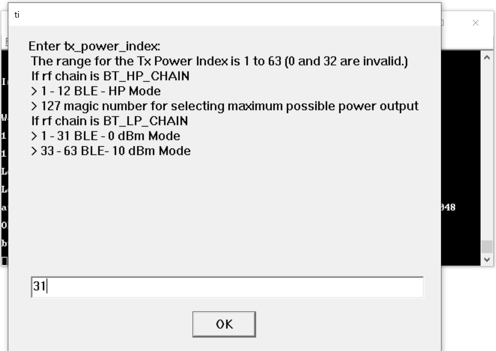
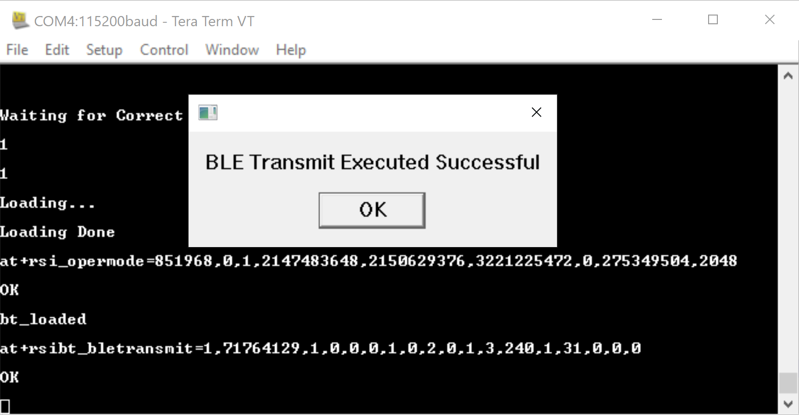
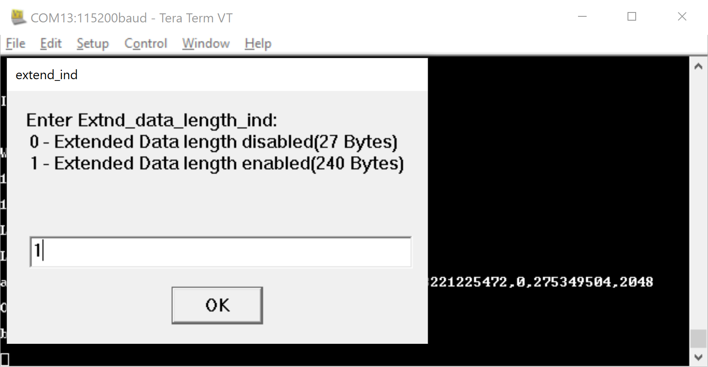
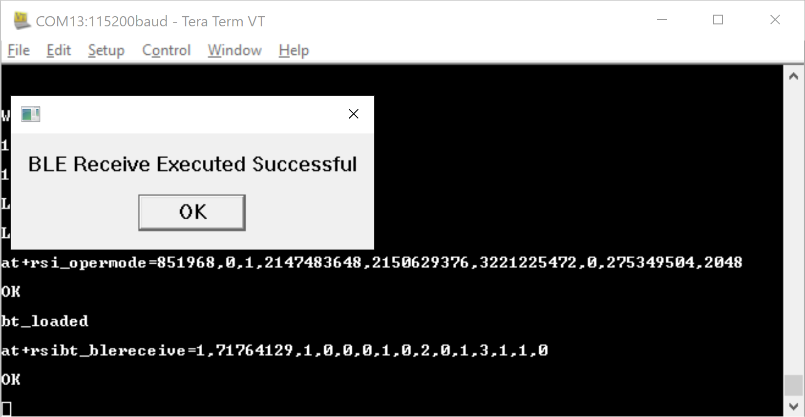
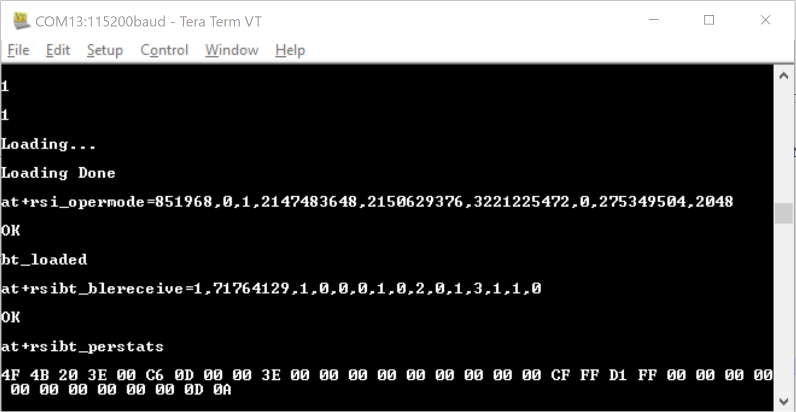

## BLE PER Mode Tera Term Script
This application demonstrates how to configure the RS9116W EVK in BLE PER mode.

Before continuing, ensure that the RS9116W EVK is plugged into your computer and is connected via Teraterm as described in [Getting Started with PC using AT Commands](http://docs.silabs.com/rs9116-wiseconnect/2.4/wifibt-wc-getting-started-with-pc/). 

**STEP 1.** Reset the RS9116W EVK.

**STEP 2.** In the Tera Term menu select `Control->Macro`.

	
**STEP 3.** Navigate to the folder `<SDK>/examples/at_commands/teraterm/ble_per` which contains the example script and select the file `ble_per.ttl`.

**STEP 4.** After selecting the ble_per.ttl script from tera-term macro, it will start executing.
1. ABRD.
2. Opermode.

Please follow the below steps when you select the BLE_PER as "Transmit" .

**Step 5.** Enter the value to run the script in PER "Transmit/Receive" mode.

**STEP 6.** Enter the value to enable/disable the PER mode.

**Step 7.** Enter the device address. It is a 32-bit address in Hex format (Access address of BLE PER packet : 0x71764129)

**Step 8.** Enter the desired 'phyrate' which is mentioned in below figure into the input box.

**Step 9.** Enter the rx and tx channel number.

**Step 10.** As per the PER mode give the "scrambler-seed" value.

**Step 11.** Enter the "le_channel" type as per your requirement.

**Step 12.** Enter the "hopping-type" as per your requirement.

**Step 13.** Enter the "antenna_type" as per your requirement.

**Step 14.** Enter the "rf_chain" as per your requirement.

**Step 15.** Enter the "payload_type" which is listed in below image.

**Step 16.** Enter the "tx_power" index which is listed in below image.

**Step 17.** Enter the "PER transmission mode".

**Step 18.** Enter the "number_of_packets" based on the selected "tx_mode" parameter.

**Step 19.** After giving all the inputs BLE Transmit command executed successfully.

### BLE CW-Mode Selection

**Step 20.** To run the BLE_CW mode all the parameters you need to enter as mentioned step by step procedure in above
method. But "Scrambler_seed" parameter you need to give input as 5.

**Step 21.**  After "Scrambler_seed" parameter script will ask all the inputs as mentioned in above BLE_Trasmit method, you
need to enter .

**Step 22.** All the necessary inputs are completed , final input will ask for "Continuous Wave" selection you need to enter
2.Like as below pic.

**Step 23.** After giving all the inputs BLE CW mode Transmit command executed successfully.

Please follow the below steps when you select the BLE_PER as "Receive".

**Step 1.** Enter the value to run the script in PER "Transmit/Receive" mode.

**STEP 2.** Enter the value to enable/disable the PER mode.

**Step 3.** Enter the device address. It is a 32-bit address in Hex format (Access address of BLE PER packet : 0x71764129)

**Step 4.** Enter the desired 'phyrate' which is mentioned in below figure into the input box.

**Step 5.** Enter the rx and tx channel numbers.

**Step 6.** As per the PER mode give the "scrambler-seed" value.

**Step 7.** Enter the "le_channel" type as per your requirement.

**Step 8.** Enter the "hopping-type" as per your requirement.

**Step 9.** Enter the "antenna_type" as per your requirement.

**Step 10.** Enter the "rf_chain" as per your requirement.

**Step 11.** Enter the "Extnd_data_length_ind" which is listed in below image.

**Step 12.** Enter the "loop-back" mode .

**Step 13.** Enter the "Duty cycling" .

**Step 14.** After giving all the inputs BLE PER Receive command executed and PER stats command also executes simultaneously.

### BLE CW-Mode Selection

**Step 15.** To run the BLE_CW mode all the parameters you need to enter as mentioned step by step procedure in above
method. But "Scrambler_seed" parameter you need to give input as 5.

**Step 16.**  After "Scrambler_seed" parameter script will ask all the inputs as mentioned in above BLE_Trasmit method, you
need to enter .

**Step 17.** All the necessary inputs are completed , final input will ask for "Continuous Wave" selection you need to enter
2.Like as below pic.

**Step 18.** After giving all the inputs BLE PER CW mode Receive command executed and PER stats command also executes simultaneously.

Refer to the [BLE Programming Reference Manual](https://docs.silabs.com/rs9116/wiseconnect/rs9116w-ble-at-command-prm/latest/08-ble-commands) for further details on how to change the parameters.
