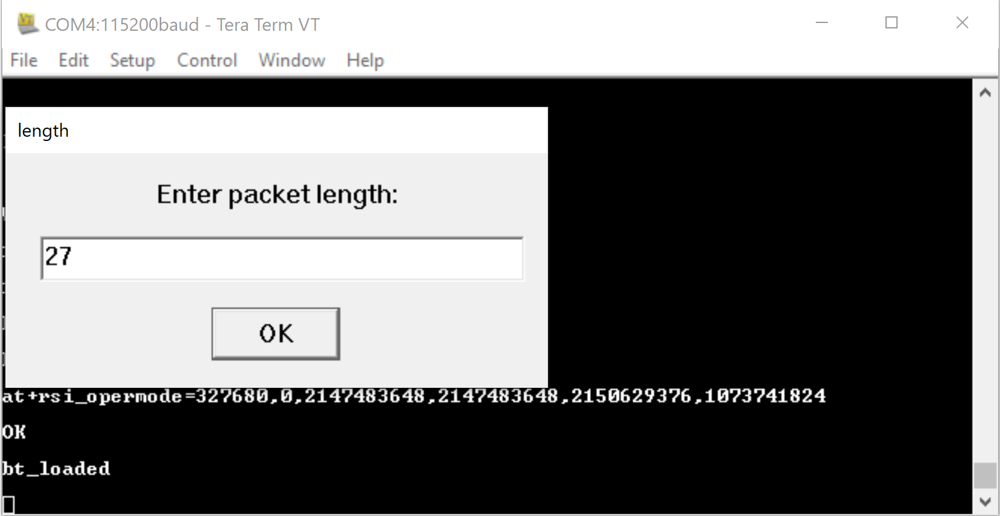
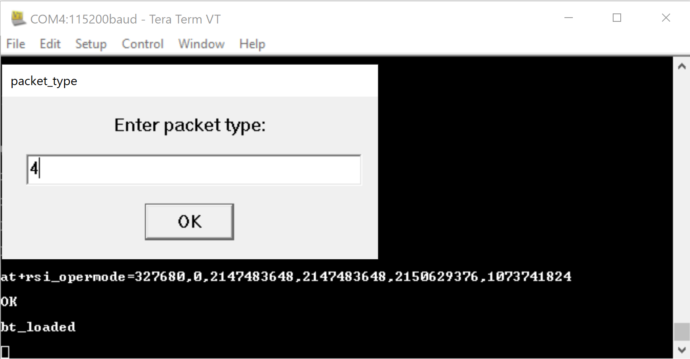
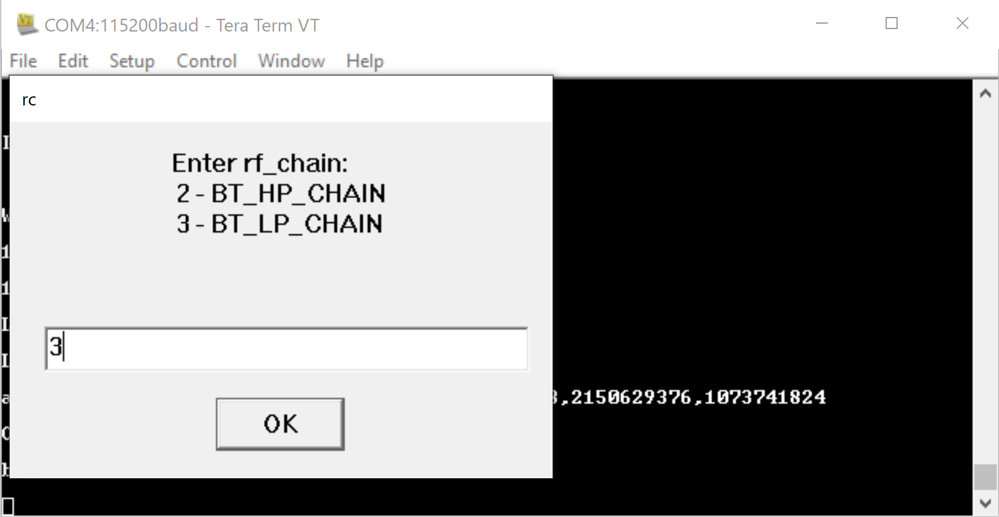
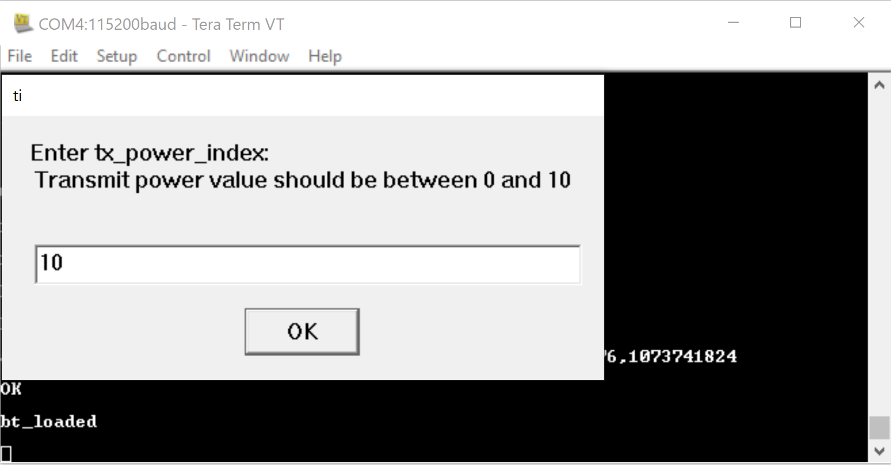
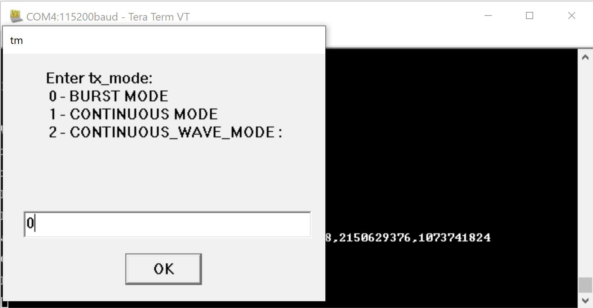
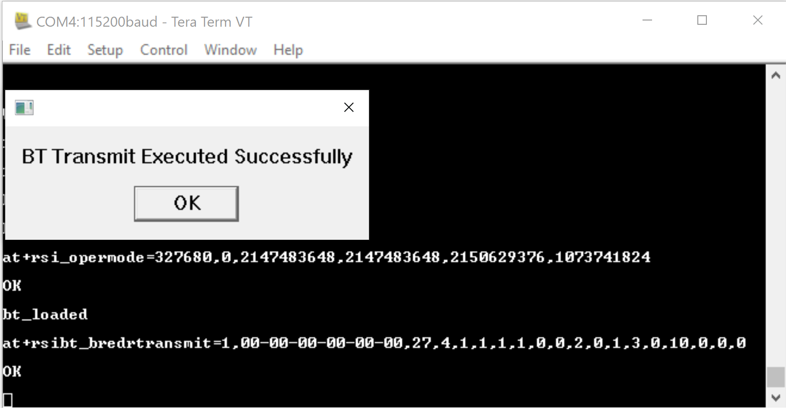
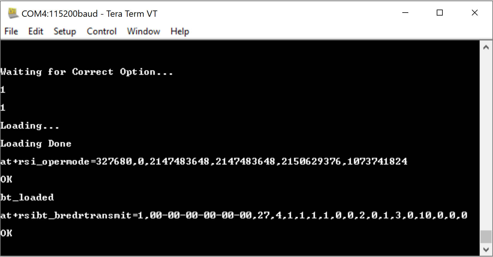

## BLUETOOTH PER Mode Tera Term Script
This application demonstrates how to configure the RS9116W EVK in BLUETOOTH PER mode.

Before continuing, ensure that the RS9116W EVK is plugged into your computer and is connected via Teraterm as described in [Getting Started with PC using AT Commands](http://docs.silabs.com/rs9116-wiseconnect/2.4/wifibt-wc-getting-started-with-pc/). 

**STEP 1.** Reset the RS9116W EVK.

**STEP 2.** In the Tera Term menu select `Control->Macro`.

	
**STEP 3.** Navigate to the folder `<SDK>/examples/at_commands/teraterm/bt_per` which contains the example script and select the file `bt_per.ttl`.

**STEP 4.** After selecting the bt_per.ttl script from tera-term macro, it will start executing.
1. ABRD.
2. Opermode.

Please follow the below steps when you select the BT_PER as "Transmit" .

**Step 5.** Enter the value to run the script in PER "Transmit/Receive" mode.

**STEP 6.** Enter the value to enable/disable the PER mode.

**Step 7.** Enter the device address.
A 48-bit address in hexadecimal format e.g. 0023A7010203.
Does not need to be the modules BD address, it can be any 48bit BD address however the same address should be used for the transmit and receive command.

**Step 8.** Enter the desired 'packet_length' which is mentioned in below.

17 :BT_DM1_PAYLOAD_MAX_LEN

121 :BT_DM3_PAYLOAD_MAX_LEN

224 :BT_DM5_PAYLOAD_MAX_LEN

27 :BT_DH1_PAYLOAD_MAX_LEN

183 :BT_DH3_PAYLOAD_MAX_LEN

339 :BT_DH5_PAYLOAD_MAX_LEN

54 :BT_2DH1_PAYLOAD_MAX_LEN

367 :BT_2DH3_PAYLOAD_MAX_LEN

679 :BT_2DH5_PAYLOAD_MAX_LEN

83 :BT_3DH1_PAYLOAD_MAX_LEN

552 :BT_3DH3_PAYLOAD_MAX_LEN

1021 :BT_3DH5_PAYLOAD_MAX_LEN

10 :BT_HV1_VOICE_PAYLOAD_LEN

20 :BT_HV2_VOICE_PAYLOAD_LEN

30 :BT_HV3_VOICE_PAYLOAD_LEN

30 :BT_EV3_VOICE_PAYLOAD_LEN

60 :BT_2EV3_VOICE_PAYLOAD_LEN

90 :BT_3EV3_VOICE_PAYLOAD_LEN

120 :BT_EV4_VOICE_PAYLOAD_LEN

180 :BT_EV5_VOICE_PAYLOAD_LEN

360 :BT_2EV5_VOICE_PAYLOAD_LEN

540 :BT_3EV5_VOICE_PAYLOAD_LEN

**Step 9.** Enter the "packet_type" which is mentioned in below .rx and tx channels.

3: BT_DM1_PKT_TYPE

4: BT_DH1_PKT_TYPE

10: BT_DM3_PKT_TYPE

11: BT_DH3_PKT_TYPE

14: BT_DM5_PKT_TYPE

15: BT_DH5_PKT_TYPE

4: BT_2DH1_PKT_TYPE

10: BT_2DH3_PKT_TYPE

14: BT_2DH5_PKT_TYPE

8: BT_3DH1_PKT_TYPE

11: BT_3DH3_PKT_TYPE

15: BT_3DH5_PKT_TYPE

5: BT_HV1_PKT_TYPE

6: BT_HV2_PKT_TYPE

7: BT_HV3_PKT_TYPE

8: BT_DV_PKT_TYPE

7: BT_EV3_PKT_TYPE

6: BT_2EV3_PKT_TYPE

7: BT_3EV3_PKT_TYPE

12: BT_EV4_PKT_TYPE

12: BT_2EV5_PKT_TYPE

13: BT_EV5_PKT_TYPE

13: BT_3EV5_PKT_TYPE

**Step 10.** Enter the "BR/EDR" mode.

**Step 11.** Enter the "rx" and "tx" channels.

**Step 12.** Enter the "link-type" as per your requirement.

**Step 13.** Enter the "scrambler-seed" as per your per transmission mode.

**Step 14.** Enter the "hopping-type" as per your requirement.

**Step 15.** Enter the "antenna-selction" which is listed in below image.

**Step 16.** Enter the "rf_chain" which is listed in below image.

**Step 17.** Enter the "payload_type" which is listed in the below image.

**Step18.** Enter the "tx_power" index which is listed in the below image.

**Step 19.** Enter the "PER transmission mode"(tx_mode).

**Step 18.** Enter the "number_of_packets" based on the selected "tx_mode" parameter.

**Step 19.** After giving all the inputs, BLE Transmit command executes successfully.

### BLUETOOTH CW-Mode Selection

**Step 20.** To run the BLUETOOTH_CW mode all the parameters you need to enter as mentioned step by step procedure in above
method. But "Scrambler_seed" parameter you need to give input as 5.

**Step 21.**  After "Scrambler_seed" parameter script will ask all the inputs as mentioned in above BLE_Trasmit method, you
need to enter .

**Step 22.** All the necessary inputs are completed , final input will ask for "Continuous Wave" selection you need to enter
2.Like as below pic.

**Step 23.** After giving all the inputs BLUETOOTH CW mode Transmit command executed successfully.

Please follow the below steps when you select the BT_PER as "Receive".

**Step 1.** Enter the value to run the script in PER "Transmit/Receive" mode.

**STEP 2.** Enter the value to enable/disable the PER mode.

**Step 3.** Enter the device address.
It is a 48-bit address in hexadecimal format, e.g.,0x000012345678

**Step 4.** Enter the desired 'packet_length' which is mentioned in below

17 :BT_DM1_PAYLOAD_MAX_LEN

121 :BT_DM3_PAYLOAD_MAX_LEN

224 :BT_DM5_PAYLOAD_MAX_LEN

27 :BT_DH1_PAYLOAD_MAX_LEN

183 :BT_DH3_PAYLOAD_MAX_LEN

339 :BT_DH5_PAYLOAD_MAX_LEN

54 :BT_2DH1_PAYLOAD_MAX_LEN

367 :BT_2DH3_PAYLOAD_MAX_LEN

679 :BT_2DH5_PAYLOAD_MAX_LEN

83 :BT_3DH1_PAYLOAD_MAX_LEN

552 :BT_3DH3_PAYLOAD_MAX_LEN

1021 :BT_3DH5_PAYLOAD_MAX_LEN

10 :BT_HV1_VOICE_PAYLOAD_LEN

20 :BT_HV2_VOICE_PAYLOAD_LEN

30 :BT_HV3_VOICE_PAYLOAD_LEN

30 :BT_EV3_VOICE_PAYLOAD_LEN

60 :BT_2EV3_VOICE_PAYLOAD_LEN

90 :BT_3EV3_VOICE_PAYLOAD_LEN

120 :BT_EV4_VOICE_PAYLOAD_LEN

180 :BT_EV5_VOICE_PAYLOAD_LEN

360 :BT_2EV5_VOICE_PAYLOAD_LEN

540 :BT_3EV5_VOICE_PAYLOAD_LEN

**Step 5.** Enter the "packet_type" which is mentioned in below .rx and tx channels.

3: BT_DM1_PKT_TYPE

4: BT_DH1_PKT_TYPE

10: BT_DM3_PKT_TYPE

11: BT_DH3_PKT_TYPE

14: BT_DM5_PKT_TYPE

15: BT_DH5_PKT_TYPE

4: BT_2DH1_PKT_TYPE

10: BT_2DH3_PKT_TYPE

14: BT_2DH5_PKT_TYPE

8: BT_3DH1_PKT_TYPE

11: BT_3DH3_PKT_TYPE

15: BT_3DH5_PKT_TYPE

5: BT_HV1_PKT_TYPE

6: BT_HV2_PKT_TYPE

7: BT_HV3_PKT_TYPE

8: BT_DV_PKT_TYPE

7: BT_EV3_PKT_TYPE

6: BT_2EV3_PKT_TYPE

7: BT_3EV3_PKT_TYPE

12: BT_EV4_PKT_TYPE

12: BT_2EV5_PKT_TYPE

13: BT_EV5_PKT_TYPE

13: BT_3EV5_PKT_TYPE

**Step 6.** Enter the "BR/EDR" mode.

**Step 7.** Enter the "rx" and "tx" channels.

**Step 8.** Enter the "link-type" as per your requirement.

**Step 9.** Enter the "scrambler-seed" as per your per transmission mode.

**Step 10.** Enter the "hopping-type" as per your requirement.

**Step 12.** Enter the "antenna-selction" which is listed in below image.

**Step 13.** Enter the "rf_chain" which is listed in below image.

**Step 12.** Enter the "loop-back" mode .

**Step 13.** After giving all the inputs, BT PER Receive command executes and PER stats command also executes simultaneously.

### BLUETOOTH CW-Mode Selection

**Step 14.** To run the BLUETOOTH_CW mode all the parameters you need to enter as mentioned step by step procedure in above
method. But "Scrambler_seed" parameter you need to give input as 5.

**Step 15.**  After "Scrambler_seed" parameter script will ask all the inputs as mentioned in above BLE_Trasmit method, you
need to enter .

**Step 16.** After giving all the inputs BLUETOOTH CW mode Receive command executed successfully.

Refer to the [BLE Programming Reference Manual](https://docs.silabs.com/rs9116/wiseconnect/rs9116w-bt-classic-at-command-prm/latest/08-bt-classic-commands) for further details on how to change the parameters.
