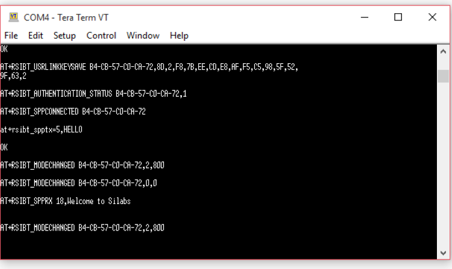

## BT SPP Slave Tera Term Script

This example demonstrates how to configure the RS9116W EVK in Slave mode and establish a SPP profile connection with remote Master device and data is exchanged between the two connected devices.

Before continuing, ensure that the RS9116W EVK is plugged into your computer and TeraTerm is connected as described in [Getting Started with PC using AT Commands](http://docs.silabs.com/rs9116-wiseconnect/2.4/wifibt-wc-getting-started-with-pc/). 

**STEP 1.** Reset the RS9116W EVK.

**STEP 2.** In the Tera Term menu, select `Control->Macro`.

**STEP 3.** Navigate to the folder `<SDK>/examples/at_commands/teraterm/bt_spp_slave` and select the file `spp_slave.ttl`.

**STEP 4.**  After the "spp_slave.ttl" script is selected,  The initial dialogue window will appear as below and as a response the user needs to click on the "OK" button.

**STEP 5.** Initally, the RS9116W EVK bootup options are executed, the firmware is loaded and the coresponding dialogue window will appear as below.  

**STEP 6.**  Command sequence in this script:

1. Opermode

2. Set connectable mode

3. Set discoverable mode

4. Set profile mode

5. Set local name

**STEP 7.** After these commands are executed, the RS9116W EVK becomes discoverable in the vicinity and the below dialogue window will appear and the user needs to click on the "OK" button.

**STEP 8.** To verify the spp functionality, the user requires "Bluetooth SPP Manager" application installed on an Android phone.

### Note:
		The "Bluetooth SPP Manager" Application detects paired devices only. Initally, the user needs to establish the PHY level connection with the mobile phone's default bluetooth settings. 
		Refer `PHY level connection procedure with Android mobile`.	

## PHY level connection procedure with Android mobile:

1. On the android phone, navigate to settings → Bluetooth 

2. Turn on the Bluetooth and scan for the RS9116W EVK.

3. The mobile phone displays the nearby discoverable Bluetooth devices as shown in image as below. The module will be  discoverable as the "RS9116W_BT_SLAVE". 

 
 
 

4. Search for the "RS9116W_BT_SLAVE" device and establish the connection with the "RS9116W_BT_SLAVE" device. 

5. During the connection the mobile phone needs to enter the pin code as "1234" as shown in the image below.

 
 
6. Once the user clicks on the "OK" button, the RS9116W EVK receives a "AT+RSIBT_USRPINCODEREQ" event as below.
 
 
 
7. Once, the RS9116W EVK receives  the "AT+RSIBT_USRPINCODEREQ" event. As a response, the user needs to sends the "Send Usrpincode Response" from the script to establish the physical level connection between the mobile phone and the RS9116W EVK.

 
 
 
 
### Note:
	To esablish the profile level connection refer to `SPP-profile level connection procedure with Android mobile`

## SPP-profile level connection procedure with Android mobile

1. The user can open the "Bluetooth SPP Manager" application on the mobile phone and can scan the devices around the vicinity. Select the device named as "RS9116W_BT_SLAVE" and click on the "pair" button.

2. After this, the host will get a bond response as well as a linkkey request event on the terminal screen. As per the received requested event, the user needs to send the response accordingly from the script. (i.e. If the linkkey request event is received, the user needs to respond with the link key response as "Send Userlinkkey Response" simillar to the "Send Usrpincode Response" for the pincode request event).

3. Once the RS9116W EVK receives the pin code request as  "AT+RSIBT_USRPINCODEREQ" and the user needs to respond with the "Send Usrpincode Response".

 
 
 

4. Once the pairing process is successful, the RS9116W EVK receives the link key save event and the SPP connection is automatically initiated from the mobile phone with the "Bluetooth SPP Manager" application. 

5. Once the SPP level connection is completed, the host will get a "AT+RSI_SPPCONNECTED" event. After this, the host can send data to the mobile phone and receive data from the mobile phone.

6. If the user initates the disconnection from the mobile phone, the RS9116W EVK receives the disconnect event as "AT+RSIBT_CLASSIC_DISCONNECTED".
	

This completes the RS9116W BT SPP Slave demo.

### TX RX Events

| TX Events                                    |   | RX Events                                |
| -------------------------------------------- | - | ---------------------------------------- |
|                                              | ← |  AT+RSIBT_USRLINKKEYREQ 34-1C-F0-70-D2-F8|
| at+rsibt_usrlinkkey=34-1C-F0-70-D2-F8,0,1234 | → |                                          |
|                                              | ← | AT+RSIBT_USRPINCODEREQ 34-1C-F0-70-D2-F8 |
| at+rsibt_usrpincode=34-1C-F0-70-D2-F8,1,1234 | → |                                          |
|                                              | ← | AT+RSIBT_USRLINKKEYSAVE 34-1C-F0-70-D2-F8,52,25,EC,DB,9E,82,8A,89,5F,CA,FB,91,E3,B0,CE,A7 |
|                                              | ← | AT+RSIBT_AUTHENTICATION_STATUS 34-1C-F0-70-D2-F8,1 |
|                                              | ← | AT+RSIBT_SPPCONNECTED 34-1C-F0-70-D2-F8  |
| at+rsibt_spptx=5,Hello                       | → |                                          |
|                                              | ← | AT+RSIBT_SPPRX 18,Welcome to silabs      |

