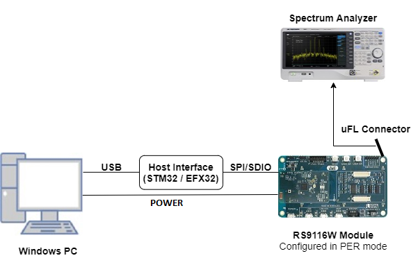
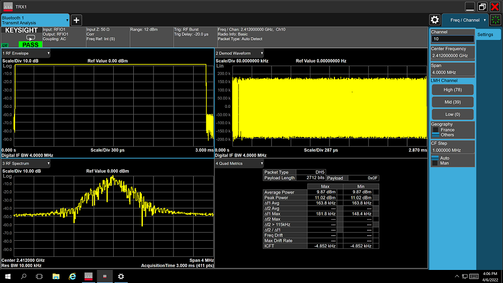

# BT PER

## 1. Purpose / Scope

This application demonstrates how to configure the necessary parameters to start transmitting or receiving BT PER packets.

## 2. Prerequisites / Setup Requirements

Before running the application, the user will need the following things to setup.

### 2.1 Hardware Requirements

- Windows PC with Host interface(UART/ SPI/ SDIO).
- Silicon Labs [RS9116 Wi-Fi Evaluation Kit](https://www.silabs.com/development-tools/wireless/wi-fi/rs9116x-sb-evk-development-kit)
- Host MCU Eval Kit. This example has been tested with:
   - Silicon Labs [WSTK + EFR32MG21](https://www.silabs.com/development-tools/wireless/efr32xg21-bluetooth-starter-kit)
   - Silicon Labs [WSTK + EFM32GG11](https://www.silabs.com/development-tools/mcu/32-bit/efm32gg11-starter-kit)
   - [STM32F411 Nucleo](https://st.com/)
- Spectrum Analyzer and/or Power Analyzer

	
 
   			
### 2.2 Software Requirements

- [WiSeConnect SDK](https://github.com/SiliconLabs/wiseconnect-wifi-bt-sdk/)
    
- Embedded Development Environment

   - For STM32, use licensed [Keil IDE](https://www.keil.com/demo/eval/arm.htm)

   - For Silicon Labs EFx32, use the latest version of [Simplicity Studio](https://www.silabs.com/developers/simplicity-studio)
   
## 3. Application Build Environment

### 3.1 Platform

The Application can be built and executed on below Host platforms
*	[STM32F411 Nucleo](https://st.com/)
*	[WSTK + EFR32MG21](https://www.silabs.com/development-tools/wireless/efr32xg21-bluetooth-starter-kit) 
*   [WSTK + EFM32GG11](https://www.silabs.com/development-tools/mcu/32-bit/efm32gg11-starter-kit)

### 3.2 Host Interface

* By default, the application is configured to use the SPI bus for interfacing between Host platforms(STM32F411 Nucleo / EFR32MG21) and the RS9116W EVK.
* This application is also configured to use the SDIO bus for interfacing between Host platforms(EFM32GG11) and the RS9116W EVK.

### 3.3 Project Configuration

The Application is provided with the project folder containing Keil and Simplicity Studio project files.

*	Keil Project
	- The Keil project is used to evaluate the application on STM32.
	- Project path: `<SDK>/examples/featured/bt_per/projects/bt_per-nucleo-f411re.uvprojx`

*	Simplicity Studio
	- The Simplicity Studio project is used to evaluate the application on EFR32MG21.
	- Project path: 
		- If the Radio Board is **BRD4180A** or **BRD4181A**, then access the path `<SDK>/examples/eatured/bt_per/projects/bt_per-brd4180a-mg21.slsproj`
		- If the Radio Board is **BRD4180B** or **BRD4181B**, then access the path `<SDK>/examples/eatured/bt_per/projects/bt_per-brd4180b-mg21.slsproj` 
        - User can find the Radio Board version as given below 

  - EFM32GG11 platform
    - The Simplicity Studio project is used to evaluate the application on EFM32GG11.
      - Project path:`<SDK>/examples/featured/bt_per/projects/bt_per-brd2204a-gg11.slsproj`
		
### 3.4 Bare Metal/RTOS Support

This application supports bare metal and RTOS environment. By default, the application project files (Keil and Simplicity Studio) are provided with bare metal configuration. 

## 4. Application Configuration Parameters

The application can be configured to suit your requirements and development environment. Read through the following sections and make any changes needed.

**4.1** Open `rsi_bt_per.c` file

**4.1.1** Update or modify following macros 
`RSI_BT_LOCAL_NAME` refer to name of Silicon Labs device.

`RSI_CONFIG_PER_MODE` refer to configuration mode BT PER TX or RX
   
    #define RSI_CONFIG_PER_MODE	  RSI_BT_PER_RECEIVE_MODE
                             OR
 	#define RSI_CONFIG_PER_MODE	RSI_BT_PER_TRANSMIT_MODE
`CMD_ID` refer to command id to transmit or receive

	#define BT_TRANSMIT_CMD_ID	0x15
	#define BT_RECEIVE_CMD_ID	0x16
`PAYLOAD_TYPE` refers to type of payload to be transmitted. 

'0' – Payload consists of all zeros.

'1' – Payload consists of all 0xFF's.

'2' – Payload consists of all 0x55's.

'3' – Payload consists of all 0xF0's.

'4' – Payload consists of PN9 sequence.

	#define	SEQUENCE_0	0
	#define	SEQUENCE_1	1
	#define	SEQUENCE_2	2
	#define	SEQUENCE_F0	3
	#define	SEQUENCE_PRBS	4

	#define PAYLOAD_TYPE	SEQUENCE_F0

`PACKET_TYPE`: Type of the packet to be transmitted, as per the Bluetooth standard. Refer Bluetooth Core 5.0 spec.
	
	#define PACKET_TYPE	15

`PACKET_LEN`: Length of the packet, in bytes to be transmitted. Refer Bluetooth Core 5.0 spec.

	#define PACKET_LEN	339

`BT_RX_CHNL_NUM`- Receive channel index, as per the Bluetooth standard. i.e., 0 to 78
`BT_TX_CHNL_NUM`- Transmit channel index, as per the Bluetooth standard. i.e., 0 to 78

	#define BT_RX_CHNL_NUM  10
	#define BT_TX_CHNL_NUM  10
`SCRAMBLER_SEED`: Initial seed to be used for whitening. It should be set to '0' in order to disable whitening.

	 #define SCRAMBLER_SEED	0

`LINK_TYPE`: ACL_LINK
#define ACL_LINK	1
`TX_MODE`: Burst mode - 0	Continuous mode - 1

	#define BURST_MODE	0
	#define CONTINUOUS_MODE	1

`HOPPING TYPE`: no hopping -0	fixed hopping - 1	random hopping - 2

	#define NO_HOPPING	0
	#define FIXED_HOPPING	1
	#define RANDOM_HOPPING	2

`ANT_SEL`: on chip antenna - 2	u.f.l - 3

	#define ONBOARD_ANT_SEL	2
	#define EXT_ANT_SEL	3

`RF_TYPE`: External RF – 0	Internal RF – 1

	#define BT_EXTERNAL_RF	0
	#define BT_INTERNAL_RF	1

`RF CHAIN`: WLAN_HP_CHAIN	0
BT_HP_CHAIN	2

	#define WLAN_HP_CHAIN_BIT	0
	#define BT_HP_CHAIN_BIT	2

`PLL_MODE`: PLL_MODE0 – 0	PLL_MODE1 – 1

	#define PLL_MODE_0	0
	#define PLL_MODE_1	1

`LOOP_BACK_MODE`: enable 1 or disable 0
	#define LOOP_BACK_MODE_DISABLE	0

Following are the non-configurable macros in the application.

`BT_GLOBAL_BUFF_LEN` refers Number of bytes required by the application and the driver

	 #define BT_GLOBAL_BUFF_LEN                             15000

   

**4.2** Open `rsi_bt_config.h` file and update/modify following macros,

	 
   **Opermode command parameters**

	 #define RSI_FEATURE_BIT_MAP                            FEAT_SECURITY_OPEN
	 #define RSI_TCP_IP_BYPASS                              RSI_DISABLE
	 #define RSI_TCP_IP_FEATURE_BIT_MAP                     TCP_IP_FEAT_DHCPV4_CLIENT
	 #define RSI_CUSTOM_FEATURE_BIT_MAP                     FEAT_CUSTOM_FEAT_EXTENTION_VALID
	 #define RSI_EXT_CUSTOM_FEATURE_BIT_MAP                 0

**Note:** `rsi_bt_config.h` files are already set with desired configuration in respective example folders user need not change for each example. 
   
## 5. Testing the Application

Follow the steps below for the successful execution of the application.

### 5.1 Loading the RS9116W Firmware

Refer [Getting started with PC ](https://docs.silabs.com/rs9116/latest/wiseconnect-getting-started) to load the firmware into RS9116W EVK. The firmware binary is located in `<SDK>/firmware/`

### 5.2 Building the Application on the Host Platform

#### 5.2.1 Using STM32

Refer [STM32 Getting Started](https://docs.silabs.com/rs9116-wiseconnect/latest/wifibt-wc-getting-started-with-efx32/)  

- Open the project `<SDK>/examples/featured/bt_per/projects/bt_per-nucleo-f411re.uvprojx` in Keil IDE.
- Build and Debug the project
- Check for the RESET pin:
	- If RESET pin is connected from STM32 to RS9116W EVK, then user need not press the RESET button on RS9116W EVK before free run.
	- If RESET pin is not connected from STM32 to RS9116W EVK, then user need to press the RESET button on RS9116W EVK before free run.
- Free run the project
- Then continue the common steps from **Section 5.3**

#### 5.2.2 Using EFX32

Refer [EFx32 Getting Started](https://docs.silabs.com/rs9116-wiseconnect/latest/wifibt-wc-getting-started-with-efx32/), for settin-up EFR & EFM host platforms

- Import the EFR32/EFM32 project from `<SDK>/examples/featured/bt_per/projects`
    - Select the appropriate .slsproj as per Radio Board type mentioned in **Section 3.3** for EFR32 board.
   (or)
    - Select the *.brd2204a-gg11.slsproj  for EFM32GG11 board.
- Compile and flash the project in to Host MCU
- Debug the project
- Check for the RESET pin:
	- If RESET pin is connected from STM32 to RS9116W EVK, then user need not press the RESET button on RS9116W EVK before free run
	- If RESET pin is not connected from STM32 to RS9116W EVK, then user need to press the RESET button on RS9116W EVK before free run
- Free run the project
- Then continue the common steps from **Section 5.3**

### 5.3 Common Steps
   
1. After the program gets executed, Silicon Labs module starts BT PER transmit or BT PER receive. 

2. For receiving purpose use other WiSeConnect module and keep it in BT PER RX mode.

3. Check for BT PER stats whatever configured values are affecting or not.

4. After successful program execution of BT PER Transmit the waveform on the spectrum looks as shown below.  

5. After successful program execution the prints in coolterm looks as shown below.
     
 
 

