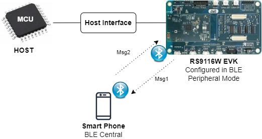
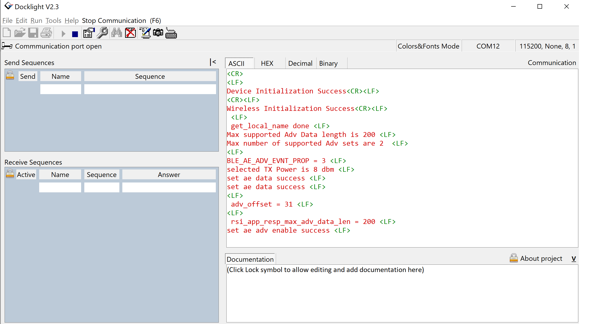

# BLE Extended Advertising Peripheral

## 1. Purpose / Scope

This application demonstrates how to connect RS9116W EVK with remote BLE device in Extended Advertising peripheral mode.

## 2. Prerequisites / Setup Requirements

Before running the application, the user will need the following things to setup.

### 2.1 Hardware Requirements

- Windows PC with Host interface(UART/ SPI/ SDIO).
- Silicon Labs [RS9116 Wi-Fi Evaluation Kit](https://www.silabs.com/development-tools/wireless/wi-fi/rs9116x-sb-evk-development-kit)
- Host MCU Eval Kit. This example has been tested with:
   - Silicon Labs [WSTK + EFR32MG21](https://www.silabs.com/development-tools/wireless/efr32xg21-bluetooth-starter-kit)
   - Silicon Labs [WSTK + EFM32GG11](https://www.silabs.com/development-tools/mcu/32-bit/efm32gg11-starter-kit)
   - [STM32F411 Nucleo](https://st.com/)
- BLE peripheral device
	
 
   			
### 2.2 Software Requirements

- [WiSeConnect SDK](https://github.com/SiliconLabs/wiseconnect-wifi-bt-sdk/)
    
- Embedded Development Environment

   - For STM32, use licensed [Keil IDE](https://www.keil.com/demo/eval/arm.htm)

   - For Silicon Labs EFx32, use the latest version of [Simplicity Studio](https://www.silabs.com/developers/simplicity-studio)
   
- Download and install the Silicon Labs [EFR Connect App](https://www.silabs.com/developers/efr-connect-mobile-app) in the android smart phones for testing BLE applications. Users can also use their choice of BLE apps available in Android/iOS smart phones.

## 3. Application Build Environment

### 3.1 Platform

The Application can be built and executed on below Host platforms
*	[STM32F411 Nucleo](https://st.com/)
*	[WSTK + EFR32MG21](https://www.silabs.com/development-tools/wireless/efr32xg21-bluetooth-starter-kit) 
*   [WSTK + EFM32GG11](https://www.silabs.com/development-tools/mcu/32-bit/efm32gg11-starter-kit)

### 3.2 Host Interface

* By default, the application is configured to use the SPI bus for interfacing between Host platforms(STM32F411 Nucleo / EFR32MG21) and the RS9116W EVK.
* This application is also configured to use the SDIO bus for interfacing between Host platforms(EFM32GG11) and the RS9116W EVK.

### 3.3 Project Configuration

The Application is provided with the project folder containing Keil and Simplicity Studio project files.

*	Keil Project
	- The Keil project is used to evaluate the application on STM32.
	- Project path: `<SDK>/examples/_internal/Wireless_Examples/ble/ble_ae_peripheral/projects/ble_ae_peripheral-nucleo-f411re.uvprojx`

*	Simplicity Studio
	- The Simplicity Studio project is used to evaluate the application on EFR32MG21.
	- Project path: 
		- If the Radio Board is **BRD4180A** or **BRD4181A**, then access the path `<SDK>/examples/_internal/Wireless_Examples/ble/ble_ae_peipheral/projects/ble_ae_peripheral-brd4180a-mg21.slsproj`
		- If the Radio Board is **BRD4180B** or **BRD4181B**, then access the path `<SDK>/examples/_internal/Wireless_Examples/ble/ble_ae_peripheral/projects/ble_ae_peripheral-brd4180b-mg21.slsproj` 
        - User can find the Radio Board version as given below 



  - EFM32GG11 platform
    - The Simplicity Studio project is used to evaluate the application on EFM32GG11.
      - Project path:`<SDK>examples/_internal/Wireless_Examples/ble/ble_ae_peripheral/ble_ae_peripheral-brd2204a-gg11.slsproj`
		
### 3.4 Bare Metal Support

This application supports bare metal . By default, the application project files (Keil and Simplicity Studio) are provided with bare metal configuration. 

## 4. Application Configuration Parameters

The application can be configured to suit your requirements and development environment. Read through the following sections and make any changes needed.

**4.1** Open `ae_peripheral.c` file

**4.1.1** User must update the below parameters 

Set below macro to enable second set of advertising

      #define ADV_SET2            1
The length of the advertising data needs to be filled in the following macro

	       #define BLE_AE_ADV_DATA_LEN    0x19

Below mentioned macro needs to be populated with data 

	       #define BLE_AE_ADV_DATA    "AE_PERIPHERAL_DATA_1"

Mention the address type of the device which needs to be whitelisted

     #define RSI_BLE_WHITELIST_DEV_ADDR1_TYPE LE_RANDOM_ADDRESS

Fill the address of the device to be whitelisted in the below mentioned variable

   ble_whitelist_addr1[6] = { 0xDA, 0x81, 0xE0, 0xB8, 0xB9, 0x42 };

**Power save configuration**

   By default, The Application is configured without power save.
	 
	 #define ENABLE_POWER_SAVE 0

   If user wants to run the application in power save, modify the below configuration. 
	 
```c
#define ENABLE_POWER_SAVE 1 
```

**4.1.2** The desired parameters are provided below. User can also modify the parameters as per their needs and requirements.

Following are the event numbers for advertising, connection and disconnection events

```c
#define RSI_APP_EVENT_ADV_REPORT                       0
#define RSI_APP_EVENT_CONNECTED                        1
#define RSI_APP_EVENT_DISCONNECTED                     2
```

Following are the non-configurable macros in the application.

`BT_GLOBAL_BUFF_LEN` refers Number of bytes required by the application and the driver

```c
#define BT_GLOBAL_BUFF_LEN                             15000
```
   

**4.2** Open `rsi_ble_config.h` file and update/modify following macros,

The minimum avertising interval:

     #define RSI_BLE_ADV_INT_MIN     0x020 
The maximum advertising interval:

     #define RSI_BLE_ADV_INT_MAX     0x020 
Channel map selection:

     #define RSI_BLE_ADV_CHANNEL_MAP 0x07

 Maximum extended advertisingevents:

     #define BLE_MAX_AE_EVNTS 0

Extended advertising filter policy

     #define BLE_AE_ADV_FILTER_POLICY  0x00
Extended advertising TX Power

     #define BLE_AE_ADV_TX_PWR         0x7f

Secondary advertising max skip count:

     #define BLE_AE_SEC_ADV_MAX_SKIP   0x00
Advertising SID

     #define BLE_AE_ADV_SID            0x00

Event properties can be set by enabling the respective bits in the following macros

     #define BLE_CONNECTABLE_ADV        (1 << 0)
     #define BLE_SCANNABLE_ADV          (0 << 1)
     #define BLE_LOW_DUTY_DIR_CONN_ADV  (0 << 2)
     #define BLE_HIGH_DUTY_DIR_CONN_ADV (0 << 3)
     #define BLE_LEGACY_ADV             (0 << 4)
     #define BLE_ANONYMOUS_ADV          (0 << 5)
     #define BLE_TX_WR_ADV              (0 << 6)
```c
#define RSI_BLE_PWR_INX                                30
#define RSI_BLE_PWR_SAVE_OPTIONS                       BLE_DISABLE_DUTY_CYCLING
```

   **Opermode command parameters**

```c
#define RSI_FEATURE_BIT_MAP                            FEAT_SECURITY_OPEN
#define RSI_TCP_IP_BYPASS                              RSI_DISABLE
#define RSI_TCP_IP_FEATURE_BIT_MAP                     TCP_IP_FEAT_DHCPV4_CLIENT
#define RSI_CUSTOM_FEATURE_BIT_MAP                     FEAT_CUSTOM_FEAT_EXTENTION_VALID
#define RSI_EXT_CUSTOM_FEATURE_BIT_MAP                 0
```

**Note:** `rsi_ble_config.h` files are already set with desired configuration in respective example folders user need not change for each example. 
   
## 5. Testing the Application

Follow the steps below for the successful execution of the application.

### 5.1 Loading the RS9116W Firmware

Refer [Getting started with PC ](https://docs.silabs.com/rs9116/latest/wiseconnect-getting-started) to load the firmware into RS9116W EVK. The firmware binary is located in `<SDK>/firmware/`

### 5.2 Building the Application on the Host Platform

### 5.2.1 Using STM32

Refer [STM32 Getting Started](https://docs.silabs.com/rs9116-wiseconnect/latest/wifibt-wc-getting-started-with-efx32/)  

- Open the project `<SDK>examples/_internal/Wireless_Examples/ble/ble_ae_central//projects/ble_ae_central-nucleo-f411re.uvprojx` in Keil IDE.
- Build and Debug the project
- Check for the RESET pin:
	- If RESET pin is connected from STM32 to RS9116W EVK, then user need not press the RESET button on RS9116W EVK before free run.
	- If RESET pin is not connected from STM32 to RS9116W EVK, then user need to press the RESET button on RS9116W EVK before free run.
- Free run the project
- Then continue the common steps from **Section 5.3**

### 5.2.2 Using EFX32

Refer [EFx32 Getting Started](https://docs.silabs.com/rs9116-wiseconnect/latest/wifibt-wc-getting-started-with-efx32/), for settin-up EFR & EFM host platforms

- Import the EFR32/EFM32 project from `<SDK>/examples/_internal/Wireless_Examples/ble/ble_ae_central//projects`
    - Select the appropriate .slsproj as per Radio Board type mentioned in **Section 3.3** for EFR32 board.
   (or)
    - Select the *.brd2204a-gg11.slsproj  for EFM32GG11 board.
- Compile and flash the project in to Host MCU
- Debug the project
- Check for the RESET pin:
	- If RESET pin is connected from EFX32 to RS9116W EVK, then user need not press the RESET button on RS9116W EVK before free run
	- If RESET pin is not connected from EFX32 to RS9116W EVK, then user need to press the RESET button on RS9116W EVK before free run
- Free run the project
- Then continue the common steps from **Section 5.3**

### 5.3 Common Steps
   
1. Configure the remote BLE device in Central mode and scan for the DUT's address and give a connect.

2. Observe that the connection is established between the desired device and RS9116W EVK. 
   
3. After successful program execution the prints in docklight looks as shown below.   
     
 

## Compressed Debug Logging

To enable the compressed debug logging feature please refer to [Logging User Guide](https://docs.silabs.com/rs9116-wiseconnect/latest/wifibt-wc-sapi-reference/logging-user-guide)