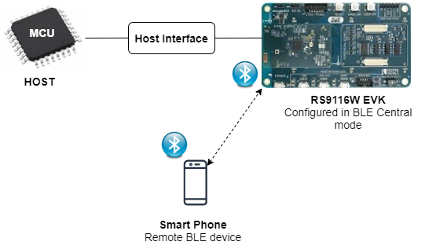

## BLE Testmodes ##

**Setup**




**Configuration and Steps for Execution**

**Configuring the Application for Tx:**

1. Open **rsi_ble_testmodes.c** file and update/modify following macros:

	 #define RSI_CONFIG_TEST_MODE                          RSI_BLE_TESTMODE_TRANSMIT
	 #define RSI_BLE_TX_PAYLOAD_LEN                        0x20
	 #define RSI_BLE_TX_PAYLOAD_TYPE                       PRBS9_SEQ


   **RSI_SEL_ANTENNA** refers to the antenna which is to be used by Silicon Labs module. 
   If the user using internal antenna then set,

	 #define RSI_SEL_ANTENNA                               RSI_SEL_INTERNAL_ANTENNA

   If the user using an external antenna (U.FL connector) then set, **RSI_SEL_EXTERNAL_ANTENNA**

2. Open rsi_bt_config.h file,
   Following are the **non-configurable** macros in the file.

   **BT_GLOBAL_BUFF_LEN** refers Number of bytes required by the application and the driver

	 #define BT_GLOBAL_BUFF_LEN                            15000

3. Open rsi_wlan_config.h file and update/modify following macros,

	 #define CONCURRENT_MODE                               RSI_DISABLE
	 #define RSI_FEATURE_BIT_MAP                           FEAT_SECURITY_OPEN
	 #define RSI_TCP_IP_BYPASS                             RSI_DISABLE
	 #define RSI_TCP_IP_FEATURE_BIT_MAP                    TCP_IP_FEAT_DHCPV4_CLIENT
	 #define RSI_CUSTOM_FEATURE_BIT_MAP                    FEAT_CUSTOM_FEAT_EXTENTION_VALID
	 #define RSI_EXT_CUSTOM_FEATURE_BIT_MAP                RAM_LEVEL_NWP_ALL_MCU_ZERO
	 #define RSI_BAND                                      RSI_BAND_2P4GHZ

4. Open rsi_ble_config.h file and update/modify following macros,

	 #define RSI_BLE_PWR_INX                               30
	 #define RSI_BLE_PWR_SAVE_OPTIONS                      0

   ```text
   Note:
   rsi_bt_config.h, rsi_wlan_config.h and rsi_ble_config.h files are already set with the desired configuration in respective example folders user need not change for each example.
   ```
   
**Executing the Application**

1. After the program gets executed, Silicon Labs module will Transmit the packets with desired length.
2. Run the below command using Third party dongle to verify whether the packets are transmitted or not from the Silicon Labs module.
3. hcitool -i hcix cmd 0x08 0x001D 0x10 → (hcix – Interface of third party dongle, 0x10 – Received  channel)
4. Received channel of third party dongle should be same as transmit channel of Silicon Labs module. 
5. Run the below command using Third party dongle to stop receiving.
6. hcitool -i hcix cmd 0x08 0x001F (hcix – Interface of third party dongle)
7. Verify the status parameters whether the packets are received or not after receiving stop command.

**Configuring the Application for Rx:**

1. Open rsi_ble_testmodes.c file and update/modify following macros:

	 #define RSI_CONFIG_TEST_MODE                      RSI_BLE_TESTMODE_RECEIVE

   **RSI_SEL_ANTENNA** refers to the antenna which is to be used by Silicon Labs module. 
   If the user using internal antenna then set,

	 #define RSI_SEL_ANTENNA                         RSI_SEL_INTERNAL_ANTENNA
 
   If the user using an external antenna (U.FL connector) then set, RSI_SEL_EXTERNAL_ANTENNA

**Executing the Application**

1. After the program gets executed, Silicon Labs module will Receive the packets.
2. Run the below command using Third party dongle to transmit the packets to Silicon Labs module.
3. hcitool -i hcix cmd 0x08 0x001E 0x10 0x20 0x01 → (hcix – Interface of third party dongle, 0x10 – Received  channel , 0x20 – Payload length, 0x01 – Payload Type)
4. Received channel of Silicon Labs module should be same as transmit channel of Third party dongle.