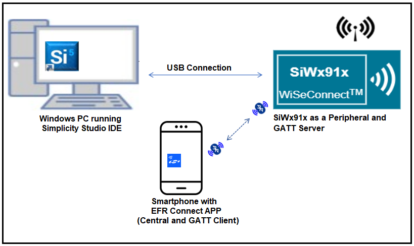
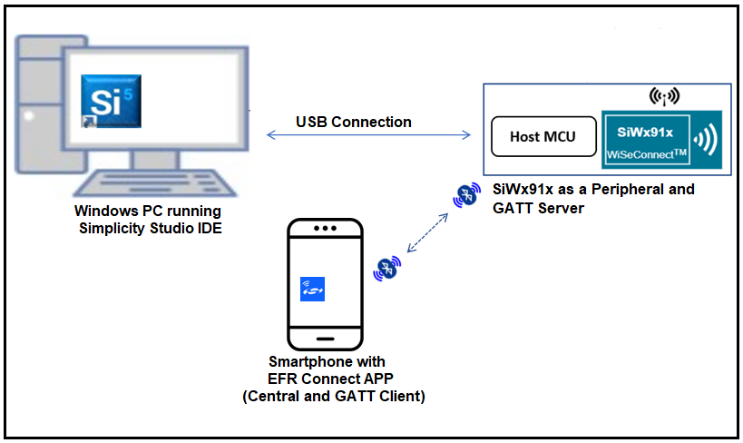
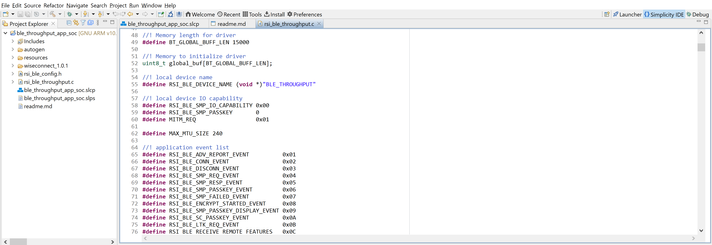
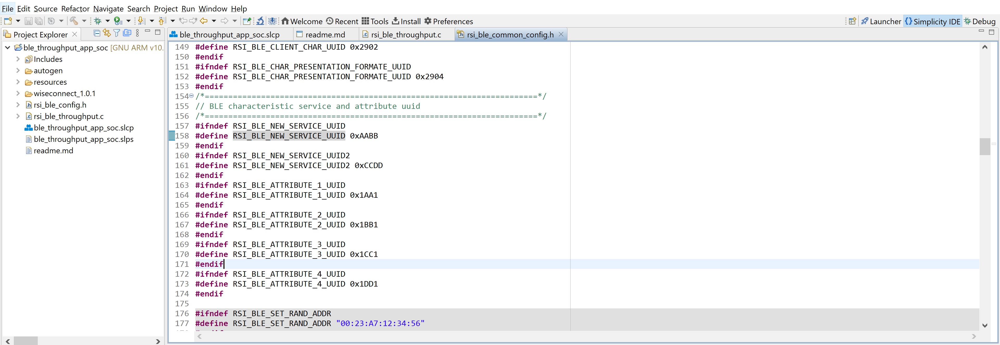
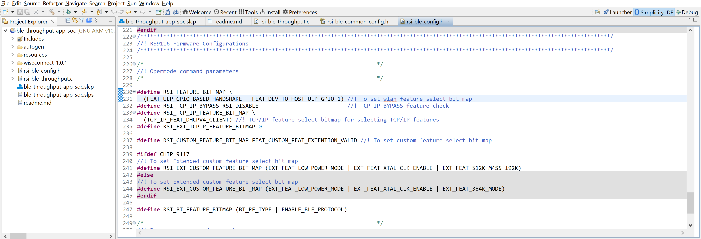
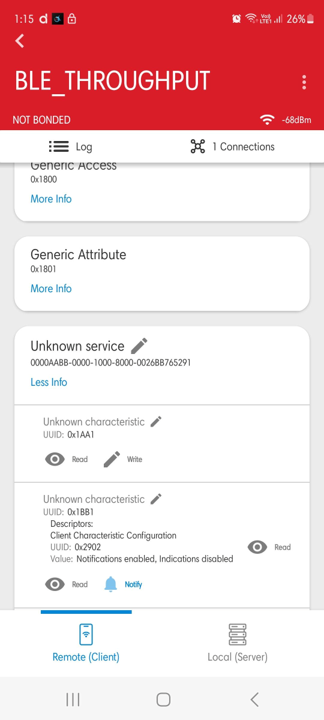
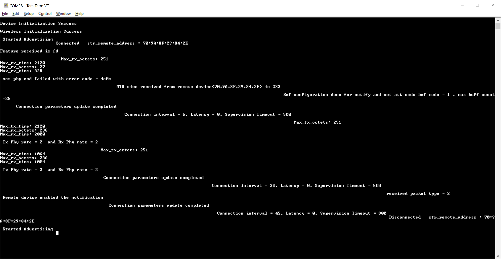

## BLE Throughput App

## **1 Introduction**

This application demonstrates how to exchange continuous data to the remote device to measure the On-Air Throughput using a BLE Sniffer.
- In this Application, the GATT server configures with Custom service with write, read, and notification characteristic UUIDs.
- When connected remote device enables the notification on UUID, Silicon Labs device sends the continuous notifications to the connected device.
- This is data can be captured with Sniffer to measure the throughputs.

**Sequence of Events**

This Application explains to the user how to:

- Create a Simple chat service
- Make the device advertise / scannable
- Connect from remote BLE device/ Connect to remote BLE device
- Initiate the Security
- Excite the Data length and Phy rate features
- Sends the notification messages to the connected peer/Smartphone when the notification is enabled

## **2 Prerequisites**

For the application, you will need the following:
### **2.1 Hardware Requirements**

- A Windows PC

- BLE peripheral device(Bluetooth version 4.0 and above version).

#### **2.1.1 SoC** 

   - Silicon Labs SiWx917 PK6030A SoC Kit which includes
      - BRD4001A/BRD4002A Wireless Starter Kit Mainboard
      - BRD4325A Radio Board
   - USB TO UART converter / TTL cable
   
#### **2.1.2 NCP**

   - Silicon Labs BRD8036A Si917 QMS SB Expansion Board
   - [Silicon Labs SLWSTK6006A EFR32xG21 Wireless Starter Kit](https://www.silabs.com/development-tools/wireless/efr32xg21-wireless-starter-kit) which includes
      - BRD4001A/BRD4002A Wireless Starter Kit Mainboard
      - BRD4180A/BRD4180B Radio Board

### **2.2 Software Requirements**

- Simplicity Studio IDE
   - To download and install the Simplicity Studio IDE, refer to the "Simplicity Studio IDE Set up" section in ***Getting started with SiWx91x*** guides.

- SiWx917_WiSeConnect_SDK.X.X
  
- [EFR connect Mobile APP](https://www.silabs.com/developers/efr-connect-mobile-app)

- Tera Term software or any other serial terminal software - for viewing application prints

## **3 Setup diagram**

### **3.1 SoC**   
  
### **3.2 NCP** 
   
**NOTE**: The Host MCU platform (EFR32xG21) and the SiWx91x interact with each other through the SPI interface. 


## **4 Setup**

### **4.1 SoC/NCP** 

- Follow the**Hardware connections and Simplicity Studio IDE Set up**  section in the respective ***Getting Started with SiWx91x*** guides to make the hardware connections and add the SiWx91x COMBO SDKs to Simplicity Studio IDE.

### **4.2 Loading the SiWx91x Firmware**

- Load the latest firmware into SiWx91x module, which is located in the `<SDK>/connectivity_firmware/` path as described in the **SiWx91x Firmware Update** section in the respective ***Getting started with SiWx91x*** guides.   

## **5 Project Creation**
To create the BLE Heartrate example project in the Simplicity Studio IDE, follow the **Project Creation** section in the respective ***Getting started with SiWx91x*** guides. 
   - For SoC, choose the **Bluetooth - SoC BLE Thoughput App** example.
   - For NCP, choose the **Bluetooth - NCP BLE Thoughput App** example.


## **6. Application Configuration**
The application can be configured to suit user requirements and development environment. Read through the following sections and make any changes if needed. 

1. In the Project explorer pane of the IDE, expand the **ble\_throughput\_app\_soc** folder and open the **rsi\_ble\_throughput.c** file. 


   - **BLE_THROUGHPUT** refers the name of the Silicon Labs device to appear during scanning by remote devices.
      ```c    
      #define RSI_BLE_DEVICE_NAME                                  "BLE_THROUGHPUT"
      ```	 
2. Open `rsi_ble_common_config.h` file and update the below parameters.    


   - **BLE characteristic service and attribute uuid**
   ```c
   //RSI_BLE_NEW_SERVICE_UUID refers to the 16-bit of 128-bit attribute value of the newly created service. 
   //128-bit UUID service: 0000AABB-0000-1000-8000-0026BB765291
   #define RSI_BLE_NEW_SERVICE_UUID                                0xAABB

   //RSI_BLE_ATTRIBUTE_1_UUID refers to the attribute type of the first attribute under this service (RSI_BLE_NEW_SERVICE_UUID).
   #define RSI_BLE_ATTRIBUTE_1_UUID                                0x1AA1

   //RSI_BLE_ATTRIBUTE_2_UUID refers to the attribute type of the second attribute under this service (RSI_BLE_NEW_SERVICE_UUID).
   #define RSI_BLE_ATTRIBUTE_2_UUID                                0x1BB1
   ```
   - **Note:**   Following are the **Non-configurable** macros in the application.
   ```c
   //RSI_BLE_CHAR_SERV_UUID refers to the attribute type of the characteristics to be added in a service.
   #define RSI_BLE_CHAR_SERV_UUID                                    0x2803

   //RSI_BLE_CLIENT_CHAR_UUID refers to the attribute type of the client characteristics descriptor to be added in a service.
   #define RSI_BLE_CLIENT_CHAR_UUID                                  0x2902
   ```
   - **Note:**  Following are the properties:
   ```c
   //RSI_BLE_ATT_PROPERTY_READ is used to set the READ property to an attribute value.
   #define RSI_BLE_ATT_PROPERTY_READ                                 0x02

   //RSI_BLE_ATT_PROPERTY_WRITE is used to set the WRITE property to an attribute value.

   #define RSI_BLE_ATT_PROPERTY_WRITE                                0x08
   
   //RSI_BLE_ATT_PROPERTY_NOTIFY is used to set the NOTIFY property to an attribute value.
   #define RSI_BLE_ATT_PROPERTY_NOTIFY                               0x10
   ```
3. Open **rsi\_ble\_config.h** file and configure the Opermode command parameters.   


   - **BLE Throughput Configurations**
   ```c 
   #define RSI_BLE_PWR_INX                                             30
   #define RSI_BLE_PWR_SAVE_OPTIONS                                    0
   
   #define RSI_BLE_REMOTE_DEV_ADDR                                     "00:12:45:AB:1D:32"
   #define RSI_REMOTE_DEVICE_NAME                                      "Note10"
   
   #define CONN_BY_ADDR                                                1
   #define CONN_BY_NAME                                                2
   
   #define CONNECT_OPTION                                              CONN_BY_NAME
   
   #define CENTERAL_ROLE                                               1
   #define PERIPHERAL_ROLE                                             2
   #define CONNECTION_ROLE                                             PERIPHERAL_ROLE
   
   #define CONN_INTERVAL_MIN                                           45
   #define CONN_INTERVAL_MAX                                           45
   #define CONN_LATENCY                                                0
   #define SUPERVISION_TIMEOUT                                         800
   
   #define SMP_ENABLE                                                  1
   
   #define TX_LEN                                                      0xFB
   #define TX_TIME                                                     0x0148
   
   #define TX_PHY_RATE                                                 0x02
   #define RX_PHY_RATE                                                 0x02
   #define CODDED_PHY_RATE                                             0x00
   
   #define NOTIFY_DISABLE                                              0x00
   #define NOTIFY_ENABLE                                               0x01
   
   #define DLE_ON                                                      1
   
   #define DLE_BUFFER_MODE                                             1
   #define DLE_BUFFER_COUNT                                            25
   #define RSI_BLE_MAX_DATA_LEN                                        232
   ```

   - **Opermode command parameters**
   ```c
    #define RSI_FEATURE_BIT_MAP     (FEAT_ULP_GPIO_BASED_HANDSHAKE | FEAT_DEV_TO_HOST_ULP_GPIO_1) 

    #define RSI_TCP_IP_BYPASS         RSI_DISABLE       

    #define RSI_TCP_IP_FEATURE_BIT_MAP     (TCP_IP_FEAT_DHCPV4_CLIENT) 

    #define RSI_EXT_TCPIP_FEATURE_BITMAP 0

    #define RSI_CUSTOM_FEATURE_BIT_MAP    FEAT_CUSTOM_FEAT_EXTENTION_VALID  

    #define RSI_EXT_CUSTOM_FEATURE_BIT_MAP (EXT_FEAT_LOW_POWER_MODE | EXT_FEAT_XTAL_CLK_ENABLE | EXT_FEAT_512K_M4SS_192K)

    #define RSI_BT_FEATURE_BITMAP (BT_RF_TYPE | ENABLE_BLE_PROTOCOL)
   ```
   **Note:** `rsi_ble_config.h` files are already set with desired configuration in respective example folders you need not change for each example.	 

## **7 Setup for Serial Prints**
- To Setup the serial prints, follow the **Setup for Serial Prints** section in the respective ***Getting started with SiWx91x*** guides


## **8 Build, Flash, and Run the Application**
- After making any custom configuration changes required, to build, flash, and run the application project, follow the **Build and Flash the Project** section in the respective ***Getting started with SiWx91x*** guides.    


## **9 Application Execution Flow**   
1. After the program gets executed, the Silicon Labs module will be in an Advertising state by default.

2. Connect any serial console for prints.

3. Open a EFR Connect App on the Smartphone and do the scan.

4. In the App, the Silicon Labs module device will appear with the name configured in the macro **RSI_BLE_DEVICE_NAME (Ex: "BLE_THROUGHPUT")**     

5. Initiate a connection from the App.

6. After successful connection, EFR connect APP displays the supported services of Silicon Labs module.     

7. Select the attribute service which is added **RSI_BLE_NEW_SERVICE_UUID**
   **(Ex: 0xAABB)**
8. After Enable notifications for the read attribute **RSI_BLE_ATTRIBUTE_2_UUID**
   **(Example: 0x1BB1) So that the GATT server notifies when value updated in that particular attribute.**
   
9. Please refer to the given below images for continuous notification received on the mobile.      
      
10. Prints can see as below in any Console terminal    
   - **SoC**      
        
   - **NCP**       
  

## **Appendix**

- By default, the application runs over FreeRTOS. To run the application with Bare metal configurations, follow the **Bare Metal configuration** section in the ***Getting Started with SiWx91x*** guides.

**Note:** According to Bluetooth Core Specification-5.3, We are replacing the words "master/slave" with "central/peripheral" in our corporate lexicon.