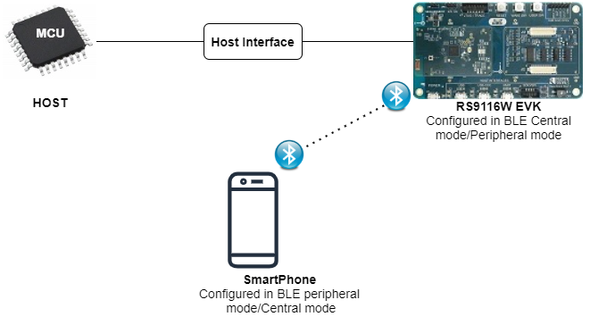

## GATT Long Read ##

**Overview**

This application demonstrates how a GATT client device accesses a GATT server device for long read, means when user wants to read more than MTU(minimum of local and remote devices MTU's) size of data.Silicon Labs module acts as a GATT client/server(based on user configuration) and explains reads/writes .Client role is initialized with Battery Service. Server role is initialized with a custom service.

**Sequence of Events**

This Application explains user how to:

 - Advertising in SLAVE role
 - Connects with remote device in MASTER role.
 - Loop back the data came from the remote device
 - Read request to the remote device

**Example Setup**

The WiSeConnect parts require that the host processor is connected to the WiSeConnect using either SPI, UART or USB host interface. The host processor firmware needs to properly initialize the selected host interface. The Silicon Labs Wireless SAPI framework provides necessary HAL APIs to enable variety of host processors.

**WiSeConnect  based Setup Requirements**

 - Windows / Linux PC with Host interface(UART/ USB-CDC/ SPI/ USB) in case of WiSeConnect
 - Silicon Labs module
 - BTLE peripheral device in case of Silicon Labs module as master
 - BTLE central device in case of Silicon Labs module as slave
 



**Configuration and Steps for Execution**

**Configuring the Application**

1. Open **rsi_ble_long_read.c** file and configure the below macros.
   **RSI_BLE_DEV_ADDR_TYPE** refers address type of the remote device to connect.

	 #define RSI_BLE_DEV_ADDR_TYPE                         LE_PUBLIC_ADDRESS
   Valid configurations are
   LE_RANDOM_ADDRESS
   LE_PUBLIC_ADDRESS

     Note:
     Depends on the remote device, address type will be changed.

   **RSI_BLE_DEV_ADDR** refers address of the remote device to connect.
	 #define RSI_BLE_DEV_ADDR                              "00:1A:7D:DA:71:13"

   **RSI_REMOTE_DEVICE_NAME** refers the name of remote device to which Silicon Labs device has to connect
	 #define RSI_REMOTE_DEVICE_NAME                        "SILABS_DEV"
   
   ```text
   Note:
   Silicon Labs module can connect to remote device by referring either RSI_BLE_DEV_ADDR or RSI_REMOTE_DEVICE_NAME of the remote device.
   ```

   **GATT_ROLE** refers the GATT role of the Silicon Labs device
	 #define SERVER                                        0
	 #define CLIENT                                        1
	 #define GATT_ROLE                                     SERVER
	 
   valid configurations of GATT_ROLE are:

   SERVER

   CLIENT

   **BT_GLOBAL_BUFF_LEN**  refers the Number of bytes required for the Application and the Driver.
	 #define BT_GLOBAL_BUFF_LEN                            15000
 
   **RSI_BLE_CHAR_SERV_UUID** refers standard attribute type of characteristic service

   **RSI_BLE_CLIENT_CHAR_UUID**  refers standard attribute type of client characteristic configuration descriptor.
	 #define RSI_BLE_CHAR_SERV_UUID                       0x2803
	 #define RSI_BLE_CLIENT_CHAR_UUID                     0x2902

   **RSI_BLE_NEW_SERVICE_UUID** refers service uuid when module acts as server

   **RSI_BLE_ATTRIBUTE_1_UUID** refers characteristic uuid when module acts as server
	 #define RSI_BLE_NEW_SERVICE_UUID                      0xAABB
	 #define RSI_BLE_ATTRIBUTE_1_UUID                      0x1AA1

   **RSI_BLE_NEW_CLIENT_SERVICE_UUID** refers service present in GATT server LE device.

   **RSI_BLE_CLIENT_ATTRIBUTE_1_UUID** refers characteristic present under above service in GATT server LE device.
	 #define RSI_BLE_NEW_CLIENT_SERVICE_UUID               0x180F
	 #define RSI_BLE_CLIENT_ATTRIBUTE_1_UUID               0x2A19

   **RSI_BLE_MAX_DATA_LEN** refers the maximum attribute value length.
  	 #define RSI_BLE_MAX_DATA_LEN                          20

   Following are event numbers for specific events
	 #define RSI_BLE_CONNN_EVENT                           1
	 #define RSI_BLE_DISCONN_EVENT                         2
	 #define RSI_BLE_GATT_WRITE_EVENT                      3
	 #define RSI_BLE_READ_REQ_EVENT                        4
	 #define RSI_BLE_MTU_EVENT                             5
	 #define RSI_BLE_GATT_PROFILE_RESP_EVENT               6
	 #define RSI_BLE_GATT_CHAR_SERVICES_RESP_EVENT         7

   Following are the non-configurable macros in the application.

	 #define RSI_BLE_ATT_PROPERTY_READ                     0x02
	 #define RSI_BLE_ATT_PROPERTY_WRITE                    0x08
	 #define RSI_BLE_ATT_PROPERTY_NOTIFY                   0x10

2. Open rsi_wlan_config.h file and update/modify following macros,

	 #define CONCURRENT_MODE                               RSI_DISABLE
	 #define RSI_FEATURE_BIT_MAP                           FEAT_SECURITY_OPEN
	 #define RSI_TCP_IP_BYPASS                             RSI_DISABLE
	 #define RSI_TCP_IP_FEATURE_BIT_MAP                    TCP_IP_FEAT_DHCPV4_CLIENT
	 #define RSI_CUSTOM_FEATURE_BIT_MAP                    FEAT_CUSTOM_FEAT_EXTENTION_VALID
	 #define RSI_EXT_CUSTOM_FEATURE_BIT_MAP                RAM_LEVEL_NWP_ALL_MCU_ZERO
	 #define RSI_BAND                                      RSI_BAND_2P4GHZ

3. Open rsi_ble_config.h file and update/modify following macros,

	 #define RSI_BLE_PWR_INX                               30
	 #define RSI_BLE_PWR_SAVE_OPTIONS                      0

**Executing the Application**

1. After the program gets executed,
2. In Client mode,
   Silicon Labs module will trying to connect with remote device as specified by RSI_BLE_REMOTE_BD_ADDRESS or RSI_REMOTE_DEVICE_NAME.     
3. After connecting, mtu size will be updated. As per mtu(maximum transmit unit) size, read requests will be happen from Silicon Labs device
4. In Server mode,
  Silicon Labs module will advertise,
5. Initiate connection from master.
6. After connecting, mtu size will be updated. As per mtu size, write will be happen from Silicon Labs device
7. In either role: If mtu size is of 100 bytes, module can read upto 98 bytes, write upto 97 bytes
8. For the data more than 20 bytes, application has to store value and send using gatt_read_response function whenever remote device reads some handle's data.
   For read request event to be raised auth_read flag in rsi_ble_add_char_val_att function need to be set.
   Based on GATT_ROLE configurable macro, this application will be act as a GATT server or GATT client device.