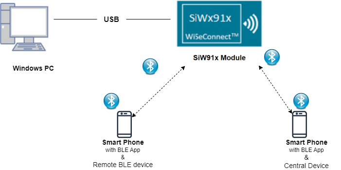
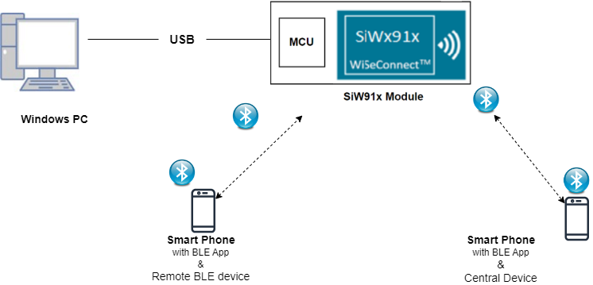
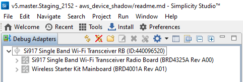
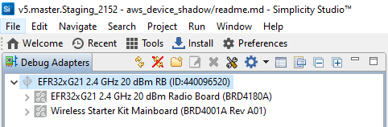
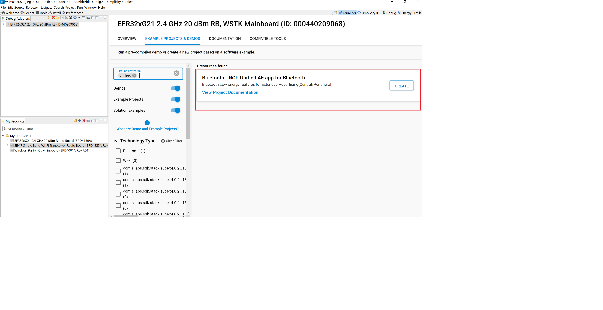
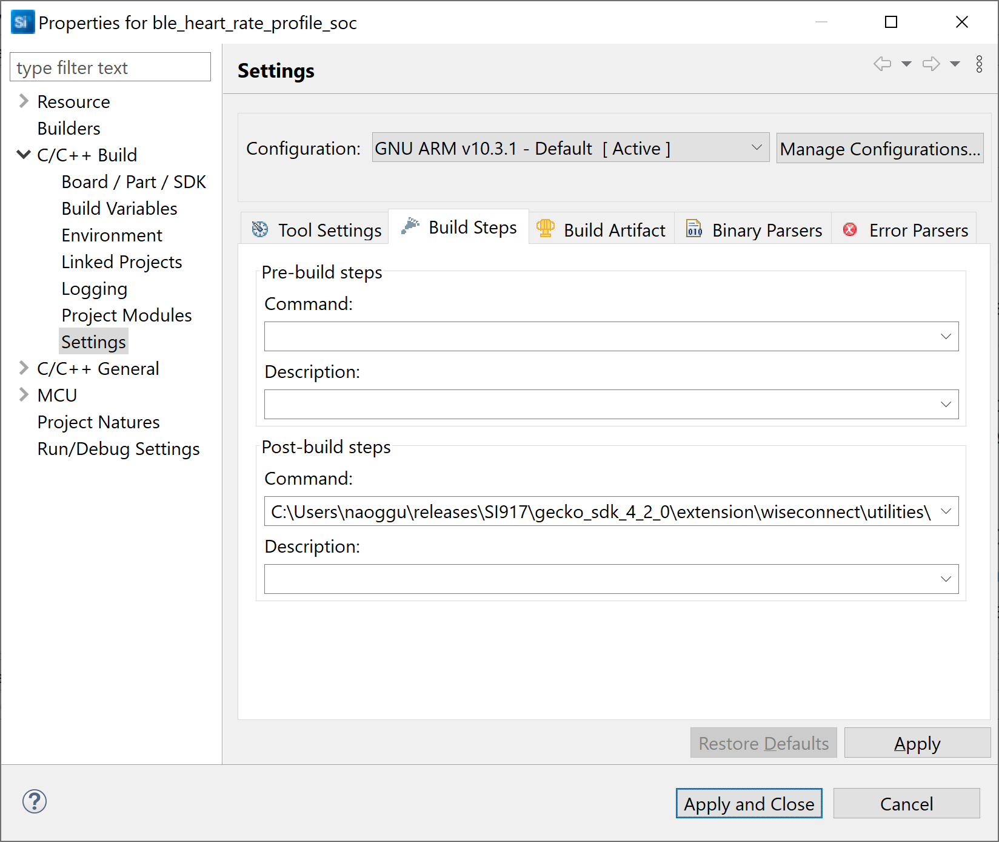
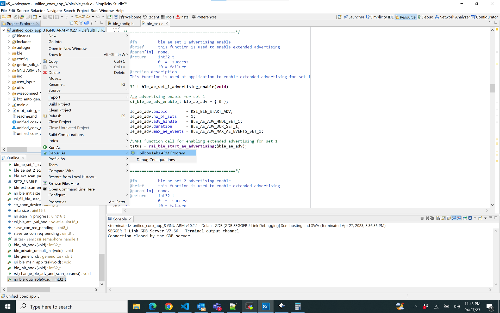

# BLE Extended Advertising Unified CoEx App

## 1. Purpose / Scope

This application demonstrates how to configure SiWx91x EVK as both Extended Advertiser(Peripheral) and Extended Scanner(Central) . It also has support for multiple connections(1 central + 1 peripheral) along with SMP feature and data transfer.

## 2. Prerequisites / Setup Requirements

Before running the application, the user will need the following things to setup.

### 2.1 Hardware Requirements

- Windows PC with Host interface(UART/ SPI/ SDIO).
   - SiWx91x Wi-Fi Evaluation Kit. The SiWx91x supports multiple operating modes. See [Operating Modes]() for details.
  - **SoC Mode**: 
      - Silicon Labs [BRD4325A](https://www.silabs.com/)
  - **NCP Mode**:
      - Silicon Labs [(BRD4180A, BRD4280B)](https://www.silabs.com/);
      - Host MCU Eval Kit. This example has been tested with:
        - Silicon Labs [WSTK + EFR32MG21](https://www.silabs.com/development-tools/wireless/efr32xg21-bluetooth-starter-kit)
        - Silicon Labs [WSTK + EFM32GG11](https://www.silabs.com/development-tools/mcu/32-bit/efm32gg11-starter-kit) 
- BLE Smart Phone with GATT client
### 2.2 Software Requirements

- Embedded Development Environment
   - For Silicon Labs EFx32, use the latest version of [Simplicity Studio](https://www.silabs.com/developers/simplicity-studio)

- Download and install the Silicon Labs [EFR Connect App](https://www.silabs.com/developers/efr-connect-mobile-app) in the android smart phones for testing BLE applications. Users can also use their choice of BLE apps available in Android/iOS smart phones.

### 2.3 Setup Diagram:
**SoC Mode :**
   
 
**NCP Mode :** 
   

## 3. Application Build Environment

### 3.1 Project Setup

- **SoC Mode**
  - **Silicon Labs SiWx91x SoC**. Follow the [Getting Started with SiWx91x SoC](https://docs.silabs.com/) to setup the example to work with SiWx91x SoC and Simplicity Studio.
- **NCP Mode**
  - **Silicon Labs EFx32 Host**. Follow the [Getting Started with EFx32](https://docs.silabs.com/rs9116-wiseconnect/latest/wifibt-wc-getting-started-with-efx32/) to setup the example to work with EFx32 and Simplicity Studio.

### 3.2 NCP Mode - Host Interface 

By default, the application is configured to use the SPI bus for interfacing between Host platforms(EFR32MG21) and the SiWx91x EVK.

## 4. Application Configuration Parameters

The application can be configured to suit your requirements and development environment. Read through the following sections and make any changes needed.

**4.1** Open `ble_config.h` file and update/modify following macros,

**4.1.1** User must update the below parameters

Configure the below macros to enable extended advertsing and scanning by default respectively 

	       #define ADV_ENABLED_DEFAULT    1
	       #define SCAN_ENABLED_DEFAULT   1

Set the below macro to enable second advertising set

	       #define ADV_SET2    1

Configure the below macros to set the number of peripheral and central connections that can be made

	       #define RSI_BLE_MAX_NBR_SLAVES    1
	       #define RSI_BLE_MAX_NBR_MASTERS   1

Fill the name of the peripheral to be connected to in the following macro 

	       #define RSI_REMOTE_DEVICE_NAME1   AEdevice1

configure below macro to enable secure connection for central and peripheral respectively :

	       #define SMP_ENABLE_M1    1
	       #define SMP_ENABLE_S1    1

set below macro to receive 'gatt notifications' from remote device

	       #define RX_NOTIFICATIONS_FROM_M1    1
	       #define RX_NOTIFICATIONS_FROM_S1    1


**Note:**
   Max limit for number of peripheral connections is 1 and central connections is 1

   **Power save configuration**

-  By default, The Application is configured without power save.

	 
	 #define ENABLE_POWER_SAVE 0

-  If user wants to run the application in power save, modify the below configuration. 
	 
	 #define ENABLE_POWER_SAVE 1 


**4.1.2** The desired parameters are provided below. User can also modify the parameters as per their needs and requirements

The length of the advertising data needs to be filled in the following macro

	       #define BLE_AE_ADV_DATA_LEN    0x19

Below mentioned macro needs to be populated with data 

	       #define BLE_AE_ADV_DATA    "AE_PERIPHERAL_DATA_1"

The Extended advertising handle for set 1 and 2 can be set with the following macros respectively

    #define BLE_AE_ADV_HNDL_SET_1          0x00
    #define BLE_AE_ADV_HNDL_SET_2          0x01
The minimum advertising interval for set 1 and 2 can be set with the following macros respectively

    #define BLE_AE_ADV_INT_MIN_SET_1       0x20
    #define BLE_AE_ADV_INT_MIN_SET_2       0x30
The maximum advertising interval for set 1 and 2 can be set with the following macros respectively

    #define BLE_AE_ADV_INT_MAX_SET_1       0x20
    #define BLE_AE_ADV_INT_MAX_SET_2       0x30
The Extended advertising channel map for set 1 and 2 can be set with the following macros respectively

    #define BLE_AE_ADV_CHANNEL_MAP_SET_1   0x07
    #define BLE_AE_ADV_CHANNEL_MAP_SET_2   0x07
The Extended advertising filter policy for set 1 and 2 can be set with the following macros respectively

    #define BLE_AE_ADV_FILTER_POLICY_SET_1 0x00
    #define BLE_AE_ADV_FILTER_POLICY_SET_2 0x00
The Extended advertising TX Power for set 1 and 2 can be set with the following macros respectively

    #define BLE_AE_ADV_TX_PWR_SET_1        0x7f
    #define BLE_AE_ADV_TX_PWR_SET_2        0x7f
The primary advertising phy for set 1 and 2 can be set with the following macros respectively

    #define BLE_AE_PRIMARY_ADV_PHY_SET_1   0x01
    #define BLE_AE_PRIMARY_ADV_PHY_SET_2   0x01
The Extended advertising max skip for set 1 and 2 can be set with the following macros respectively

    #define BLE_AE_SEC_ADV_MAX_SKIP_SET_1  0x00
    #define BLE_AE_SEC_ADV_MAX_SKIP_SET_2  0x00
The secondary advertising phy for set 1 and 2 can be set with the following macros respectively

    #define BLE_AE_SECONDARY_ADV_PHY_SET_1 0x01
    #define BLE_AE_SECONDARY_ADV_PHY_SET_2 0x01
The Extended advertising SID for set 1 and 2 can be set with the following macros respectively

    #define BLE_AE_ADV_SID_SET_1           0x00
    #define BLE_AE_ADV_SID_SET_2           0x01
The Extended advertising scan request notification enable for set 1 and 2 can be set with the following macros respectively

    #define BLE_AE_SCAN_REQ_NOTIF_EN_SET_1 0x01
    #define BLE_AE_SCAN_REQ_NOTIF_EN_SET_2 0x01
The Extended advertising event properties for set 1 and 2 can be set with the following macros respectively

    #define BLE_AE_ADV_EVNT_PROP_SET_1     (BLE_CONNECTABLE_ADV)
    #define BLE_AE_ADV_EVNT_PROP_SET_2     0x00
The Extended advertising duration for set 1 and 2 can be set with the following macros respectively

    #define BLE_AE_ADV_DUR_SET_1           0x00
    #define BLE_AE_ADV_DUR_SET_2           0x00
The maximum extended advertising events for set 1 and 2 can be set with the following macros respectively

    #define BLE_AE_ADV_MAX_AE_EVENTS_SET_1 0x00
    #define BLE_AE_ADV_MAX_AE_EVENTS_SET_2 0x00

Extended scanning filter type can be set with the below macro

    #define BLE_AE_SCAN_FILTER_TYPE       SCAN_FILTER_TYPE_ALL
The scan type for primary phy can be set using below macro

    #define PRI_PHY_BLE_AE_SCAN_TYPE      SCAN_TYPE_ACTIVE

The scan type for secondary phy can be set using below macro
   
    #define SEC_PHY_BLE_AE_SCAN_TYPE      SCAN_TYPE_ACTIVE

The primary phy extended scan interval can be set using below macro

    #define PRI_PHY_LE_AE_SCAN_INTERVAL   0x100
The primary phy extended scan window can be set using below macro

    #define PRI_PHY_LE_AE_SCAN_WINDOW     0x50
The secondary phy extended scan interval can be set using below macro

    #define SEC_PHY_LE_AE_SCAN_INTERVAL   0x100
The secondary phy extended scan window can be set using below macro

    #define SEC_PHY_LE_AE_SCAN_WINDOW     0x50

Extended scanning filter duplicates can be set using below macro

    #define BLE_AE_SCAN_ENABLE_FILTER_DUP 0x00
Extended scan duration can be set using below macro

    #define BLE_AE_SCAN_DUR               0x00
Extended scan period can be set using below macro

    #define BLE_AE_SCAN_PERIOD            0x00

Following are the **non-configurable** macros in the application.

The event properties bits:

    #define BLE_CONNECTABLE_ADV        (1 << 0)
    #define BLE_SCANNABLE_ADV          (1 << 1)
    #define BLE_LOW_DUTY_DIR_CONN_ADV  (1 << 2)
    #define BLE_HIGH_DUTY_DIR_CONN_ADV (1 << 3)
    #define BLE_LEGACY_ADV             (1 << 4)
    #define BLE_ANONYMOUS_ADV          (1 << 5)
    #define BLE_TX_WR_ADV              (1 << 6)

Global buffer length:
	 #define BT_GLOBAL_BUFF_LEN                             15000

Phy rate bits:

    #define PHY_1M       BIT(0)
    #define PHY_2M       BIT(1)
    #define PHY_LE_CODED BIT(2)

```c
	 #define RSI_BLE_PWR_INX          30
	 #define RSI_BLE_PWR_SAVE_OPTIONS 0    
	 #define BLE_DISABLE_DUTY_CYCLING 0
     #define BLE_DUTY_CYCLING         1
     #define BLR_DUTY_CYCLING         2
     #define BLE_4X_PWR_SAVE_MODE     4
```
   **Opermode command parameters**
```c
	 #define RSI_FEATURE_BIT_MAP                            FEAT_SECURITY_OPEN
	 #define RSI_TCP_IP_BYPASS                              RSI_DISABLE
	 #define RSI_TCP_IP_FEATURE_BIT_MAP                     TCP_IP_FEAT_DHCPV4_CLIENT
	 #define RSI_CUSTOM_FEATURE_BIT_MAP                     FEAT_CUSTOM_FEAT_EXTENTION_VALID
	 #define RSI_EXT_CUSTOM_FEATURE_BIT_MAP                 0
```
**Note:**
    ble_config.h file is already set with desired configuration in respective example folder , user need not change for each example.


## 5. Testing the Application

- Follow the below steps for the successful execution of the application.

### 5.1 Loading the SiWx91x Firmware
Refer [Getting started with a PC](https://docs.silabs.com/rs9116/latest/wiseconnect-getting-started) to load the firmware into SiWx91x EVK. The firmware file is located in `<SDK>/connectivity_firmware/`

### 5.2 Creating the Project and builing the Application
  
- Refer [Getting started with EFX32](https://docs.silabs.com/rs9116-wiseconnect/latest/wifibt-wc-getting-started-with-efx32/), for settin-up EFR & EFM host platforms

#### 5.2.1 Project Creation - SoC Mode : 

- Connect your board. The Si917 compatible SoC board is **BRD4325A**.
- Studio should detect your board. Your board will be shown here.
   

#### 5.2.2 Project Creation - NCP Mode : 

- Connect your board. The supported NCP boards are: **BRD4180A,BRD4280B**
- Studio should detect your board. Your board will be shown here.
   

#### 5.2.3 Selecting an example application and generate project

- Go to the 'EXAMPLE PROJECT & DEMOS' tab and select your desired example application
   
- Click 'Create'. The "New Project Wizard" window appears. Click 'Finish'.
   

#### 5.2.4 Build Project - SoC Mode

- Once the project is created, right click on project and go to properties → C/C++ Build → Settings → Build Steps
- Add post_build_script_SimplicityStudio.bat file path (SI917_COMBO_SDK.X.X.X.XX\utilities\isp_scripts_common_flash) in build steps settings as shown in below image.
   

- Check for M4 projects macros in preprocessor settings(RSI_M4_INTERFACE=1)
- Check for 9117 macro in preprocessor settings(CHIP_917=1).
- Click on the build icon (hammer) to build the project
   
- Successful build output will shown
#### 5.2.5 Build Project - NCP Mode :

- Check for 9117 macro in preprocessor settings(CHIP_917=1).
- If expansion board is used add the macro (EXP_BOARD=1) to preprocessor settings
- Click on the build icon (hammer) to build the project
   
- Successful build output will show as below.
   
## 6. Program the device

- Once the build was successfull, right click on project and click on Debug As->Silicon Labs ARM Program as shown in below image.

### NCP Mode : 
   

**Note:** Simillarly, Choose the **Run As** option fo one shot execution.

## 6.1 Running the SiWx91x Application

### 6.1.1 Steps to be followed to verify BLE AE Unified CoEx App
   1. Set all the configurations necessary refering to section 4.
   2. If extended advertsing is enabled by default SiWx91x would be visible on air 
   3. If extended scanning is enabled it will scan in the given interval and window 
   4. To make remote central connection scan from any BLE scanner search for the device(if no random address is set it will advertise with the public address)click on connect , if SMP is enabled for this connection the process is started and after successful bonding if data transfer is enabled it is started . 
   **Note:** To see the services on client end need to issue discover services after bonding from remote
   5. To make a remote peripheral connection advertise the remote with the particuler name specified in RSI_REMOTE_DEVICE_NAME1 macro,if SMP is enabled for this connection the process is started and after successful bonding if data transfer is enabled it is started . 

## 7. Observing the output prints on serial terminal

### 7.1 SoC Mode:
- Connect USB to UART connector Tx and GND pins to WSTK radio board.

   - Connect Tx(Pin-6) to P27 on WSTK
   - Connect GND(Pin 8 or 10) to GND on WSTK
   
- Prints can see as below in any Console terminal
   
### 7.2 NCP Mode:
- Prints can see as below in any Console terminal
   


