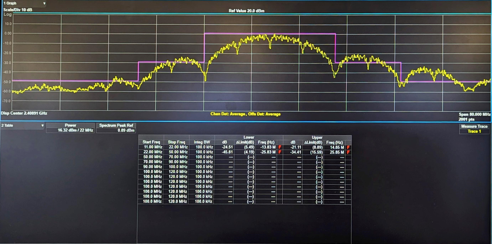

# Calibration

## 1. Purpose / Scope

This application demonstrates the procedure to calibrate the carrier frequency offset, EVM offset, Tx gain offset and few more parameters and update them to the Flash/Efuse. Customers need to calibrate these two parameters on their platforms after chip integration.

## 2. Prerequisites / Setup Requirements

Before running the application, the user will need the following things to setup.

### 2.1 Hardware Requirements

* Windows PC with Host interface (UART/ SPI/ SDIO).
* Silicon Labs [RS9116 Wi-Fi Evaluation Kit](https://www.silabs.com/development-tools/wireless/wi-fi/rs9116x-sb-evk-development-kit)
* Host MCU Eval Kit. This example has been tested with:
  - Silicon Labs [WSTK + EFR32MG21](https://www.silabs.com/development-tools/wireless/efr32xg21-bluetooth-starter-kit)
  - Silicon Labs [WSTK + EFM32GG11](https://www.silabs.com/development-tools/mcu/32-bit/efm32gg11-starter-kit)
  - [STM32F411 Nucleo](https://st.com/)
*  Spectrum Analyzer
*  RF Cable connects between EVK and Spectrum Analyzer.


### 2.2 Software Requirements

- [WiSeConnect SDK](https://github.com/SiliconLabs/wiseconnect-wifi-bt-sdk/)

- Embedded Development Environment.

   - For STM32, use licensed [Keil IDE](https://www.keil.com/demo/eval/arm.htm)
 
   - For Silicon Labs EFx32, use the latest version of [Simplicity Studio](https://www.silabs.com/developers/simplicity-studio).

- Python 3 installation

### 2.3 Flowchart for Calibration Process


## 3. Application Build Environment

### 3.1 Platform

The Application can be built and executed on below Host platforms
* [STM32F411 Nucleo](https://st.com/)
* [WSTK + EFR32MG21](https://www.silabs.com/development-tools/wireless/efr32xg21-bluetooth-starter-kit) 
* [WSTK + EFM32GG11](https://www.silabs.com/development-tools/mcu/32-bit/efm32gg11-starter-kit)

### 3.2 Host Interface

* By default, the application is configured to use the SPI bus for interfacing between Host platforms(STM32F411 Nucleo / EFR32MG21) and the RS9116W EVK.
* This application is also configured to use the SDIO bus for interfacing between Host platforms(EFM32GG11) and the RS9116W EVK.

### 3.3 Project Configuration

The Application is provided with the project folder containing Keil and Simplicity Studio project files.

* Keil Project
  - The Keil project is used to evaluate the application on STM32.
  - Project path: `<SDK>/examples/snippets/wlan/calibration_app/projects/calibration_app-nucleo-f411re.uvprojx`

* Simplicity Studio
  - The Simplicity Studio project is used to evaluate the application on EFR32MG21.
  - Project path: 
    - If the Radio Board is **BRD4180A** or **BRD4181A**, then access the path `<SDK>/examples/snippets/wlan/calibration_app/projects/calibration_app-brd4180a-mg21.slsproj`
    - If the Radio Board is **BRD4180B** or **BRD4181B**, then access the path `<SDK>/examples/snippets/wlan/calibration_app/projects/calibration_app-brd4180b-mg21.slsproj`
    - User can find the Radio Board version as given below 

 

  - EFM32GG11 platform
    - The Simplicity Studio project is used to evaluate the application on EFM32GG11.
      - Project path:`<SDK>/examples/snippets/wlan/calibration_app/projects/calibration_app-brd2204a-gg11.slsproj`

### 3.4 Bare Metal/RTOS Support

This application supports bare metal and RTOS environment. By default, the application project files (Keil and Simplicity studio) are provided with bare metal configuration in the SDK.

## 4. Application Configuration Parameters

The application can be configured to suit user requirements and development environment. Read through the following sections and make any changes needed.

### 4.1 Open rsi_calib_app.c file. The desired parameters are provided below. User can also modify the parameters as per their needs and requirements.

To set TX power in dBm. The valid values are from 2dbm to 18dbm for WiSeConnectTM module.

```c
#define RSI_TX_TEST_POWER                         18
```
  
To set transmit data rate.

```c
#define RSI_TX_TEST_RATE                          RSI_RATE_1
```
   
To configure length of the TX packet. Valid values are in the range of 24 to 1500 bytes in the burst mode and range of 24 to 260 bytes in the continuous mode.

```c
#define RSI_TX_TEST_LENGTH                        1000 
```
   
To configure Burst mode or Continuous mode

```c
#define RSI_TX_TEST_MODE                           RSI_BURST_MODE
```
   
To configure the channel number in 2.4 GHz or 5GHz. Here mention the channel number. For example user wants to given channel 1 in 2.4 GHz

```c
#define RSI_TX_TEST_CHANNEL                       1
```
   
To select internal antenna or UFL connector

```c
#define RSI_ANTENNA                               0
```

> **Note:** RSI_ANTENNA value should be set to 0 for Single Band module and 1 for Dual Band module

To select antenna gain in db for 2.4GHz band. Valid values are from 0 to 10.

```c
#define RSI_ANTENNA_GAIN_2G                       0
```

To select antenna gain in db for 5GHz band. Valid values are from 0 to 10.

```c
#define RSI_ANTENNA_GAIN_5G                       0
```

The following parameters are configured if OS is used. WLAN task should be of low priority

```c
#define RSI_WLAN_TASK_PRIORITY                   1
```
   
Driver task should have the highest priority among all threads

```c
#define RSI_DRIVER_TASK_PRIORITY                 2
```

WLAN Task stack size is configured by this macro
	 
```c
#define RSI_WLAN_TASK_STACK_SIZE           500
```

Driver Task stack size is configured by this macro
	 
```c
#define RSI_DRIVER_TASK_STACK_SIZE         500
```

GLOBAL_BUFF_LEN refers the memory length for driver

```c
#define GLOBAL_BUFF_LEN                      15000
```

### 4.2 Open rsi_wlan_config.h file. User can also modify the below parameters as per their needs and requirements.

```c
#define CONCURRENT_MODE                           RSI_DISABLE
#define RSI_FEATURE_BIT_MAP                       FEAT_SECURITY_OPEN
#define RSI_TCP_IP_BYPASS                         RSI_DISABLE
#define RSI_TCP_IP_FEATURE_BIT_MAP                TCP_IP_FEAT_DHCPV4_CLIENT
#define RSI_CUSTOM_FEATURE_BIT_MAP                0
#define RSI_BAND                                  RSI_BAND_2P4GHZ
```

## 5. Testing the Application

Follow the steps below for the successful execution of the application. 

### 5.1 Loading the RS9116W Firmware

Refer [Getting started with a PC](https://docs.silabs.com/rs9116/latest/wiseconnect-getting-started) to load the firmware into RS9116W EVK. The firmware file is located in `<SDK>/firmware/`


### 5.2 Building the Application on Host Platform

#### 5.2.1 Using STM32

Refer [Getting started with STM32](https://docs.silabs.com/rs9116-wiseconnect/latest/wifibt-wc-getting-started-with-stm32/)

- Open the project `<SDK>/examples/snippets/wlan/calibration_app/projects/calibration_app-nucleo-f411re.uvprojx`
- Build and Debug the project
- Check for the RESET pin:
  - If RESET pin is connected from STM32 to RS9116W EVK, then user need not press the RESET button on RS9116W EVK before free run.
  - If RESET pin is not connected from STM32 to RS9116W EVK, then user need to press the RESET button on RS9116W EVK before free run.
- Free run the project
- Then continue the common steps from **5.3**

#### 5.2.2 Using EFX32

Refer [Getting started with EFX32](https://docs.silabs.com/rs9116-wiseconnect/latest/wifibt-wc-getting-started-with-efx32/), for settin-up EFR & EFM host platforms

- Open Simplicity Studio and import theEFR32/EFM32 project from `<SDK>/examples/snippets/wlan/calibration_app/projects`
    - Select the appropriate .slsproj as per Radio Board type mentioned in **Section 3.3** for EFR32 board.
   (or)
    - Select the *.brd2204a-gg11.slsproj  for EFM32GG11 board.
- Compile and flash the project in to Host MCU
- Debug the project
- Check for the RESET pin:
  - If RESET pin is connected from EFX32 to RS9116W EVK, then user need not press the RESET button on RS9116W EVK before free run
  - If RESET pin is not connected from EFX32 to RS9116W EVK, then user need to press the RESET button on RS9116W EVK before free run
- Free run the project
- Then continue the common steps from **5.3**

### 5.3 Common Steps

1. Make connections as per setup diagram (above) and set the appropriate settings on the Spectrum Analyzer by using the steps mentioned in below **Spectrum Analyzer Settings**.

2. After the program gets executed, the RS9116W device will start the transmit test with the given configuration.

3. Refer the below image which shows when RS9116W device transmits packets in Burst mode with different Tx power and different transmission rates in channel 1 with length 1000bytes.

   ```sh 
   RSI_TX_TEST_POWER    - 18dBm
   RSI_TX_TEST_RATE     - 1Mbps
   RSI_TX_TEST_LENGTH   - 1000
   RSI_TX_TEST_MODE     - BURST mode
   RSI_TX_TEST_CHANNEL  - 1 
   ```

4. Observe the Avg Freq Error (highlighted) on the screen and now try to adjust the frequency offset by using CLI commands with serial terminal (Docklight or Teraterm)
   


### Frequency Offset Correction

Frequency offset correction will be done by using the rsi_freq_offset command. This command is used during the RF calibration process and requires PER mode transmissions to be initiated prior. This command sends freq_offset (deviation) as observed on the signal analyzer against the expected channel frequency.

   
Prototype :  
> `rsi_freq_offset = freq_offset_in_khz <CR><LF>`  
> 
> Here freq_offset_in_khz means Frequency deviation in KHz or ppm
   
   
Examples :
> `rsi_freq_offset=10<CR><LF>`
>
> `rsi_freq_offset=-10<CR><LF>` 


> **Note:** User can use the above command for any number of times till it gets tuned to desired frequency offset.

Open the serial terminal (Docklight/TeraTerm tool) and enter the following commands. User can provide input to correct frequency offset by sending the commands on console. This should lead towards a correction in the frequency offset as observed earlier and repeat till the error is within the tolerance limits (+/- 2 KHz tolerance limits).

See the below picture after frequency offset correction.


> **Note:** freq_offset_in_khz can be either +ve or -ve. When user enters the freq offset as observed on signal analyzer (+ve/-ve), a small freq offset correction is done. User needs to iterate this till the freq offset is within tolerance limits.


### Gain Offset Correction:

#### Update XO Ctune and Gain Offset

Using rsi_calib_write command the calibrated XO Ctune and calculated gain offset can be updated to target memory (Flash/Efuse).

   ```sh
   Prototype :
   rsi_calib_write=<target>,<flags>,<gain_offset_low>,<gain_offset_mid>,<gain_offset_high>,<xo_ctune>
   ```

**Parameters**

   | Parameter  | Description |                 |          |
   | :---       | :---        | :---            | :---     |
   | target     | Value       | Macro         | Description |
   |            |   0         | BURN_INTO_EFUSE | Burns calibration data to EFuse |
   |            |   1         | BURN_INTO_FLASH | Burns calibration data to Flash |
   | flags      |  BIT        | Macro                  | Description |
   |            |   0         |	                      |  Reserved for future use
   |            |   1         |	BURN_FREQ_OFFSET      |	1 - Update XO Ctune to calibration data 
   ||||	0 - Skip XO Ctune update
   |            |   2         |	SW_XO_CTUNE_VALID     |	1 - Use XO Ctune provided as argument to update calibration data  
   ||||	0 - Use XO Ctune value as read from hardware register
   |            |   3         |	BURN_XO_FAST_DISABLE  |     Used to apply patch for cold temperature issue (host interface detection) observed on CC0/CC1 modules. \ref appendix
   |            |   4         |  BURN_GAIN_OFFSET_LOW  | 1 - Update gain offset for low sub-band (2 GHz)  
   ||||	0 - Skip low sub-band gain-offset update
   |            |   5         |  BURN_GAIN_OFFSET_MID  | 1 - Update gain offset for mid sub-band (2 GHz)  
   ||||	0 - Skip mid sub-band gain-offset update
   |            |   6         |  BURN_GAIN_OFFSET_HIGH | 1 - Update gain offset for high sub-band (2 GHz)  
   ||||	0 - Skip high sub-band gain-offset update
   |            |   7         |  SELECT_GAIN_OFFSETS_1P8V | 1 - Update gain offsets for 1.8 V 
   ||||	0 - Update gain offsets for 3.3 V
   |            |   31-8      |                        |	Reserved for future use
   |gain_offset_low | gain_offset as observed in dBm in channel-1 | |
   |gain_offset_mid | gain_offset as observed in dBm in channel-6 | |
   |gain_offset_high| gain_offset as observed in dBm in channel-11 | |
   | xo_ctune   | This field allows user to directly update xo_ctune value to calibration data bypassing the freq offset loop, valid only when BURN_FREQ_OFFSET & SW_XO_CTUNE_VALID of flags is set. |   | The range of xo_ctune is [0, 255], and the typical value is 80 |
   |

> **Note:** For RS9116 Rev 1.5, the user needs to calibrate gain-offset for low sub-band (channel-1), mid sub-band (channel-6), and high sub-band (channel-11) and input the three gain-offsets to this API and set the corresponding flags to validate it. However, for RS9116 Rev 1.4, the user needs to calibrate gain-offset for low sub-band (channel-1) only and input the three gain-offsets to this API with dummy values for mid and high gain offsets and set the flag for low gain offset only to validate it. \n

> **Precondition:** 
rsi_freq_offset command needs to be called before this command when xo ctune value from hardware register is to be used. 

Gain offset can be calculated using the following equation :

   gain_offset = observed_power_level + cable_loss - configured_power_level

Example :

   gain_offset = 14.3 + 1.7 (assuming) - 18 = -2 dBm

For 2 GHz band, the gain offset has to calibrated for three channels, viz. channel-1, channel-6, channel-11. After the three gain offsets are calculated these can be written to Flash using the `rsi_calib_write` command. the command to update gain offsets as -2, 2, 1 dBm for channel-1, channel-6, channel-11, and XO Ctune value as it reads from hardware is:

   `rsi_calib_write=1,114,-2,2,1<CR><LF>`

> NOTE : 
> The gain_offset can be negative but not a floating value.
> Once the frequency offset is corrected after multiple tries, rsi_calib_write commands has to be given once for all to write the values to flash.

The application reads the updated calibration values for verification by using `rsi_calib_read` command and displays.


### EVM Offset Correction

EVM offset correction will be done by using the rsi_evm_offset command. This command is used during the RF calibration process and requires PER mode transmissions to be initiated prior. This command sends evm_offset (deviation) as observed on the signal analyzer.

**Note:**
After this command is send, application is required to restart the transmission for the EVM offset correction to reflect.

### EVM offset setting procedure

1. Configure the RF parameters in the SAPI code, like frequency, data rate and set power index to 127.
   
2. Change the #define RSI_TX_TEST_POWER 18 to #define RSI_TX_TEST_POWER 127 in rsi_calib_app.c for EVM offset calibration.

3. Load the SAPI code onto your host microcontroller. 
Load the firmware file onto the WMS chip.

4. Select the port on which the host is connected to communicate with the WMS chip and send commands.

5. Tune the EVM offset using rsi_evm_offset command. Refer to the section below for setting the parameters.

6. Write the EVM offsets into the flash using rsi_evm_write command. Refer to the section below for setting the parameters.

7. Reset the WMS module to verify the changes.

### Below Section about setting parameters in rsi_evm_offset and rsi_evm_write

Prototype :  
> `rsi_evm_offset =<index>, <evm_offset> <CR><LF>`  
>
> Here index is used to update the evm_offset_cust[index] range from 0 to 4
> 
     0 - customer_evm_offset_11B
     1 - customer_evm_offset_11G_6M_24M
     2 - customer_evm_offset_11G_36M_54M_11N_MCS4_MCS6
     3 - customer_evm_offset_11N_MCS0_MCS3
     4 - customer_evm_offset_11N_MCS7
   
> Here evm_offset means EVM offset value

Examples :
> `rsi_evm_offset=0,10<CR><LF>`
>
> `rsi_evm_offset=0,-10<CR><LF>` 


> **Note:** evm_offset can be either +ve or -ve. When user enters the evm offset as observed on signal analyzer (+ve/-ve), a small EVM offset correction is done. User needs to iterate this till the EVM offset is within the limits

#### Update EVM Offset

Using rsi_evm_write command the calibrated calculated EVM offset can be updated to target memory (Flash).

   ```sh
   Prototype :
rsi_evm_write=<target>,<flags>,<evm_offset_0>,<evm_offset_1>,<evm_offset_2>,<evm_offset_3>,<evm_offset_4>
   ```
>Here Target means based on value need to write into on Flash/Efuse

>0 - Efuse

>1 - Flash

Note:Efuse not supported .

>Here flag means based on flag value will update corresponding index

**Parameters**

 Bit |	MACRO 		           |	Description
 :---|:---------------------:|:---------------------------------------------------
 0   |	EVM_OFFSET_CUST_0     |	1 - Update customer_evm_offset_11B rate calibration data \n	0 - Skip evm_offset update
 1   |	EVM_OFFSET_CUST_1     |	1 - Update customer_evm_offset_11G_6M_24M rate calibration data \n 0 - Skip evm_offset update
 2   |	EVM_OFFSET_CUST_2     | 1 - Update customer_evm_offset_11G_36M_54M_11N_MCS4_MCS6 rate calibration data \n0 - Skip evm_offset update
 3   | EVM_OFFSET_CUST_3     | 1 - Update customer_evm_offset_11N_MCS0_MCS3 rate calibration data \n	0 - Skip evm_offset update
 4   | EVM_OFFSET_CUST_4     | 1 - Update customer_evm_offset_11N_MCS7 rate calibration data \n	0 - Skip evm_offset update
 31-5|                       | Reserved

Example for rsi_evm_write :
 
To update EVM offset into flash use the command below.

  > `rsi_evm_write=1,31,-20,-10,10,20,-7 <CR><LF>`

> NOTE : 
> In the above example,
> 
> The flag value is 31 (In binary : 11111) - it should update all EVM offset values to flash.
 
> If flag value is 3 (In binary : 0011) - it should update EVM offset value of -20 and -10.

> If flag value is 4 (binary : 0100) - it should update EVM offset value of 10 etc.


> NOTE : 
> The evm_offset can be negative but not a floating value.
> Once the EVM offset is corrected after multiple tries, rsi_evm_write  commands has to be given once for all to write the values to flash.

### Examples with Pics.
### Customer_evm_offset_11B:

Change the below macros in rsi_calib_app.c for EVM offset calibration.

```c
#define RSI_TX_TEST_POWER                         127
```
  
To set transmit data rate.

```c
#define RSI_TX_TEST_RATE                          RSI_RATE_1
```
**Before EVM offset correction**

For 1Mbps, the RMS EVM average is 10.78% and the average burst power is 16.3dB.
For the same case the spectral emission mask limit is failing as shown below.




**Commands**

The following are the commands used for this case.


**After EVM offset correction**

After setting the EVM offset the RMS EVM average value changes to 6.14% and average burst power reduces to 11.4dB.
The spectral emission mask is now passing as shown below.


### Customer_evm_offset_11G_6M_24M:

Change the below macros in rsi_calib_app.c for EVM offset calibration.

```c
#define RSI_TX_TEST_POWER                         127
```
  
To set transmit data rate.

```c
#define RSI_TX_TEST_RATE                          RSI_RATE_6
```
**Before EVM offset correction**

For 6Mbps, the RMS EVM average is -9.8dB and the average burst power is 16.7dB.
For the same case the spectral emission mask limit is failing as shown below.


**Commands**

The following are the commands used for this case.


**After EVM offset correction**

After setting the EVM offset the RMS EVM average value changes to -13.5dB  and average burst power reduces to 12.4dB.
The spectral emission mask is now passing as shown below


### Customer_evm_offset_11G_36M_54M_11N_MCS4_MCS6:

Change the below macros in rsi_calib_app.c for EVM offset calibration.

```c
#define RSI_TX_TEST_POWER                         127
```
  
To set transmit data rate.

```c
#define RSI_TX_TEST_RATE                          RSI_RATE_54
```
**Before EVM offset correction**

For 54Mbps, the RMS EVM average is -18.9dB which below the limit, and the average burst power is 12.8dB. For this case spectral emission mask will generally pass and hence is not shown. 


**Commands**

The following are the commands used for this case.


**After EVM offset correction**

After setting the EVM offset the RMS EVM average value changes to -26.6dB and average burst power reduces to 8.3dB.


### Customer_evm_offset_11N_MCS0_MCS3:

Change the below macros in rsi_calib_app.c for EVM offset calibration.

```c
#define RSI_TX_TEST_POWER                         127
```
  
To set transmit data rate.

```c
#define RSI_TX_TEST_RATE                          RSI_RATE_MCS0
```

**Before EVM offset correction**

For MCS0, the RMS EVM average is -18.9dB, and the average burst power is 11.7dB. 
For the same case the spectral emission mask limit is failing as shown below.


**Commands**

The following are the commands used for this case.


**After EVM offset correction**

After setting the EVM offset the RMS EVM average value changes to -15dB and average burst power reduces to 4.6dB.
The spectral emission mask is now passing as shown below.


### Customer_evm_offset_11N_MCS7:

Change the below macros in rsi_calib_app.c for EVM offset calibration.

```c
#define RSI_TX_TEST_POWER                         127
```
  
To set transmit data rate.

```c
#define RSI_TX_TEST_RATE                          RSI_RATE_MCS7
```
**Before EVM offset correction**

For MCS7, the RMS EVM average is -16.3dB which below the limit, and the average burst power is 12dB. For this case spectral emission mask will generally pass and hence is not shown. 


**Commands**

The following are the commands used for this case.


**After EVM offset correction**

After setting the EVM offset the RMS EVM average value changes to -28dB and average burst power reduces to 6.7dB.


### Spectrum Analyzer Settings
**Below are the necessary settings to see Polar Graph Spectrum Analyzer settings**
1. Frequency channel → center frequency→ 2412MHz for channel1.

2. SpanX scale → span→ 50MHz

3. Mode → WLAN → Mode setup → Radio Std → 802.11a/b/g → 802.11 b/g

4. Trigger → RF Burst

The frequency error section shows the error that needs to be adjusted. Using `rsi_freq_offset` and `rsi_calib_write` command user should be able to adjust the frequency error.


### Acronyms and Abbreviations

| Acronym   | Description |
| :----  | :----  | 
| TX      | Transmit       |
|RX | Receive |
|RF | Radio Frequency |
|WLAN | Wireless Local Area Network |
|XO | Crystal Oscillator |
|Ctune| Captune |
|Q7 | Single band RS9116 EVK |
|A7 | Dual band RS9116 EVK |

## Compressed Debug Logging

To enable the compressed debug logging feature please refer to [Logging User Guide](https://docs.silabs.com/rs9116-wiseconnect/latest/wifibt-wc-sapi-reference/logging-user-guide)