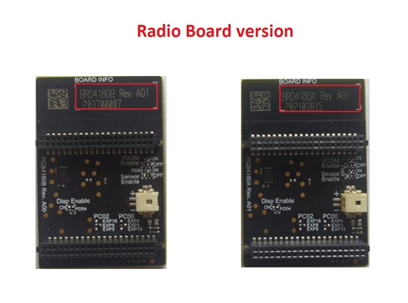
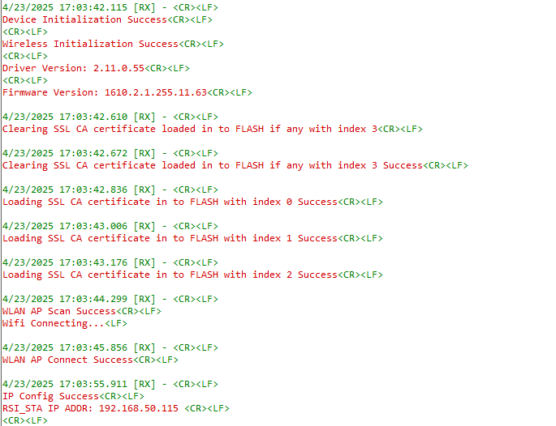

# Index Based SSL Client Sockets

## 1. Purpose / Scope

This application demonstrates how RS9116W EVK will connect to three different SSL servers with four different set of SSL certificates and loading certificates into the FLASH using the Index.

- Both index 0 and index 1 have a common root CA certificate and different client certificates and private key certificates required for HTTPS and MQTT connections.
- Index 2 is used for firmware listing, a connection is made to the firmware listing server with a different root CA certificate using HTTPS connection.
- Index 3 is fetching the required certificate for SSL connection, from the Index 2 server.
- Index 3 location is kept idle while the certificate for index 3 is being fetched from the server, which we are connecting to index 2.
- Index 3 is used for firmware download, by initiating from the firmware download server using HTTPS connection.


## 2. Prerequisites / Setup Requirements

Before running the application, set up the following:

### 2.1 Hardware Requirements

- Windows PC with Host interface (UART / SPI / SDIO).
- Silicon Labs [RS9116 Wi-Fi Evaluation Kit](https://www.silabs.com/development-tools/wireless/wi-fi/rs9116x-sb-evk-development-kit)
- Host MCU Eval Kit. This example has been tested with:
    - Silicon Labs [WSTK + EFR32MG21](https://www.silabs.com/development-tools/wireless/efr32xg21-bluetooth-starter-kit)
    - [STM32F411 Nucleo](https://st.com/)
- [Python tool](https://www.python.org/downloads/)
- Windows PC1 with with MQTT broker installed in it.
- Wireless Access Point


### 2.2 Software Requirements

- [WiSeConnect SDK](https://github.com/SiliconLabs/wiseconnect-wifi-bt-sdk/)
- Embedded Development Environment

   - For STM32, use licensed [Keil IDE](https://www.keil.com/demo/eval/arm.htm)

   - For Silicon Labs EFx32, use the latest version of [Simplicity Studio](https://www.silabs.com/developers/simplicity-studio)

   - [Python tool](https://www.python.org/downloads/)
   - [MQTT Broker](https://mosquitto.org/files/binary/win64/mosquitto-1.6.12-install-windows-x64.exe) in Windows PC1.
   > __Note:__ This example has been tested with Mosquitto _v1.5.3_, _v1.6.9_, and _v1.6.12_.
   - Install and configure Wamp-Apache HTTP server, refer to Appendix section 6.3 **Configuring and uploading firmware on Apache HTTP**.
   - Install and configure Wamp-Apache HTTPs server, refer to Appendix section 6.4 **Configuring and uploading firmware on Apache HTTPs**.

## 3. Application Build Environment 

### 3.1 Platform 

The Application can be built and executed on below Host platforms
* [STM32F411 Nucleo](https://st.com/)
* [WSTK + EFR32MG21](https://www.silabs.com/development-tools/wireless/efr32xg21-bluetooth-starter-kit) 
* [WSTK + EFM32GG11](https://www.silabs.com/development-tools/mcu/32-bit/efm32gg11-starter-kit)

### 3.2 Host Interface 

* By default, the application is configured to use the SPI bus for interfacing between Host platforms(STM32F411 Nucleo / EFR32MG21) and the RS9116W EVK.
* This application is also configured to use the SDIO bus for interfacing between Host platforms(EFM32GG11) and the RS9116W EVK.

### 3.3 Project Configuration 

The application is provided with the project folder containing Keil and Simplicity Studio project files.

* Keil Project
  - The Keil project is used to evaluate the application on STM32.
  - Project path: `<SDK>/examples/snippets/wlan/mqtt_client/projects/mqtt_client-nucleo-f411re.uvprojx`

* Simplicity Studio
  - The Simplicity Studio project is used to evaluate the application on EFR32MG21.
  - Project path: 
    - If the Radio Board is **BRD4180A** or **BRD4181A**, then access the path `<SDK>/examples/snippets/wlan/mqtt_client/projects/mqtt_client-brd4180a-mg21.slsproj`
    - If the Radio Board is **BRD4180B** or **BRD4181B**, then access the path `<SDK>/examples/snippets/wlan/mqtt_client/projects/mqtt_client-brd4180b-mg21.slsproj` 
    - User can find the Radio Board version as given below 

 

  - EFM32GG11 platform
    - The Simplicity Studio project is used to evaluate the application on EFM32GG11.
      - Project path:`<SDK>/examples/snippets/wlan/mqtt_client/projects/mqtt_client-brd2204a-gg11.slsproj`


### 3.4 Bare Metal/RTOS Support 

This application supports bare metal and RTOS environment. By default, the application project files (Keil and Simplicity Studio) are provided with bare metal configuration in the SDK. 


## 4. Application Configuration Parameters 

The application can be configured to suit user requirements and development environment. Read through the following sections and make any changes needed. 

### 4.1 Open rsi_index_based_ssl_client_sockets.h file

#### 4.1.1 User must update the below common parameters  

SSID refers to the name of the Access point.

```c
#define SSID                         "SILABS_AP"
```
  
CHANNEL_NO refers to the channel in which AP would be started
  
```c
#define CHANNEL_NO                  0
 ```
  
SECURITY_TYPE refers to the type of security. Generally Access point supports Open, WPA, WPA2 securities.
  
   Valid configuration is:

   - RSI_OPEN - For OPEN security mode

   - RSI_WPA  - For WPA security mode

   - RSI_WPA2 - For WPA2 security mode
  
```c
#define SECURITY_TYPE                RSI_WPA2
```

PSK refers to the secret key of the Access point(applies when AP is configured in WPA/WPA2 security modes)
  
```c
#define PSK                          "1234567890"
```

MQTT_CLIENT_PORT port refers to device MQTT client port number

```c
#define MQTT_CLIENT_PORT                           1883
```

MQTT_SERVER_PORT port refers remote MQTT broker/server port number

```c
#define MQTT_SERVER_PORT			   8883
```

SERVER_IP_ADDRESS refers remote peer IP address (Windows PC1) to connect with MQTT broker/server socket.

```c
#define SERVER_IP_ADDRESS                          192.168.10.1
```

MQTT client keep alive period

```c
#define RSI_KEEP_ALIVE_PERIOD                      100
```

Memory to initialize MQTT client Info structure

```c
#define MQTT_CLIENT_INIT_BUFF_LEN                  3500
```

QOS indicates the level of assurance for delivery of an Application Message.

   QoS levels are:

   0 - At most once delivery

   1 - At least once delivery

   2 - Exactly once delivery

```c
#define QOS                                        0
```

RSI_MQTT_TOPIC refers to which topic WiSeConnect MQTT client is supposed to subscribe.

```c
#define RSI_MQTT_TOPIC                             "MQTT_DEMO"
```

#### 4.1.2 The desired parameters are provided below. User can also modify the parameters as per their needs and requirements.

The following parameters are configured if OS is used. WLAN task should be of low priority

```c
#define RSI_WLAN_TASK_PRIORITY                   1
```
   
Driver task should have the highest priority among all threads

```c
#define RSI_DRIVER_TASK_PRIORITY                 2
```

WLAN Task stack size is configured by this macro
	 
```c
#define RSI_WLAN_TASK_STACK_SIZE           500
```

Driver Task stack size is configured by this macro
	 
```c
#define RSI_DRIVER_TASK_STACK_SIZE         500
```

GLOBAL_BUFF_LEN refers the memory length for driver

```c
#define GLOBAL_BUFF_LEN                      15000
```

DHCP_MODE refers the way of configuring IP address to Silicon Labs module

   1-Enables DHCP mode (gets the IP from DHCP server)

   0-Disables DHCP mode

   Desired configuration :

```c
#define DHCP_MODE                    1
```

If DHCP Mode is disabled configure a static IP address using the following macros. These values are in long format and in little endian order. For example an address of "192.168.10.1" is represented by a value of 0x010AA8C0.

```c
#define DEVICE_IP                    0X010AA8C0
```

IP address of the gateway should also be in long format and in little endian byte order

   Example: To configure "255.255.255.0" as network mask, update the macro NETMASK as 0x00FFFFFF

```c
#define NETMASK                      0x00FFFFFF
```

> Note:
> In AP mode, configure same IP address for both DEVICE_IP and GATEWAY macros.

#### 4.1.3 User must update the below server configuration parameters

Based on the type of server (Apache) from which firmware files needs to be downloaded, the below mentioned parameters needs to be configured.
Configure FLAGS to choose the version and security type to be enabled

   Valid configurations are :

   Enable IPv6 set this bit in FLAGS, Default is IPv4

   ```c
   #define HTTPV6           BIT(0)
   ```
   Set HTTPS_SUPPORT to use HTTPS feature

  ```c
   #define HTTPS_SUPPORT    BIT(1)
   ```

   Set HTTP_V_1_1 to use HTTP version 1.1

  ```c
   #define HTTP_V_1_1       BIT(6)
   ```

Both AWS and Azure macro is disabled in application, HTTP/s Apache server can be used to download the firmware and certificates required.

- HTTP_SERVER_PORT refers to HTTP Server port number
- SERVER_IP_ADDRESS refers to HTTP/MQTT Server IP address
- HTTP_SERVER_URL refers to HTTP resource name to list the firmware and certificates on the server.
- HTTP_FW_UPDATE_URL refers to the HTTP Firmware update URL
- HTTP_SERVER_URL1 refers to the HTTP local server for index_0
- HTTP_CERTS_DOWNLOAD_URL refers to the URL of HTTPS server to download the certificate
- HTTP_HOSTNAME refers to HTTP server hostname
- HTTP_EXTENDED_HEADER refers to HTTP extended header. If NULL default extented header is filled
- USERNAME refers to the username to be used to access the HTTP resource
- PASSWORD refers to the password to be used to access the HTTP resource1

**For local HTTPS Server for index_0**
   * Include Root certificate pem file for SSL connection
   * Provide the PC IP where HTTPS server is running in SERVER_IP_ADDRESS

   ```c
   //Sample configurations for Index_0
   #include "cacert.pem"
   #define HTTP_INDEX0_FLAGS       HTTPS_SUPPORT
   #define HTTP_SERVER_PORT1       5443
   #define SERVER_IP_ADDRESS  	   "192.168.xxx.xxx"
   #define HTTP_SERVER_URL1        "/index.html" //Index_0 HTTPS connection
   #define HTTP_HOSTNAME           "192.168.xxx.xxx"
   #define USERNAME                "admin"
   #define PASSWORD                "admin"
   ```

**For Apache HTTPS Server for index_2 and Index_3**
   * Include Root certificate pem file for SSL connection
   * Provide the PC IP where Apache server is running in SERVER_IP_ADDRESS
   * Provide the firmware listing path to upload the firmwares on Apache server in HTTP_SERVER_URL
   * Provide the certifcate path uploaded in Apache server in HTTP_CERTS_DOWNLOAD_URL
   * Provide the firmware package name uploaded in Apache server in HTTP_FW_UPDATE_URL

   ```c
   //Sample configurations for Index_2
   #include "cacert.pem"
   #define HTTP_INDEX2_FLAGS       (HTTPS_SUPPORT | HTTPS_CERT_INDEX_2)
   #define HTTP_SERVER_PORT        443
   #define SERVER_IP_ADDRESS       "192.168.xxx.xxx"
   #define HTTP_SERVER_URL         "silabs/index.html" //For FW listing on the apache server
   #define HTTP_HOSTNAME           "192.168.xxx.xxx"
   #define USERNAME                "admin"
   #define PASSWORD                "admin"
   ```

   ```c
   //Sample configurations for Index_3 to download certificates
   #include "cacert.pem"
   #define HTTP_INDEX2_FLAGS       (HTTPS_SUPPORT | HTTPS_CERT_INDEX_2)
   #define HTTP_SERVER_PORT        443
   #define SERVER_IP_ADDRESS       "192.168.xxx.xxx"
   #define HTTP_CERTS_DOWNLOAD_URL certs/cacert.pem
   #define HTTP_HOSTNAME           "192.168.xxx.xxx"
   #define USERNAME                "admin"
   #define PASSWORD                "admin"
   ```

   ```c
   //Sample configurations for Index_3 to downalod and update the firmware
   #include "cacert.pem"
   #define FLAGS                   (HTTPS_SUPPORT | HTTPS_CERT_INDEX_3)
   #define HTTP_SERVER_PORT        443
   #define SERVER_IP_ADDRESS       "192.168.xxx.xxx"
   #define HTTP_FW_UPDATE_URL      "firmware/RS9116W.2.11.4.0.1.rps"
   #define HTTP_HOSTNAME           "192.168.xxx.xxx"
   #define USERNAME                "admin"
   #define PASSWORD                "admin"
   ```

### 4.2 Open rsi_mqtt_client.c file. User can also modify the below parameters as per their needs and requirements.

   ```c
   uint8_t publish_message[] ="THIS IS MQTT CLIENT DEMO FROM APPLICATION"
   ```

   > Note :
   > As the publish message will be appended to MQTT header it is recommended to substract (topic length + 7 bytes of MQTT control fields) from maximum buf size limit for the protocol(TCP/SSL) to decide payload size.
   > Example, if topic is "MQTT_DEMO", for TCP payload size should be of size 1444 bytes( = 1460 - 9 - 7), for SSL it sums up to 1354 bytes( = 1370 - 9 - 7).

   MQTT Client ID with which MQTT client connects to MQTT broker/server

   ```c
   uint8_t clientID[] = "MQTTCLIENT"
   ```

   User name for login credentials

   ```c
   int8_t username[] = "username"
   ```

   Password for login credentials

   ```c
   int8_t password[] = "password"
   ```

### 4.3 Open  rsi_wlan_config.h file. User can also modify the below parameters as per their needs and requirements.

   ```c
   #define CONCURRENT_MODE			RSI_DISABLE
   #define RSI_FEATURE_BIT_MAP                  FEAT_SECURITY_OPEN
   #define RSI_TCP_IP_BYPASS                    RSI_DISABLE
   #define RSI_TCP_IP_FEATURE_BIT_MAP 		(TCP_IP_FEAT_DHCPV4_CLIENT | TCP_IP_FEAT_HTTP_CLIENT | TCP_IP_FEAT_EXTENSION_VALID | TCP_IP_FEAT_SSL | TCP_IP_FEAT_DNS_CLIENT)
   #define RSI_EXT_TCPIP_FEATURE_BITMAP 	(EXT_FEAT_HTTP_OTAF_SUPPORT | EXT_TCP_IP_FEAT_SSL_THREE_SOCKETS | EXT_TCP_IP_SSL_16K_RECORD | EXT_TCP_IP_CERTIFICATE_INDEX_3)
   #define RSI_CUSTOM_FEATURE_BIT_MAP           EXT_FEAT_CUSTOM_FEAT_EXTENTION_VALID
   #define RSI_EXT_CUSTOM_FEATURE_BIT_MAP 	(RAM_LEVEL_NWP_ALL_MCU_ZERO | EXT_FEAT_UART_SEL_FOR_DEBUG_PRINTS)
   #define RSI_BAND                             RSI_BAND_2P4GHZ
   ```

## 5. Testing the Application

User has to follow the below steps for the successful execution of the application. 

### 5.1 Loading the RS9116W Firmware

Refer [Getting started with a PC](https://docs.silabs.com/rs9116/latest/wiseconnect-getting-started) to load the firmware into RS9116W EVK. The firmware file is located in `<SDK>/firmware/`

### 5.2 Building the Application on the Host Platform

#### 5.2.1 Using STM32

Refer [Getting started with STM32](https://docs.silabs.com/rs9116-wiseconnect/latest/wifibt-wc-getting-started-with-stm32/) 

- Open the project `<SDK>/examples/snippets/wlan/http_otaf/projects/http_otaf-nucleo-f411re.uvprojx`
- Build and Debug the project
- Check for the RESET pin:
  - If RESET pin is connected from STM32 to RS9116W EVK, then user need not press the RESET button on RS9116W EVK before free run.
  - If RESET pin is not connected from STM32 to RS9116W EVK, then user need to press the RESET button on RS9116W EVK before free run.
- Free run the project
- Then continue the common steps from **Section 5.3**

#### 5.2.2 Using EFX32

Refer [Getting started with EFX32](https://docs.silabs.com/rs9116-wiseconnect/latest/wifibt-wc-getting-started-with-efx32/), for settin-up EFR & EFM host platforms

- Open Simplicity Studio and import the project from `<SDK>/examples/snippets/wlan/http_otaf/projects`
- Select the appropriate .slsproj as per the Radio Board type mentioned in **Section 3.3**
- Compile and flash the project in to Host MCU
- Debug the project
- Check for the RESET pin:
  - If RESET pin is connected from EFX32 to RS9116W EVK, then user need not press the RESET button on RS9116W EVK before free run
  - If RESET pin is not connected EFX32 to RS9116W EVK, then user need to press the RESET button on RS9116W EVK before free run
- Free run the project
- Then continue the common steps from **Section 5.3**


### 5.3 Common Steps 

1. Configure the Access point in OPEN / WPA-PSK / WPA2-PSK mode to connect RS9116W EVK in STA mode.

2. Follow step 5.3.1 for HTTPS Server-1 configuration.

3. Follow step 5.3.2 for MQTT Server-2 configuration.

4. Follow step 5.3.3 for Steps for Apache HTTPS Server-2 configuration for Firmware Listing and Firmware updating.

5. After the program gets executed, RS9116W EVK would be connected to Access point having the configuration same that of in the application and get IP.



6. The Device which is configured as SSL client will connect to three different remote SSL servers. 

7. Device will connect to HTTPS server on index_0. GET the HTTPS data from the server.


8. Device will connect to the MQTT server on index_1. Subscribes to the topic, publishes the topic. Closes the socket.


9. Device will connect to HTTPS server on index_2 and lists the firmware's on the server.


10. Device will connect to the HTTPS server and gets the required certificates from the server-2 and loads the certificate into index_3.

11. Device will connect to the HTTPS server using index_3 and updates the firmware on the module.


#### 5.3.1 Steps for HTTPS configuration.

1. In Windows PC, install python and run HTTPS server.

2. Copy the certificates cacert, server-cert and server-key into local folder where simple_https_server.py file is present in the Windows PC (Remote PC).

 > Note:
 > All the certificates are given in the SDK. Path: `<SDK>/resources/certificates`

3. In release package python scripts are provided to open HTTPS server in the path: utilities/script

4. Run simple_https_server.py by port number 5443 as argument to open HTTPS server

```sh
python simple_https_server.py 5443
```


#### 5.3.2 Steps for MQTTS configuration.

1. Install MQTT broker in Windows PC which is connected to Access Point through LAN.

2. User needs to update the mosquitto.conf file with the proper file paths, in which the certificates are available in the mosquitto.conf file.

3. Also, add "certs" folder to the mosquitto broker folder.

4. Execute the following command in MQTT server installed folder. (Ex:  C:\Program Files\mosquitto>mosquitto.exe -c mosquitto.conf -v) (Port can be 1883/8883)

```sh
mosquitto.exe -c mosquitto.conf -v`  
```  
  


#### 5.3.3 Steps for Apache HTTPS Server configuration for Firmware Listing and Firmware updating.

1. In Windows PC, install Apache and run HTTP/s server.

2. Install and configure Apache. To configure apache server follow step-6.4

3. Write the HTML script for firmwares to be listed on the server in index.html file.

4. Configuring and Uploading Firmwares on Apache HTTPs:


5. HTTPs Sever configuration for Apache requires Wamp server, if you have not installed it, follow the **"Step 1: Download and Install Wamp-Apache Server"** step and continue with the HTTPS steps in this document.

* **Download and Install OPENSSL for windows**
    * OpenSSL for windows from here (https://slproweb.com/products/Win32OpenSSL.html).
    * Do default install for OpenSSL.
    * We can only run OpenSSL using command prompt, for that we need to first find the openssl.exe file.
    * Normally it will be in "C:\Program Files\OpenSSL-Win64\bin\openssl.exe"

* **Generate required certs**
   > **Note:** If you already have the reqired certs to run the server then, skip the **Generate required certs** step, copy your certs to `C:\wamp64\bin\apache\apache2.4.46\conf` directory and update the `httpd-ssl.conf` file with these certificate paths shown in **HTTPD Configuration** step. 

   * Open Command Prompt in Administrator privilege's.
   * Change directory to your openssl.exe file "cd C:\Program Files\OpenSSL-Win64\bin\"
   * Execute the below command to generate a private.key file with AES 256 encryption. 

 ```sh
    openssl.exe genrsa -aes256 -out private.key 2048
    openssl.exe rsa -in private.key -out private.key
    openssl.exe req -new -x509 -nodes -sha1 -key private.key -out certificate.crt -days 36500 -config <your-wamp-apache-openssl.conf-file-path>
    openssl.exe req -new -x509 -nodes -sha1 -key private.key -out certificate.crt -days 36500 -config C:\wamp64\bin\apache\apache2.4.46\conf\openssl.conf
 ```
    
   * Now there will be two files created [Private.key and certificate.crt] in "C:\Program Files\OpenSSL-Win64\bin\" directory, copy them to "C:\wamp64\bin\apache\apache2.4.46\conf"

* **HTTPD Configuration**
  * Open "httpd.conf" file in "C:\wamp64\bin\apache\apache2.4.46\conf"
  * Uncomment the below shown lines in that file. Save and Exit.
  ```sh
  LoadModule ssl_module modules/mod_ssl.so
  Include conf/extra/httpd-ssl.conf
  LoadModule socache_shmcb_module modules/mod_socache_shmcb.so
  ```
  * Open "php.ini" file in "C:\wamp64\bin\php\php5.6.40" and uncomment the below line in the file
  
      `extension=php_openssl.dll`
  * Open "httpd-ssl.conf" file in "C:\wamp64\bin\apache\apache2.4.46\conf\extra" and update the below paths with proper information (i.e provide system relative paths)
  ``` sh
  <VirtualHost default:443>
  General setup for the virtual host
  DocumentRoot "C:/wamp64/www"
  ServerName 192.168.43.85:443
  ServerAdmin admin@example.com
  ErrorLog "C:/wamp64/bin/apache/apache2.4.46/logs/error.log"
  TransferLog "C:/wamp64/bin/apache/apache2.4.46/logs/access.log"

  SSLCertificateFile "C:/wamp64/bin/apache/apache2.4.46/conf/certificate.crt"
  SSLCertificateKeyFile "C:/wamp64/bin/apache/apache2.4.46/conf/private.key" 
  ```
  * Run below command to check if the configurations given above are proper or not. If the configurations are proper, it will return "Syntax OK"

      `httpd.exe -t`
* **Configure HTTPS Wamp-Apache Server to Download firmware**
  * Goto the Wamp Root directory "C:\wamp64" and navigate to "www"
  * Create a new folder in that directory "Firmware". [Folder Structure: C:\wamp64\www\Firmware]
  * In the "Firmware" folder create an "index.html" file and write below contents to the file.
```html
    <!DOCTYPE html>
    <html>
        <body>
            <h2>Using a Relative File Path</h2>
            <a href="firmware.rps" download>Download_Version_6</a><br><br>
            <a href="firmware1.rps" download>Download_Version_4</a>
        </body>
    </html>
```
  * This code will link your resources to Apache server, so that those files can be downloaded.

  * Make sure to copy all the firmware files into the present directory, C:\wamp64\www\Firmware

  * you can edit href values in the index.html to your firmware file names.
```html
    <a href="<your-firmware-file>-1.rps" download>Download_Version_6</a><br><br>
    <a href="<your-firmware-file>-2.rps" download>Download_Version_4</a>
```
  * Save the file and Exit.
* **Restart Server**
  * Open RUN, "WIN+R" → "services.msc" → ENTER
  * Restart the Apache service.
  * Open browser and give your Apache server URL


> * Here click on "Advanced Settings" and click on "Proceed to 192.168.43.85 (unsafe)"
> * You will be able to access the page and resources in HTTPS.


> **Note:** Make sure to check your HTTPS server from other local machines present in the same network. It should be accessible.


## Compressed Debug Logging

To enable the compressed debug logging feature please refer to [Logging User Guide](https://docs.silabs.com/rs9116-wiseconnect/latest/wifibt-wc-sapi-reference/logging-user-guide)
