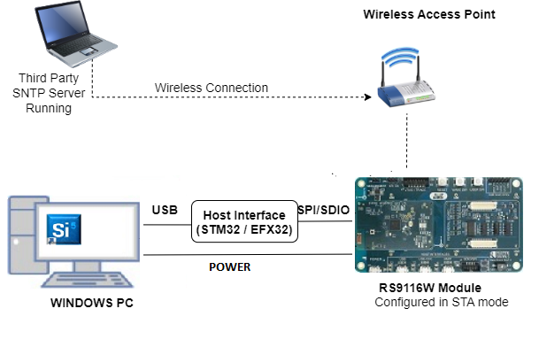

# SNTP Client (IPv6)

## 1. Purpose / Scope

This application demonstrates how Silicon Labs device gets info from SNTP server. In this application, Silicon Labs device connects to Access Point in client mode and connects to SNTP server. After successful connection with SNTP server, application gets time and date info from SNTP server.

## 2. Prerequisites / Setup Requirements 

Before running the application, set up the following:

### 2.1 Hardware Requirements 

- Windows PC with Host interface (UART / SPI/ SDIO).
- Silicon Labs [RS9116 Wi-Fi Evaluation Kit](https://www.silabs.com/development-tools/wireless/wi-fi/rs9116x-sb-evk-development-kit) 
- Host MCU Eval Kit. This example has been tested with:
    - Silicon Labs [WSTK + EFR32MG21](https://www.silabs.com/development-tools/wireless/efr32xg21-bluetooth-starter-kit)
	- Silicon Labs [WSTK + EFM32GG11](https://www.silabs.com/development-tools/mcu/32-bit/efm32gg11-starter-kit)
    - [STM32F411 Nucleo](https://st.com/) 
- Wireless Access Point




### 2.2 Software Requirements 

- [WiSeConnect SDK](https://github.com/SiliconLabs/wiseconnect-wifi-bt-sdk/) 
- Embedded Development Environment
   
   - For STM32, use licensed [Keil IDE](https://www.keil.com/demo/eval/arm.htm) 

   - For Silicon Labs EFx32, use the latest version of [Simplicity Studio](https://www.silabs.com/developers/simplicity-studio)

## 3. Application Build Environment 

### 3.1 Platform 

The Application can be built and executed on below Host platforms
* [STM32F411 Nucleo](https://st.com/)
* [WSTK + EFR32MG21](https://www.silabs.com/development-tools/wireless/efr32xg21-bluetooth-starter-kit) 
* [WSTK + EFM32GG11](https://www.silabs.com/development-tools/mcu/32-bit/efm32gg11-starter-kit)

### 3.2 Host Interface 

* By default, the application is configured to use the SPI bus for interfacing between Host platforms (STM32F411 Nucleo / EFR32MG21) and the RS9116W EVK.
* The SAPI driver provides APIs to enable other host interfaces if SPI is not suitable for your needs.

### 3.3 Project Configuration 

The Application is provided with the project folder containing Keil and Simplicity Studio project files.

* Keil Project
  - The Keil project is used to evaluate the application on STM32.
  - Project path: `<Release_Package>/examples/snippets/wlan/sntp_client_v6/projects/sntp_client_v6-nucleo-f411re.uvprojx`

* Simplicity Studio
  - The Simplicity Studio project is used to evaluate the application on EFR32MG21.
  - Project path: 
    - If the Radio Board is **BRD4180A** or **BRD4181A**, then access the path `<Release_Package>/examples/snippets/wlan/sntp_client_v6/projects/sntp_client_v6-brd4180a-mg21.slsproj`
    - If the Radio Board is **BRD4180B** or **BRD4181B**, then access the path `<Release_Package>/examples/snippets/wlan/sntp_client_v6/projects/sntp_client_v6-brd4180b-mg21.slsproj`
    - User can find the Radio Board version as given below 

 

### 3.4 Bare Metal Support 

This application supports only bare metal environment. By default, the application project files (Keil and Simplicity studio) are provided with bare metal configuration in the release package. 

## 4. Application Configuration Parameters 

The application can be configured to suit user requirements and development environment. Read through the following sections and make any changes needed. 

### 4.1 Open rsi_sntp_client_app.c file 

#### 4.1.1 User must update the below parameters  

SSID refers to the name of the Access point.

```c
#define SSID "SILABS_AP"
```

CHANNEL_NO refers to the channel in which device should scan. If it is 0, device will scan all channels

```c
#define CHANNEL_NO 0
```

SECURITY_TYPE refers to the type of security. In this application STA supports Open, WPA-PSK, WPA2-PSK securities.
   
   Valid configuration is:
   
   - RSI_OPEN - For OPEN security mode

   - RSI_WPA  - For WPA security mode
   
   - RSI_WPA2 - For WPA2 security mode

```c
#define SECURITY_TYPE RSI_WPA2
```

PSK refers to the secret key if the Access point configured in WPA-PSK /WPA2-PSK security modes.
   
```c
#define PSK "1234567890"
```
SERVER_IP_ADDRESS refers remote SNTP Server IPv6 address to connect. 

```c
#define SERVER_IP "2610:20:6f96:96::4"
```

Configure the SNTP method to use the server

```c
#define SNTP_METHOD RSI_SNTP_UNICAST_MODE
```

SNTP time out value to use

```c
#define SNTP_TIMEOUT 50
```

Application memory length which is required by the driver
```c
#define GLOBAL_BUFF_LEN 15000
```

#### 4.1.2 The desired parameters are provided below. User can also modify the parameters as per their needs and requirements.

To configure IP address
   DHCP_MODE refers whether IP address configured through DHCP or STATIC

```c
#define DHCP_MODE 1
```
   
**Note!**
> If the user wants to configure the STA IP address through DHCP then set DHCP_MODE to "1" and skip configuring the following DEVICE_IP6, and GATEWAY6 macros Otherwise set the DHCP_MODE macro to "0" and configure the following DEVICE_IP6 and GATEWAY6 macros.
****

IPv6 address to be configured to the device.

   Example: To configure "2001:db8:0:1::121" as IP address, update the macro DEVICE_IP6 as below

```c
#define DEVICE_IP6 "2001:db8:0:1::121"
```

IP address of the gateway.

   Example: To configure "2001:db8:0:1::121" as Gateway, update the macro GATEWAY6 as below

```c
#define GATEWAY6 "2001:db8:0:1::121"
```

### 4.2 Open rsi_wlan_config.h file. User can also modify the below parameters as per their needs and requirements. 

```c
#define CONCURRENT_MODE     RSI_DISABLE
#define RSI_FEATURE_BIT_MAP FEAT_SECURITY_OPEN
#define RSI_TCP_IP_BYPASS   RSI_DISABLE
#define RSI_TCP_IP_FEATURE_BIT_MAP \
  (TCP_IP_FEAT_DHCPV4_CLIENT | TCP_IP_FEAT_SNTP_CLIENT | TCP_IP_FEAT_DHCPV6_CLIENT | TCP_IP_FEAT_IPV6)
#define RSI_CUSTOM_FEATURE_BIT_MAP  FEAT_CUSTOM_FEAT_EXTENTION_VALID
#define RSI_EXT_CUSTOM_FEAT_BIT_MAP RAM_LEVEL_NWP_MEDIUM_MCU_MEDIUM
#define RSI_BAND                    RSI_BAND_2P4GHZ
```

## 5. Testing the Application

Follow the steps below for the successful execution of the application.

### 5.1 Loading the RS9116W Firmware

Refer [Getting started with a PC](https://docs.silabs.com/rs9116/latest/wiseconnect-getting-started) to load the firmware into RS9116W EVK.

The firmware file is located in `<SDK>/firmware/`

### 5.2 Building the Application on Host Platform

#### 5.2.1 Using STM32

Refer [Getting started with STM32](https://docs.silabs.com/rs9116-wiseconnect/latest/wifibt-wc-getting-started-with-stm32/)

- Open the project `<SDK>/examples/snippets/wlan/sntp_client_v6/projects/sntp_client_v6-nucleo-f411re.uvprojx`
- Build and Debug the project
- Check for the RESET pin:
  - If RESET pin is connected from STM32 to RS9116W EVK, then user need not press the RESET button on RS9116W EVK before free run.
  - If RESET pin is not connected from STM32 to RS9116W EVK, then user need to press the RESET button on RS9116W EVK before free run.
- Add the macro RSI_CONFIGURE_IPV6=1 in the preprocessor settings (Project -> Options for Target -> C/C++ -> Preprosessor Symbols)
- Free run the project
- Then continue the common steps from **5.3**

#### 5.2.2 Using EFX32

Refer [Getting started with EFX32](https://docs.silabs.com/rs9116-wiseconnect/latest/wifibt-wc-getting-started-with-efx32/), for settin-up EFR & EFM host platforms

- Open Simplicity Studio and import the EFR32/EFM32 project from `<SDK>/examples/snippets/wlan/sntp_client/projects`
    - Select the appropriate .slsproj as per Radio Board type mentioned in **Section 3.3** for EFR32 board.
   (or)
    - Select the *.brd2204a-gg11.slsproj  for EFM32GG11 board.
- Compile and flash the project in to Host MCU
- Debug the project
- Check for the RESET pin:
  - If RESET pin is connected from STM32 to RS9116W EVK, then user need not press the RESET button on RS9116W EVK before free run
  - If RESET pin is not connected from STM32 to RS9116W EVK, then user need to press the RESET button on RS9116W EVK before free run
- Add the macro RSI_CONFIGURE_IPV6=1 in the preprocessor settings to enable IPv6 (Project -> Properties -> C/C++ Build -> Settings ->GNU ARM C Compiler ->Preprosessor)
- Free run the project
- Then continue the common steps from **5.3**

### 5.3 Common Steps

1. Configure the Access point (internet AP) in OPEN / WPA-PSK / WPA2-PSK mode in order to connect Silicon Labs device in STA mode.
 
2. Connect to SNTP server and request server for information.
   
3. After the program gets executed, Silicon Labs device would be connected to access point and gets IP.

4. After successful connection with access point, device starts connection with the SNTP server.

5. After successful connection, module will send request to the server for time,date and Server details.

6. Application gets all the information requested.

7. Analyze the sniffer capture for NTP server response which contains date and time.
 
## Compressed Debug Logging

To enable the compressed debug logging feature please refer to [Logging User Guide](https://docs.silabs.com/rs9116-wiseconnect/latest/wifibt-wc-sapi-reference/logging-user-guide)