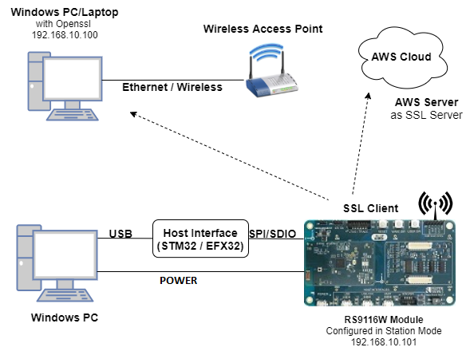
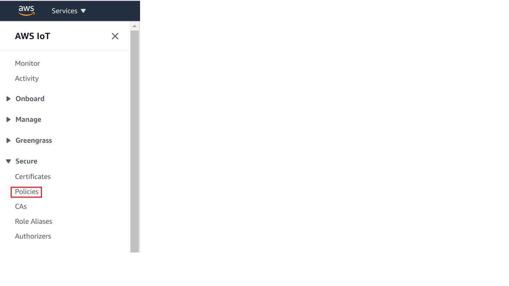

# Three SSL Client Sockets 

## 1. Purpose / Scope 

This application demonstrates how RS9116W EVK will connect to three different SSL servers with three different set of SSL certificates and loading certificates into the FLASH.

## 2. Prerequisites / Setup Requirements 

Before running the application, set up the following:

### 2.1 Hardware Requirements 

- Windows PC with Host interface (UART / SPI/ SDIO).

- Silicon Labs [RS9116 Wi-Fi Evaluation Kit](https://www.silabs.com/development-tools/wireless/wi-fi/rs9116x-sb-evk-development-kit) 

- Host MCU Eval Kit. This example has been tested with:
    - Silicon Labs [WSTK + EFR32MG21](https://www.silabs.com/development-tools/wireless/efr32xg21-bluetooth-starter-kit)
	- Silicon Labs [WSTK + EFM32GG11](https://www.silabs.com/development-tools/mcu/32-bit/efm32gg11-starter-kit)
    - [STM32F411 Nucleo](https://st.com/) 
- AWS server information like domain name running in the cloud which supports SSL connection.
- Wireless Access Point
- TCP server over SSL running in Windows PC (This application uses OpenSSL to create TCP server over SSL)




### 2.2 Software Requirements 

- [WiSeConnect SDK](https://github.com/SiliconLabs/wiseconnect-wifi-bt-sdk/) 
- Embedded Development Environment
   
   - For STM32, use licensed [Keil IDE](https://www.keil.com/demo/eval/arm.htm) 

   - For Silicon Labs EFx32, use the latest version of [Simplicity Studio](https://www.silabs.com/developers/simplicity-studio)
   
   - [OpenSSL Application](http://ufpr.dl.sourceforge.net/project/gnuwin32/openssl/0.9.8h-1/openssl-0.9.8h-1-bin.zip) in Windows PC (Remote PC).


## 3. Application Build Environment 

### 3.1 Platform 

The Application can be built and executed on below Host platforms
* [STM32F411 Nucleo](https://st.com/)
* [WSTK + EFR32MG21](https://www.silabs.com/development-tools/wireless/efr32xg21-bluetooth-starter-kit) 
* [WSTK + EFM32GG11](https://www.silabs.com/development-tools/mcu/32-bit/efm32gg11-starter-kit)

### 3.2 Host Interface 

* By default, the application is configured to use the SPI bus for interfacing between Host platforms(STM32F411 Nucleo / EFR32MG21) and the RS9116W EVK.
* This application is also configured to use the SDIO bus for interfacing between Host platforms(EFM32GG11) and the RS9116W EVK.

### 3.3 Project Configuration 

The Application is provided with the project folder containing Keil and Simplicity Studio project files.

* Keil Project
  - The Keil project is used to evaluate the application on STM32.
  - Project path: `<SDK>/examples/snippets/wlan/three_ssl_concurrent_client_sockets/projects/three_ssl_concurrent_client_sockets-nucleo-f411re.uvprojx`

* Simplicity Studio
  - The Simplicity Studio project is used to evaluate the application on EFR32MG21.
  - Project path: 
    - If the Radio Board is **BRD4180A** or **BRD4181A**, then access the path `<SDK>/examples/snippets/wlan/three_ssl_concurrent_client_sockets/projects/three_ssl_concurrent_client_sockets-brd4180a-mg21.slsproj`
    - If the Radio Board is **BRD4180B** or **BRD4181B**, then access the path `<SDK>/examples/snippets/wlan/three_ssl_concurrent_client_sockets/projects/three_ssl_concurrent_client_sockets-brd4180b-mg21.slsproj`
    - User can find the Radio Board version as given below 

 

  - EFM32GG11 platform
    - The Simplicity Studio project is used to evaluate the application on EFM32GG11.
      - Project path:`<SDK>/examples/snippets/wlan/station_ping/projects/station_ping-brd2204a-gg11.slsproj`

### 3.4 Bare Metal/RTOS Support 

This application supports bare metal and RTOS environment. By default, the application project files (Keil and Simplicity studio) are provided with bare metal configuration in the SDK. 

## 4. Application Configuration Parameters 

The application can be configured to suit user requirements and development environment. Read through the following sections and make any changes needed. 

### 4.1 Open rsi_three_ssl_client_sockets.c file 

#### 4.1.1 User must update the below parameters  

SSID refers to the name of the Access point.

```c   
   #define SSID                                       "SILABS_AP"
```

SECURITY_TYPE refers to the type of security. In this application STA supports Open, WPA-PSK, WPA2-PSK securities.
   
   Valid configuration is:
   
   - RSI_OPEN - For OPEN security mode

   - RSI_WPA  - For WPA security mode
   
   - RSI_WPA2 - For WPA2 security mode

```c   
   #define SECURITY_TYPE                              RSI_WPA2
```

PSK refers to the secret key if the Access point configured in WPA-PSK /WPA2-PSK security modes.
   
```c   
   #define PSK                                        "1234567890"
```
    
DEVICE_PORT1 port refers TCP client port number

```c   
   #define DEVICE_PORT1                               <local port>
```

SERVER_PORT1 port refers remote TCP server port number which is opened in remote peer/ which is running on cloud.
   
```c   
   #define SERVER_PORT1                               <remote port>
```

DEVICE_PORT2 refers another TCP client port number
   
```c   
   #define DEVICE_PORT2                               <local port>
```

SERVER_PORT2 port refers another remote TCP server port number which is opened in remote peer/ which is running on cloud.
   
```c   
   #define SERVER_PORT2                               <remote port>
```

DEVICE_PORT3 refers another TCP client port number
   
```c   
   #define DEVICE_PORT3                               <local port>
```

SERVER_PORT3 port refers another remote TCP server port number which is opened in remote peer/ which is running on cloud.
   
```c   
   #define SERVER_PORT3                               <remote port>
```

SERVER_IP_ADDRESS refers remote peer IP address to connect with TCP server socket over SSL running on the Windows PC.

```c   
   #define SERVER_ADDR                                0x640AA8C0
```

IP address should be in long format and in little endian byte order.
   
   Example: To configure "192.168.10.100" as IP address, update the macro DEVICE_IP as 0x640AA8C0.

   Note: 
   For Servers running on cloud, get the IP using DNS server.
 


#### 4.1.2 The desired parameters are provided below. User can also modify the parameters as per their needs and requirements.

The following parameters are configured if OS is used. WLAN task should be of low priority

```c
#define RSI_WLAN_TASK_PRIORITY                   1
```
   
Driver task should have the highest priority among all threads

```c
#define RSI_DRIVER_TASK_PRIORITY                 2
```

WLAN Task stack size is configured by this macro
	 
```c
#define RSI_WLAN_TASK_STACK_SIZE           500
```

Driver Task stack size is configured by this macro
	 
```c
#define RSI_DRIVER_TASK_STACK_SIZE         500
```

Application memory length which is required by the driver
  
```c   
   #define GLOBAL_BUFF_LEN                            15000
```

RSI_SSL_BIT_ENABLE
   
   0 - Disable SSL bitmap
   1 - Enable SSL bitmap
   This bit should be enabled for SSL connection

```c   
   #define RSI_SSL_BIT_ENABLE                         1
```

>   Note:
>   If certificates are not there in flash, then ssl handshake will fail.

DHCP_MODE refers whether IP address configured through DHCP or STATIC

```c   
   #define DHCP_MODE                                  1
```

> Note:
> If user wants to configure STA IP address through DHCP then set DHCP_MODE to "1" and skip configuring the following DEVICE_IP, GATEWAY and NETMASK macros.
> (Or)
> If user wants to configure STA IP address through STATIC then set DHCP_MODE macro to "0" and configure following DEVICE_IP, GATEWAY and NETMASK macros.
    
IP address to be configured to the device in STA mode should be in long format and in little endian byte order.
   
   Example: To configure "192.168.10.10" as IP address, update the macro DEVICE_IP as 0x0A0AA8C0.

```c   
   #define DEVICE_IP                                  0X0A0AA8C0
```
IP address of the gateway should also be in long format and in little endian byte order.

   Example: To configure "192.168.10.1" as Gateway, update the macro GATEWAY as 0x010AA8C0.

```c   
   #define GATEWAY                                    0x010AA8C0
```

IP address of the network mask should also be in long format and in little endian byte order.

   Example: To configure "255.255.255.0" as network mask, update the macro NETMASK as 0x00FFFFFF.

```c   
   #define NETMASK                                    0x00FFFFFF
```

AWS_DOMAIN_NAME refers to domain name of the AWS server

```c   
   #define AWS_DOMAIN_NAME                            "a25jwtlmds8eip-ats.iot.us-east-2.amazonaws.com"
```

#### 4.2 Open rsi_wlan_config.h file. User can also modify the below parameters as per their needs and requirements. 

    
```c   
   #define CONCURRENT_MODE                            RSI_DISABLE
   #define RSI_FEATURE_BIT_MAP                        FEAT_SECURITY_OPEN
   #define RSI_TCP_IP_BYPASS                          RSI_DISABLE
   #define RSI_TCP_IP_FEATURE_BIT_MAP                 (TCP_IP_FEAT_DHCPV4_CLIENT | TCP_IP_FEAT_SSL | TCP_IP_FEAT_DNS_CLIENT | TCP_IP_FEAT_EXTENSION_VALID)
   #define RSI_EXT_TCPIP_FEATURE_BITMAP               EXT_TCP_IP_FEAT_SSL_THREE_SOCKETS
   #define RSI_CUSTOM_FEATURE_BIT_MAP                 FEAT_CUSTOM_FEAT_EXTENTION_VALID
   #define RSI_EXT_CUSTOM_FEATURE_BIT_MAP             RAM_LEVEL_NWP_ALL_MCU_ZERO
   #define RSI_BAND                                   RSI_BAND_2P4GHZ
```

**Power save configuration**

   - By default, the application is configured without power save.
  
```c   
  #define ENABLE_POWER_SAVE              0
```

   - If user wants to run the application in power save, modify the below macro.

```c   
  #define ENABLE_POWER_SAVE              1
```

### 4.3 Setting up Security Certificates

To authenticate and securely connect with AWS, your Wi-Fi device requires a unique x.509 security certificate and private key, as well as a CA certificate which is used to verify the AWS server. Security credentials need to be converted into a C-array rather than [PEM format](https://en.wikipedia.org/wiki/Privacy-Enhanced_Mail) provided by AWS; they also need to be added to your project. 

The WiSeConnect SDK includes a Python 3 script to streamline the conversion process. This script
certificate_to_array.py is in the SDK 'resources' directory [certificate_to_array.py](https://github.com/SiliconLabs/wiseconnect-wifi-bt-sdk/tree/master/resources/certificates/).

To convert the device certificate and private key to C arrays, open a system command prompt and use the script as indicated in the following examples.

```sh
$> python3 certificate_to_array.py <input filename> <output arrayname>

For example:
$> python3 certificate_to_array.py d8f3a44d3f.cert.pem    aws_client_certificate
$> python3 certificate_to_array.py d8f3a44d3f.private.key aws_client_private_certificate
```

After running the script on the certificate and private key, two new files are created.

```sh
aws_client_certificate.pem.crt.h
aws_client_private_key.pem.key.h
```

Copy the two files aws_client_certificate.pem.crt.h and aws_client_private_key.pem.key.h to the WiSeConnect directory: /resources/certificates, overwriting any existing files with same name. 

The Root CA certificate used by your Wi-Fi device to verify the AWS server is already included in the WiSeConnect SDK; no additional setup is required.
For reference, Amazon uses [Starfield Technologies](https://www.starfieldtech.com/) to secure the AWS website, the WiSeConnect SDK includes the [Starfield CA Certificate](https://github.com/SiliconLabs/wiseconnect-wifi-bt-sdk/tree/master/resources/certificates/aws_starfield_ca.pem.h).

> NOTE :
> For AWS connectivity, StarField Root CA Class 2 certificate has the highest authority being at the top of the signing hierarchy.
> 
> The StarField Root CA Class 2 certificate is an expected/required certificate which usually comes pre-installed in the operating systems and it plays a key part in certificate chain verification when a device is performing TLS authentication with the IoT endpoint.
> 
> On RS9116 device, we do not maintain root CA trust repository due to memory constraints, so it is mandatory to load StarField Root CA Class 2 certificate for successful connection to AWS server.
> 
> The certificate chain sent by AWS server is as below:
> id-at-commonName=Amazon,id-at-organizationalUnitName=Server CA 1B,id-at-organizationName=Amazon,id-at-countryName=US
> id-at-commonName=Amazon Root CA 1,id-at-organizationName=Amazon,id-at-countryName=US
> id-at-commonName=Starfield Services Root Certificate Authority ,id-at-organizationName=Starfield Technologies, Inc.,id-at-localityName=Scottsdale,id-at-  stateOrProvinceName=Arizona,id-at-countryName=US)
> 
> On RS9116 to authenticate the AWS server, firstly Root CA is validated (validate the Root CA received with the Root CA loaded on the device). Once the Root CA is validation is successful , other certificates sent from the AWS server are validated.
> RS9116 don't authenticate to AWS server if intermediate CA certificates are loaded instead of StarField Root CA Class 2 certificate and would result in Handshake error.
> StarField Root CA Class 2 certificate is at https://certs.secureserver.net/repository/sf-class2-root.crt
> 
> Reference links :
> https://aws.amazon.com/blogs/security/how-to-prepare-for-aws-move-to-its-own-certificate-authority/

## 5. Testing the Application 

User has to follow the below steps for the successful execution of the application.

### 5.1 Loading the RS9116W Firmware 

Refer [Getting started with a PC](https://docs.silabs.com/rs9116/latest/wiseconnect-getting-started) to load the firmware into RS9116W EVK. The firmware file is located in `<SDK>/firmware/`


### 5.2 Building the Application on the Host Platform 

#### 5.2.1 Using STM32 

Refer [Getting started with STM32](https://docs.silabs.com/rs9116-wiseconnect/latest/wifibt-wc-getting-started-with-stm32/)

- Open the project `<SDK>/examples/snippets/wlan/three_ssl_concurrent_client_sockets/projects/three_ssl_concurrent_client_sockets-nucleo-f411re.uvprojx`
- Build and Debug the project
- Check for the RESET pin:
  - If RESET pin is connected from STM32 to RS9116W EVK, then user need not press the RESET button on RS9116W EVK before free run.
  - If RESET pin is not connected from STM32 to RS9116W EVK, then user need to press the RESET button on RS9116W EVK before free run.
- Free run the project
- Then continue the common steps from **5.3**

#### 5.2.2 Using EFX32 

Refer [Getting started with EFX32](https://docs.silabs.com/rs9116-wiseconnect/latest/wifibt-wc-getting-started-with-efx32/), for settin-up EFR & EFM host platforms 

- Open Simplicity Studio and import the EFR32/EFM32 project from `<SDK>/examples/snippets/wlan/three_ssl_concurrent_client_sockets/projects`
    - Select the appropriate .slsproj as per Radio Board type mentioned in **Section 3.3** for EFR32 board.
   (or)
    - Select the *.brd2204a-gg11.slsproj  for EFM32GG11 board.
- Compile and flash the project in to Host MCU
- Debug the project
- Check for the RESET pin:
  - If RESET pin is connected from EFX32 to RS9116W EVK, then user need not press the RESET button on RS9116W EVK before free run
  - If RESET pin is not connected from EFX32 to RS9116W EVK, then user need to press the RESET button on RS9116W EVK before free run
- Free run the project
- Then continue the common steps from **5.3**

#### 5.3 Common Steps 

1. Configure the Access point in OPEN / WPA-PSK / WPA2-PSK mode to connect RS9116W EVK in STA mode.

2. Copy the certificates server-cert and server-key into Openssl/bin folder in the Windows PC (Remote PC).

 > Note:
 > All the certificates are given in the SDK. Path: `<SDK>/resources/certificates`
 
3. In Windows PC (Remote PC) which is connected to AP, run the Openssl server by giving the following command

   ```sh
   Openssl.exe s_server -accept<SERVER_PORT> -cert <server_certificate_file_path> -key <server_key_file_path> -tls<tls_version>
   Example: openssl.exe s_server -accept 5001 -cert server-cert.pem -key server-key.pem -tls1
   ```

 
4. Make sure the SSL server is running in the cloud (check with the domain name)

5. After the program gets executed, RS9116W EVK would be connected to Access point having the configuration same that of in the application and get IP.

6. The Device which is configured as SSL client will connect to three different remote SSL servers.

## Appendix

### Create an AWS Thing

Create a thing in the AWS IoT registry to represent your IoT Device.

* In the [AWS IoT console](https://console.aws.amazon.com/iot/home), in the navigation pane, under Manage, choose All devices, and then choose Things.

  

* If a **You don't have any things yet** dialog box is displayed, choose **Register a thing**. Otherwise, choose **Create**.
* Click on **Create things**.

  

* On the **Create things** page, choose **Create a single thing** and click next.

  

* On the **Specify thing properties** page, enter a name for your IoT thing (for example, **Test_IoT**), and choose **Unnamed shadow (classic)** in the Device Shadow section, then choose **Next**. You can't change the name of a thing after you create it. To change a thing's name, you must create a new thing, give it the new name, and then delete the old thing.

  

* During **Configure device certificate** step, choose **Auto-generate a new certificate (recommended)** option and click next.

   

* Attach the policy to the thing created
   
   * If you have any existing policy, attach it and click on create thing

      

   * If policy is not yet created, follow the below steps.
      
      * Choose Create policy and fill the fields as per your requirements.

         

      * Give the **Name** to your Policy, Fill **Action** and **Resource ARN** as shown in below image, Click on **Allow** under **Effect** and click **Create**
   
         

      * choose the created policy and click on **Create thing**

* Choose the **Download** links to download the device certificate, private key, and root CA certificate. Root CA certificate is already present in SDK (aws_starfield_ca.pem.h), and can be directly used.
  > **Warning:** This is the only instance you can download your device certificate and private key. Make sure to save them safely. 

  

* Click Done.

* The created thing should now be visible on the AWS console (Manage > All devices > Things)

### **Appendix**: Steps to create a policy from AWS console

* Navigate to **AWS IoT console**
* Choose **Policies** under **Secure**

   

* Click on **Create**
   
  

## Compressed Debug Logging

To enable the compressed debug logging feature please refer to [Logging User Guide](https://docs.silabs.com/rs9116-wiseconnect/latest/wifibt-wc-sapi-reference/logging-user-guide)