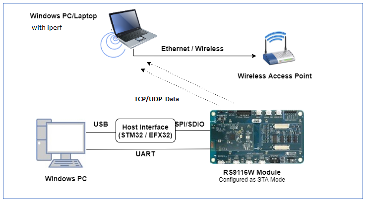

# Throughput Dual IP (IPv4 and IPv6) Application

## Introduction
This application demonstrates the procedure to measure WLAN UDP/TCP throughput in both ipv4 and ipv6 simultaneously by configuring the RS9116W.

## Setting Up 
To use this application, the following hardware, software and project setup is required.

### Hardware Requirements	
- Windows PC with Host interface (UART / SPI/ SDIO).
- A computer running Iperf (may be the same PC or Mac used to program the Host MCU)
- Silicon Labs [RS9116 Wi-Fi Evaluation Kit](https://www.silabs.com/development-tools/wireless/wi-fi/rs9116x-sb-evk-development-kit)
- Host MCU Eval Kit. This example has been tested with:
  - Silicon Labs [WSTK + EFR32MG21](https://www.silabs.com/development-tools/wireless/efr32xg21-bluetooth-starter-kit)
  - Silicon Labs [WSTK + EFM32GG11](https://www.silabs.com/development-tools/mcu/32-bit/efm32gg11-starter-kit)
  - [STM32F411 Nucleo](https://st.com/) 
- Wi-Fi Access Point



### Software Requirements
- [WiSeConnect SDK](https://github.com/SiliconLabs/wiseconnect-wifi-bt-sdk/)
- Embedded Development Environment
  - For Silicon Labs EFx32, use the latest version of [Simplicity Studio](https://www.silabs.com/developers/simplicity-studio).
  - For STM32, use [Keil](https://www.keil.com/demo/eval/arm.htm)
- Installation of Build tools for Linux including the gcc compiler (or equivalent on PC or Mac)
  - For Ubuntu, use the following command for installation: `user@ubuntu:~$ sudo apt install build-essential`
- If you don't have Linux, [Cygwin for Windows](https://www.cygwin.com/) may be used instead
- A working installation of [iPerf version 2.0.9](https://iperf.fr/iperf-download.php#windows).  **Note:** iPerf version 2.0.9 is the only version that has been verified to work with this example.
 
### Project Setup
- **Silicon Labs EFx32 Host**. Follow the the [Getting Started with EFx32](https://docs.silabs.com/rs9116-wiseconnect/latest/wifibt-wc-getting-started-with-efx32/) to setup the example to work with EFx32 and Simplicity Studio.
- **STM32F411 Host**. Follow the the [Getting Started with STM32](https://docs.silabs.com/rs9116-wiseconnect/latest/wifibt-wc-getting-started-with-stm32/) to setup the example to work with STM32 and Keil.

## Configuring the Application
The application can be configured to suit your requirements and development environment.
Read through the following sections and make any changes needed. 

### Host Interface

* By default, the application is configured to use the SPI bus for interfacing between Host platforms (STM32F411 Nucleo / EFR32MG21) and the RS9116W EVK.
* This application is also configured to use the SDIO bus for interfacing between Host platforms (EFM32GG11) and the RS9116W EVK.

### Bare Metal/RTOS Support
To select a bare metal configuration, see [Selecting bare metal](#selecting-bare-metal).

### Wi-Fi Configuration
Configure the following parameters in [rsi_dual_ip.c] to enable your Silicon Labs Wi-Fi device to connect to your Wi-Fi network.

```c
#define SSID          "SILABS_AP"  // Wi-Fi Network Name
#define PSK           "1234567890" // Wi-Fi Password
#define SECURITY_TYPE RSI_WPA2     // Wi-Fi Security Type: RSI_OPEN / RSI_WPA / RSI_WPA2
#define CHANNEL_NO    0            // Wi-Fi channel if the softAP is used (0 = auto select)
```

### Client/Server IP Settings
```c
#define PORT_NUM            <local_port>        // Local port to use
#define SERVER_PORT         <remote_port>       // Remote server port
#define SERVER_IP_ADDRESS   "192.168.0.111"     // Remote server IPv4 address .
#define SERVER_IP_ADDRESS_6 "2001:db8:0:1::121" // Remote server IPv6 address .
                                          
```

## Throughput Measurement Types
The application is configured to measure throughput using UDP, TCP in ipv4 and ipv6 respectively.  
```c
#define THROUGHPUT_TYPE_4 UDP_TX_4
#define THROUGHPUT_TYPE_6 TCP_TX_6
```

#Testing Throughput
There are two 'ends' involved when measuring throughput, data is sent between the client end and the server end. By default, the Iperf protocol sends data from the Client to the Server to measure throughput. Depending on the configuration selected, the RS9116W may be the client or the server. In general, it is advisable to start the server before the client since the client will immediately begin to try to connect to the server to send data. 

The following sections describe how to run the RS9116W throughput application together with examples for various Iperf configurations that run on the PC.   


## Running the RS9116 Application
After making any custom configuration changes required, build, download and run the application as described in the [EFx32 Getting Started](https://docs.silabs.com/rs9116-wiseconnect/latest/wifibt-wc-getting-started-with-efx32/) or [STM32 Getting Started](https://docs.silabs.com/rs9116-wiseconnect/latest/wifibt-wc-getting-started-with-stm32/). 


## UDP Tx v4 Throughput
To measure UDP Tx throughput, configure the RS9116W as a UDP client and start a UDP server on the remote PC.
The Iperf command to start the UDP server on the PC is: 

> `C:\> iperf.exe -s -u -p <SERVER_PORT> -i 1`
> 
> For example ...
>
> `C:\> iperf.exe -s -u -p 5001 -i 1`

## TCP Tx v6 Throuhgput
To measure TCP Tx throughput, configure the RS9116W as a TCP client and start a TCP server on the remote PC.
The Iperf command to start the TCP server is: 
		
> `C:\> iperf.exe -s -V -p <SERVER_PORT> -i 1`
>
> For example ...
>
> `C:\> iperf.exe -s -V -p 5001 -i 1`

#Selecting Bare Metal
The application has been designed to work with FreeRTOS and Bare Metal configurations. By default, the application project files (Keil and Simplicity studio) are configured with FreeRTOS enabled. The following steps demonstrate how to configure Simplicity Studio and Keil to test the application in a Bare Metal environment.

## Bare Metal with Simplicity Studio
> - Open the project in Simplicity Studio
> - Right click on the project and choose 'Properties'
> - Go to 'C/C++ Build' | 'Settings' | 'GNU ARM C Compiler' | 'Symbols' and remove macro 'RSI_WITH_OS=1'
> - Select 'Apply' and 'OK' to save the settings

## Bare Metal with Keil
> - Open the project in Keil and select 'Options for Target'
> - Go to the 'C/C++' tab and remove 'RSI_WITH_OS' macro present under Preprocessor Symbols
> - Select 'OK' to save the settings
      
## Compressed Debug Logging

To enable the compressed debug logging feature please refer to [Logging User Guide](https://docs.silabs.com/rs9116-wiseconnect/latest/wifibt-wc-sapi-reference/logging-user-guide)