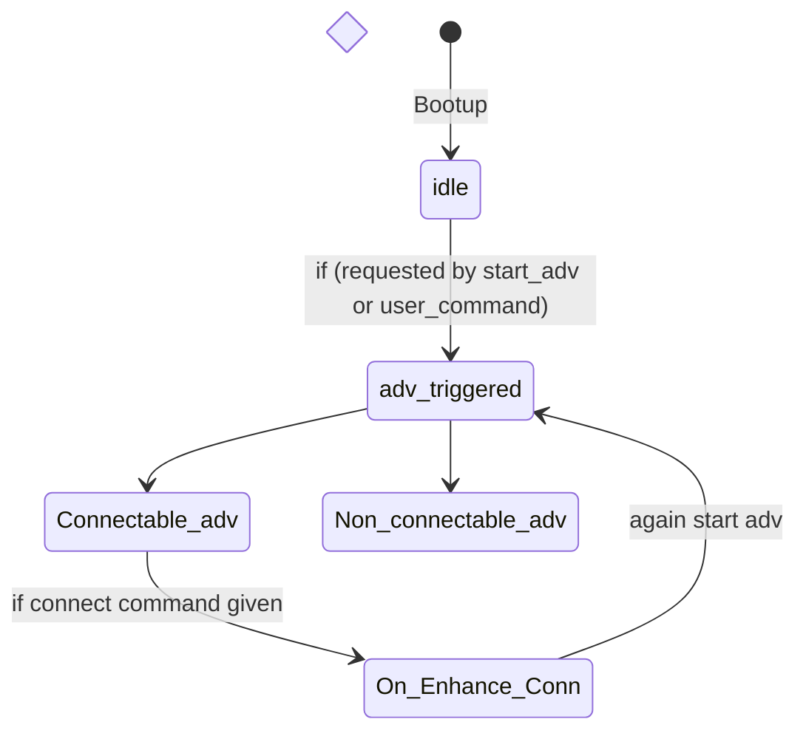
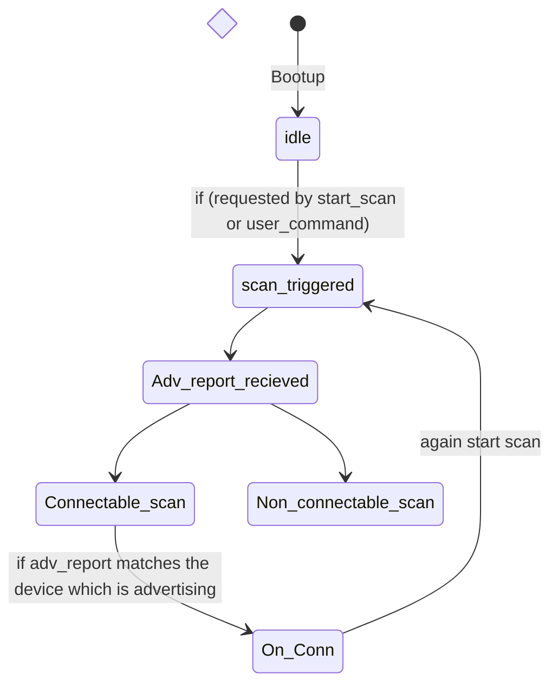
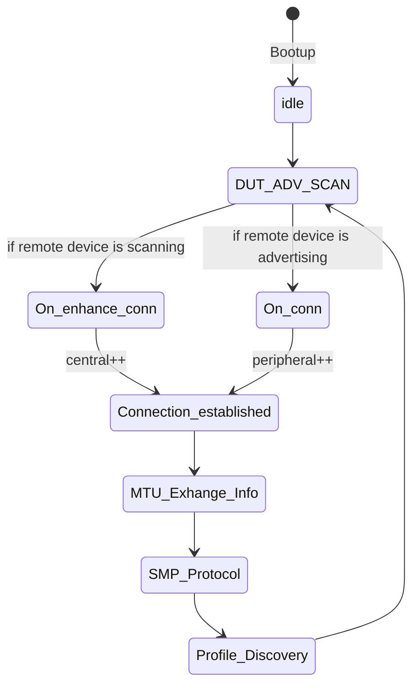
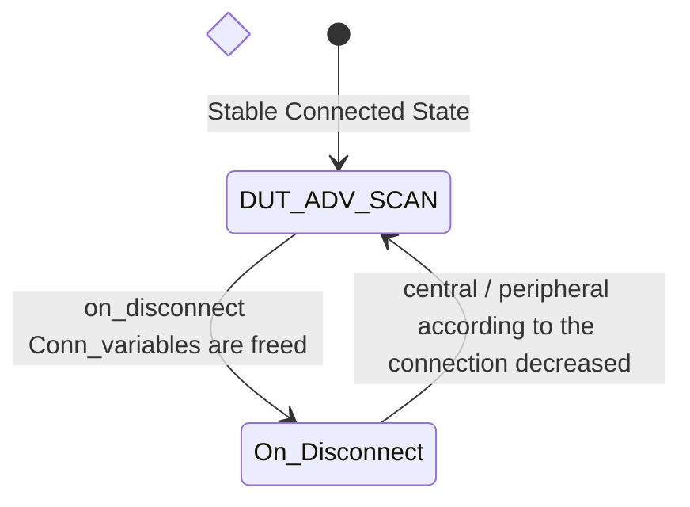
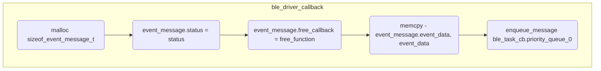

#BLE LLD
## BLE Task Private CB
### Structures

The structures for ble module are all defined in [ble_private.h](ble_private.h)
## Initialization
```mermaid
sequenceDiagram
	ble_init() ->> rsi_ble_register_callbacks() : register ble Callbacks
	alt ble_private_cb.adv_scan_cb.adv_scan_enable
	ble_init() ->> rsi_ble_start_advertising() : RSI_BLE_SET_ADV_DATA rsi_ble_set_advertise_data
	end
	alt ble_private_cb.adv_scan_cb.page_scan_enable
	ble_init() ->> rsi_ble_start_scanning() : 
	note over rsi_ble_set_connctable() : Triggers on_connect subtask created
	end
	alt ble_private_cb.peer_info[n].bd_address is valid
	alt ble_private_cb.page_cb.adv_required
	ble_init() ->> rsi_ble_adv() : RSI_BLE_REQ_ADV
	note over rsi_ble_adv() : Triggers on_adv_complete
	else
	ble_init() ->> rsi_ble_connect() : RSI_BLE_REQ_BOND
	note over rsi_bleconnect() : Triggers on_connect
	end
	end

```
## State Transitions
### ADV Process



### SCAN Process

### Connection Process

#### On Connect



#### On Disconnect

### Event Handling
#### Generic Flow
The generic handling of all events starting from ble call back handling in driver context to call for each event handler in ble task context shall be implemented through jinja templates and a yaml file to configure the supported events.
The templeate is defines in ble_auto_gen.c.jinja and ble_auto_gen.h.jinja. list of events is configerd through ble_configs.yaml under event hierarchy.
```mermaid
sequenceDiagram
	note over ble_driver_call_back() : Driver/SAPI context
	note over ble_generic_cb.event_handler_lut[event_id], event_handler() : BLE Main Task context which leads to BLE subtask 
	ble_driver_call_back() ->> ble_generic_cb.event_handler_lut[event_id] : Invokes BLE MAIN tasks
	ble_generic_cb.event_handler_lut[event_id] ->> event_handler() : Final event Handler which Invokes ble sub task
	note over ble_driver_call_back() : AutoGen Code
	note over ble_generic_cb.event_handler_lut[event_id] : Generic Task Handling
	note over event_handler() : manual implementation
```
##### BLE Driver Call Back Handling
All BLE driver call backs are handled in driver context as per below flow

### Folder Heirarchy
```mermaid
flowchart
    subgraph src
    subgraph ble
    classic_defines
    subgraph ble
        ble_configs.yaml
        ble_auto_gen.c.j2
        ble_auto_gen.c
        ble_auto_gen.h.j2
        ble_auto_gen.h
        ble_call_backs.c
        ble_private.h
    end
    end
    end
```
- ble_configs.yaml files shall host the config for all autogen code
- ble_autogen.c.j2 files shall host the templates for ble_auto_gen.c files
- ble_autogen.h.j2 files shall host the templates for ble_auto_gen.h files
- ble_autogen.c files shall host autogenerated C code
    - event and command handler look up tables
    - registered driver call backs()
    - command handler wrappers(performs conversion of ascii to binary of arguments and call actual command handlers)
- ble_autogen.h shall host auto generated enums and declarations
    - enum for event list for the ble
    - declarations for event and command handlers
    - MACRO for event callback registration
- ble_call_backs.c file shall host actual event and command call backs
- ble_private.h file shall host structures specific to the ble, ie. struct ble_private_cb