# WLAN - BLE Extended Advertising CoEx App

## 1. Purpose / Scope

This application demonstrates how to configure  RS9116W EVK as both Extended Advertiser(Peripheral) with 2 advertising sets supported and Extended Scanner(Central) . It supports multiple connections (one central + one peripheral), WLAN Station Connection along with SMP feature and data transfer.

## 2. Prerequisites / Setup Requirements

Before running the application, the user needs the following things to setup.

### 2.1 Hardware Requirements

- Windows PC with Host interface(UART/ SPI).
- Silicon Labs [RS9116 Wi-Fi Evaluation Kit](https://www.silabs.com/development-tools/wireless/wi-fi/rs9116x-sb-evk-development-kit)
- Host MCU Eval Kit. This example has been tested with:
   - Silicon Labs [WSTK + EFR32MG21](https://www.silabs.com/development-tools/wireless/efr32xg21-bluetooth-starter-kit)
- BLE peripheral device with AE support
- BLE central device with AE support
- Wi-Fi Access point with a connection to the internet
- Windows PC2 (Remote PC) if TCP data needs to be transffered on Wi-Fi.


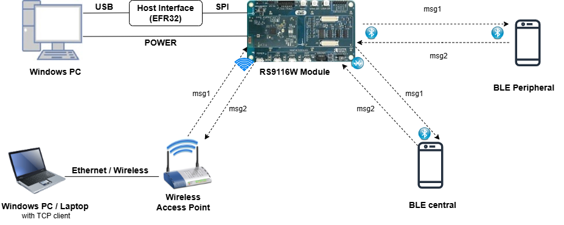

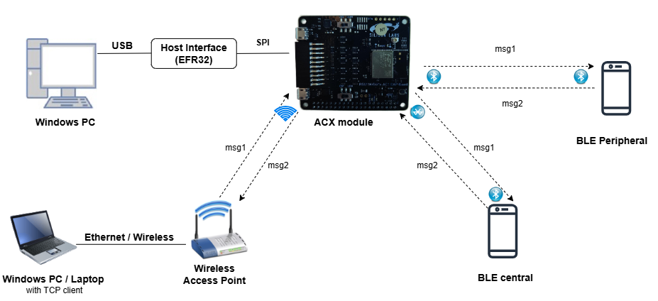


### 2.2 Software Requirements

- [WiSeConnect SDK](https://github.com/SiliconLabs/wiseconnect-wifi-bt-sdk/)
    
- Embedded Development Environment

   - For Silicon Labs EFx32, use the latest version of [Simplicity Studio](https://www.silabs.com/developers/simplicity-studio)
   
-  Download and install the Silicon Labs Simplicity Connect App(formerly EFR Connect App) or other BLE Central/Peripheral app in the Android/iOS smart phones for testing BLE applications. Users can also use their choice of BLE apps available in Android/iOS smart phones (which support AE).

## 3. Application Build Environment
The Application is built and executed on following Host platforms
*	[WSTK + EFR32MG21](https://www.silabs.com/development-tools/wireless/efr32xg21-bluetooth-starter-kit) 

### 3.2 Host Interface

* By default, the application is configured to use the SPI bus for interfacing between Host platforms and the RS9116W EVK.
* The SAPI driver provides APIs to enable other host interfaces if SPI is not suitable for your needs.

Refer to "Connect the RS9116W EVK to the host MCU development board" section in the following link for SPI connections
   Refer [Connect the RS9116W EVK to the host MCU development board](https://docs.silabs.com/rs9116-wiseconnect/latest/wifibt-wc-getting-started-with-efx32/getting-started-with-rs9116w-with-efr32#connect-the-rs9116w-evk-to-the-host-mcu-development-board)

### 3.3 Project Configuration

The Application is provided with the project folder containing Simplicity Studio project files.

*	Simplicity Studio
	- The Simplicity Studio project is used to evaluate the application on EFR32MG21.
	- Project path: 
		- If the Radio Board is **BRD4180A** or **BRD4181A**, then access the path `<SDK>/examples/snippets/ble/wlan_ble_ae_coex_app/projects/wlan_ble_ae_coex_app-brd4180a-mg21.slsproj`
		- If the Radio Board is **BRD4180B** or **BRD4181B**, then access the path `<SDK>/examples/snippets/ble/wlan_ble_ae_coex_app/projects/wlan_ble_ae_coex_app-brd4180b-mg21.slsproj` 
        - User can find the Radio Board version as given below 

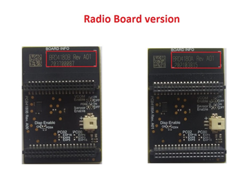
		

### 3.4 RTOS Support

This application supports only RTOS configuration. By default, the application project files (Simplicity studio) are provided with OS environment in the SDK.

## 4. Application Configuration Parameters

The application can be configured to suit your requirements and development environment. Read through the following sections and make any changes needed.

**4.1** Open `ble_config.h` file and update/modify following macros,

**4.1.1** User must update the below parameters

Configure the below macros to enable extended advertsing and scanning by default respectively 

	       #define ADV_ENABLED_DEFAULT    1
	       #define SCAN_ENABLED_DEFAULT   1

Set the below macro to enable second advertising set

	       #define ADV_SET2    1

Configure the below macros to set the number of peripheral and central connections that can be made

	       #define RSI_BLE_MAX_NBR_SLAVES    1
	       #define RSI_BLE_MAX_NBR_MASTERS   1

RSI_REMOTE_DEVICE_NAME1 refers address of the remote device(AE peripheral) to connect

	       #define RSI_REMOTE_DEVICE_NAME1   AEdevice1

configure following macros to enable secure connection for central and peripheral respectively:

	       #define SMP_ENABLE_M1    1
	       #define SMP_ENABLE_S1    1

Enable the following macros to receive the "GATT Notifications" from the remote devices

	       #define RX_NOTIFICATIONS_FROM_M1    1
	       #define RX_NOTIFICATIONS_FROM_S1    1


**Note:**
   The maximum number of peripheral connections support, and the maximum number of central connections support is one for both.

   **Power save configuration**

-  By default, the application is configured with power save enable feature:

	 
	 #define ENABLE_POWER_SAVE 1

-  To disable power save, modify the following configuration:
	 
	 #define ENABLE_POWER_SAVE 0

     **For Powersave functionality with NCP expansion (ACX) board**

> **Note:** 
  For using powersave functionality with NCP expansion (ACX) board, the `EXP_BOARD=1` preprocessor symbol should be added to the list of defined symbols in the preprocessor menu of project settings"

    > - Open the project in Simplicity Studio
    > - Right click on the project and choose 'Properties'
    > - Go to 'C/C++ Build' | 'Settings' | 'GNU ARM C Compiler' | 'Preprocessor' and add the macro `EXP_BOARD=1`
    > - Select 'Apply' and 'OK' to save the settings

    To add the macro
    1.Click Add to Pre-processor defines symbol
    2.Add macro EXP_BOARD and assign it to 1
    3.Click OK
    4.Click "Apply and Close" 

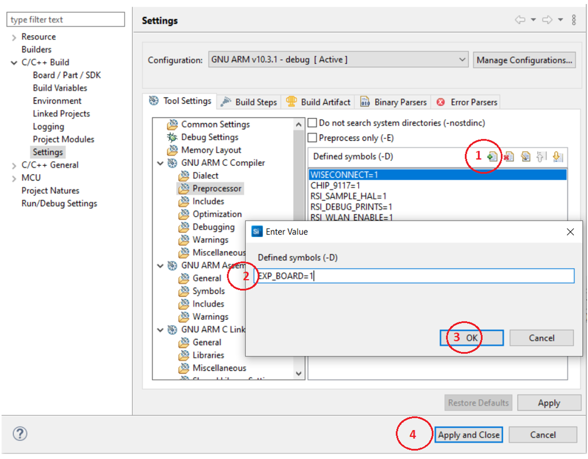

**4.1.2** The desired parameters are provided below. User can also modify the parameters as per their needs and requirements

**4.1.2.1** Extended Advertising parameters

The length of the advertising data needs to be filled in the following macro

	       #define BLE_AE_ADV_DATA_LEN    0x19

Below mentioned macro needs to be populated with data 

	       #define BLE_AE_ADV_DATA    "AE_PERIPHERAL_DATA_1"

The Extended advertising handle for set 1 and 2 can be set with the following macros respectively

    #define BLE_AE_ADV_HNDL_SET_1          0x00
    #define BLE_AE_ADV_HNDL_SET_2          0x01
The minimum advertising interval for set1 and set2 can be configured using the following macros

    #define BLE_AE_ADV_INT_MIN_SET_1       0x664
    #define BLE_AE_ADV_INT_MIN_SET_2       0x664
The maximum advertising interval for set1 and set2 can be configured with the following macros respectively

    #define BLE_AE_ADV_INT_MAX_SET_1       0x664
    #define BLE_AE_ADV_INT_MAX_SET_2       0x664
The Extended advertising channel map for set1 and set2 can be configured with the following macros respectively

    #define BLE_AE_ADV_CHANNEL_MAP_SET_1   0x07
    #define BLE_AE_ADV_CHANNEL_MAP_SET_2   0x07
The Extended advertising filter policy for set1 and set2 can be configured with the following macros respectively

    #define BLE_AE_ADV_FILTER_POLICY_SET_1 0x00
    #define BLE_AE_ADV_FILTER_POLICY_SET_2 0x00
The Extended advertising TX Power for set1 and set2 can be configured with the following macros respectively

    #define BLE_AE_ADV_TX_PWR_SET_1        0x00
    #define BLE_AE_ADV_TX_PWR_SET_2        0x06
The primary advertising phy for set1 and set2 can be configured with the following macros respectively

    #define BLE_AE_PRIMARY_ADV_PHY_SET_1   0x01
    #define BLE_AE_PRIMARY_ADV_PHY_SET_2   0x03
The Extended advertising max skip for set1 and set2 can be configured with the following macros respectively

    #define BLE_AE_SEC_ADV_MAX_SKIP_SET_1  0x00
    #define BLE_AE_SEC_ADV_MAX_SKIP_SET_2  0x00
The secondary advertising phy for set1 and set2 can be configured with the following macros respectively

    #define BLE_AE_SECONDARY_ADV_PHY_SET_1 0x01
    #define BLE_AE_SECONDARY_ADV_PHY_SET_2 0x03
The Extended advertising SID for set1 and set2 can be configured with the following macros respectively

    #define BLE_AE_ADV_SID_SET_1           0x00
    #define BLE_AE_ADV_SID_SET_2           0x01
The Extended advertising scan request notification enable for set1 and set2 can be configured with the following macros respectively

    #define BLE_AE_SCAN_REQ_NOTIF_EN_SET_1 0x01
    #define BLE_AE_SCAN_REQ_NOTIF_EN_SET_2 0x01
The Extended advertising event properties for set1 and set2 can be configured with the following macros respectively

    #define BLE_AE_ADV_EVNT_PROP_SET_1     (BLE_CONNECTABLE_ADV)
    #define BLE_AE_ADV_EVNT_PROP_SET_2     0x00
The Extended advertising duration for set1 and set2 can be configured with the following macros respectively

    #define BLE_AE_ADV_DUR_SET_1           0x00
    #define BLE_AE_ADV_DUR_SET_2           0x00
The maximum extended advertising events for set1 and set2 can be configured with the following macros respectively

    #define BLE_AE_ADV_MAX_AE_EVENTS_SET_1 0x00
    #define BLE_AE_ADV_MAX_AE_EVENTS_SET_2 0x00

**4.1.2.2** Extended scan parameters

Extended scanning filter type can be set with the below macro

    #define BLE_AE_SCAN_FILTER_TYPE       SCAN_FILTER_TYPE_ALL
The scan type for primary phy can be set using below macro

    #define PRI_PHY_BLE_AE_SCAN_TYPE      SCAN_TYPE_ACTIVE

The scan type for secondary phy can be set using below macro
   
    #define SEC_PHY_BLE_AE_SCAN_TYPE      SCAN_TYPE_ACTIVE

The primary phy extended scan interval can be set using below macro

    #define PRI_PHY_LE_AE_SCAN_INTERVAL   0x14A0
The primary phy extended scan window can be set using below macro

    #define PRI_PHY_LE_AE_SCAN_WINDOW     0x14A0
The secondary phy extended scan interval can be set using below macro

    #define SEC_PHY_LE_AE_SCAN_INTERVAL   0x14A0
The secondary phy extended scan window can be set using below macro

    #define SEC_PHY_LE_AE_SCAN_WINDOW     0x14A0

Extended scanning filter duplicates can be set using below macro

    #define BLE_AE_SCAN_ENABLE_FILTER_DUP 0x00
Extended scan duration can be set using below macro

    #define BLE_AE_SCAN_DUR               0x00
Extended scan period can be set using below macro

    #define BLE_AE_SCAN_PERIOD            0x00

Following are the **non-configurable** macros in the application.

The event properties bits:

    #define BLE_CONNECTABLE_ADV        (1 << 0)
    #define BLE_SCANNABLE_ADV          (1 << 1)
    #define BLE_LOW_DUTY_DIR_CONN_ADV  (1 << 2)
    #define BLE_HIGH_DUTY_DIR_CONN_ADV (1 << 3)
    #define BLE_LEGACY_ADV             (1 << 4)
    #define BLE_ANONYMOUS_ADV          (1 << 5)
    #define BLE_TX_WR_ADV              (1 << 6)

Global buffer length:

	 #define GLOBAL_BUFF_LEN                             15000

Phy rate bits:

    #define PHY_1M       BIT(0)
    #define PHY_2M       BIT(1)
    #define PHY_LE_CODED BIT(2)

```c
	 #define RSI_BLE_PWR_INX          30
	 #define RSI_BLE_PWR_SAVE_OPTIONS 0    
	 #define BLE_DISABLE_DUTY_CYCLING 0
     #define BLE_DUTY_CYCLING         1
     #define BLR_DUTY_CYCLING         2
     #define BLE_4X_PWR_SAVE_MODE     4
```
   **Opermode command parameters**
```c
	 #define RSI_FEATURE_BIT_MAP                            FEAT_SECURITY_OPEN
	 #define RSI_TCP_IP_BYPASS                              RSI_DISABLE
	 #define RSI_TCP_IP_FEATURE_BIT_MAP                     TCP_IP_FEAT_DHCPV4_CLIENT
	 #define RSI_CUSTOM_FEATURE_BIT_MAP                     FEAT_CUSTOM_FEAT_EXTENTION_VALID
	 #define RSI_EXT_CUSTOM_FEATURE_BIT_MAP                 (EXT_FEAT_LOW_POWER_MODE | EXT_FEAT_XTAL_CLK_ENABLE)
	 #define RSI_EXT_TCPIP_FEATURE_BITMAP 			(EXT_TCP_IP_WINDOW_DIV | EXT_TCP_IP_WAIT_FOR_SOCKET_CLOSE)
```
**Note:**
    ble_config.h file is already set with desired configuration in respective example folder , user need not change for each example.

**4.2** Open `rsi_wlan_tcp_server_app.c` file and update/modify following macros,

SSID refers to the name of the Access point.

     #define SSID "YOUR_AP_SSID"

PSK refers to the Password of the Access point.

     #define PSK "YOUR_AP_PASSWORD"

SECURITY_TYPE refers to the security type of the Access Point either OPEN/WPA_2

     #define SECURITY_TYPE RSI_WPA2

## 5. Testing the Application

User has to follow the below steps for the successful execution of the application.

### 5.1 Loading the RS9116W Firmware

Refer [Getting started with PC ](https://docs.silabs.com/rs9116/latest/wiseconnect-getting-started) to load the firmware into RS9116W EVK. The firmware binary is located in `<SDK>/firmware/`

### 5.2 Building the Application on the Host Platform

Refer [EFx32 Getting Started](https://docs.silabs.com/rs9116-wiseconnect/latest/wifibt-wc-getting-started-with-efx32/)

- Import the project from `<SDK>/examples/snippets/ble/wlan_ble_ae_coex_app/projects`
- Select the appropriate .slsproj as per Radio Board type mentioned in **Section 3.3**
- Compile and flash the project in to Host MCU
- Debug the project
- Check for the RESET pin:
	- If RESET pin is connected from EFX32 to RS9116W EVK, then user need not press the RESET button on RS9116W EVK before free run
	- If RESET pin is not connected from EFX32 to RS9116W EVK, then user need to press the RESET button on RS9116W EVK before free run
- Free run the project
   
- Successful build output will show as below.
   
## 6. Program the device

- Once the build was successfull, right click on project and click on Debug As->Silicon Labs ARM Program as shown in below image.
   
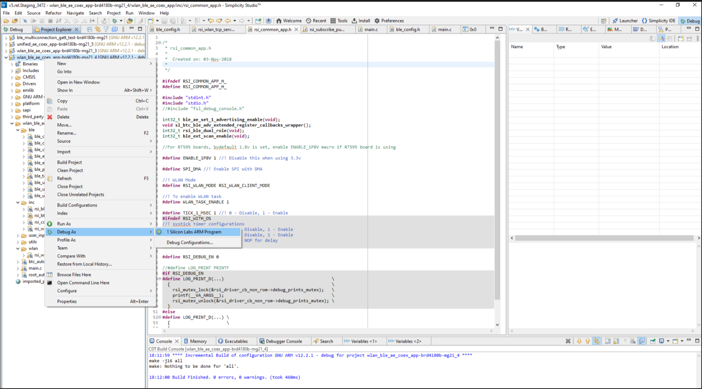
**Note:** Simillarly, Choose the **Run As** option fo one shot execution.

## 6.1 Running the RS9116W Application

### 6.1.1 Steps to be followed to verify BLE AE Unified CoEx App
   1. Set all the configurations necessary refering to section 4.
   2. The RS9116W device, with its default configuration parameters, is set up for 2 extended advertising sets and extended scanning. Its advertising functionality will be validated with any remote device supporting the AE feature. The image below illustrates the RS9116W device's extended advertising sets in the Si Connect app
     
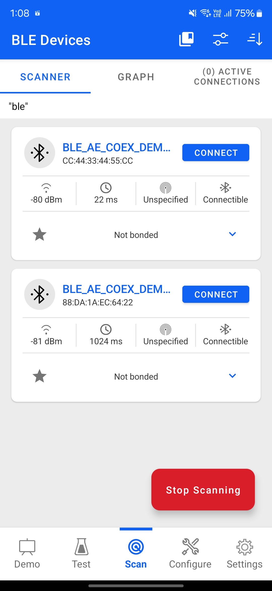

   3. To make remote central connection , scan from any BLE scanner search for the device(if no random address is set it will advertise with the public address).
   4. As shown in step 2, to establish the connection, click on the "CONNECT" option of the device for the required advertising set.
   5. Once the physical level connection is established, and if SMP is enabled, the application will initiate the SMP process, as shown in the images below.
   6. The pairing procedure using the app is as follows: Select the "Pair and Connect" option.

   click on the "Pair and connect" option

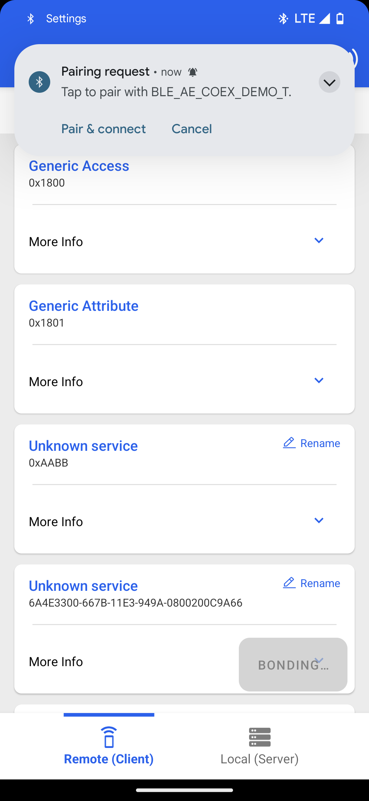        
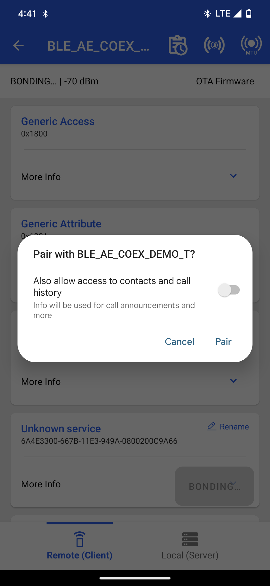


 Enter the passkey displayed in the serial terminal, as shown in the following images.
      
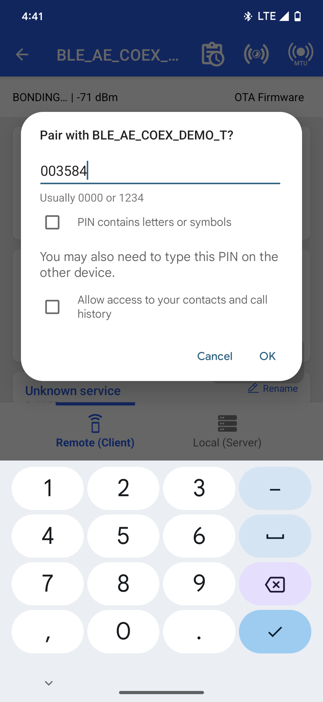

 Once the SMP pairing process is successful, the connection status is displayed as follows :

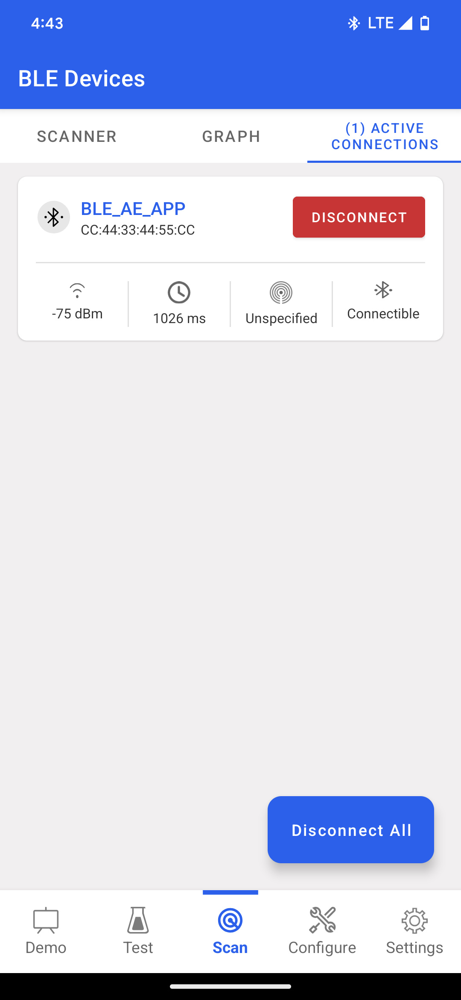

   7. If extended scanning is enabled, the RS9116W device will scan for the advertising devices using the configured scan parameters
   8. To make a remote peripheral connection, advertise the remote device with the specific name defined in the RSI_REMOTE_DEVICE_NAME1 macro. If SMP is enabled for this connection, the bonding process is initiated. Here in the example heartrate service and advertise the device clicking on create new button and configuring required parameters in the advertiser.

   **Note:**  Refer to " Create a New Advertisement Set " for creating the advertising set in the Simplicity Connect mobile App(formerly EFR Connect App).

   Refer [Create a New Advertisement Set](https://docs.silabs.com/mobile-apps/latest/mobile-apps-explore/03-ble-configure-view) .
   Add required services say for example heartrate service and advertise the device clicking on create new button and configuring required parameters in the advertiser.

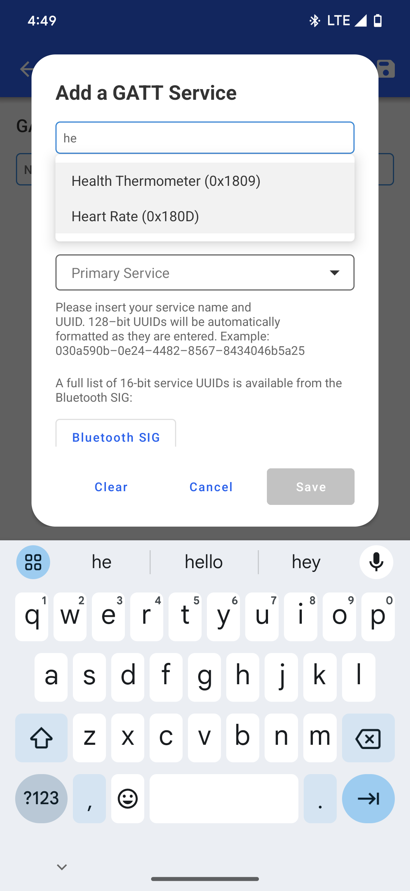

   9. Select the "Notify" property to enable notifications for continuous data transfer from the RS9116W device.
    Following image shows how to enable TX notifications from DUT after connection

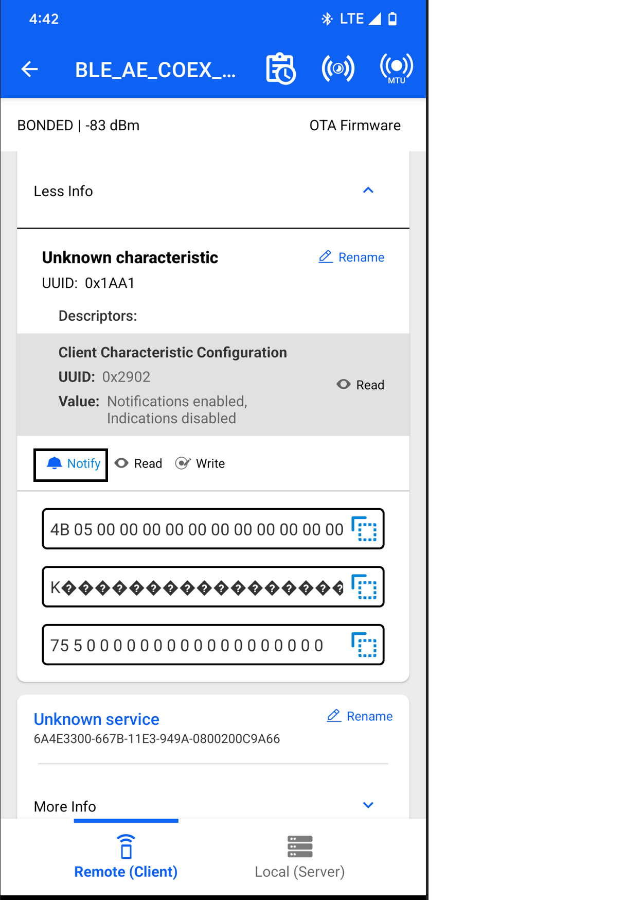

   10. To enable Wi-Fi TCP data transfer, user needs to set the macro TCP_DATA_TEST_CODE = 1 in rsi_wlan_tcp_server_app.c
   11. Run TCP client on another PC (preferably linux) and issue the following command using command prompt in iperf application :

      TCP client command.
      iperf -c <IPAddr> -p <portnumber> -i <interval between reports (seconds)> -t <time (in sec)>
      TCP server command.
      iperf -s -p <portnumber> -i <interval between reports (seconds)>
      for example :
        1. To run TCP_RX on our module for 10 mins with the remote client having IP_ADDR = 192.168.10.100 - Run the following command on the remote client.
           iperf -c 192.168.10.100 -p 5003 -i 1 -t 600
        2. To run TCP_TX on our module with the remote client having IP_ADDR = 192.168.10.100 - Run the below command on the remote client.
           iperf -s -p 5003 -i 1

## 7. Observing the output prints on serial terminal
- Prints can see as below in any Console terminal

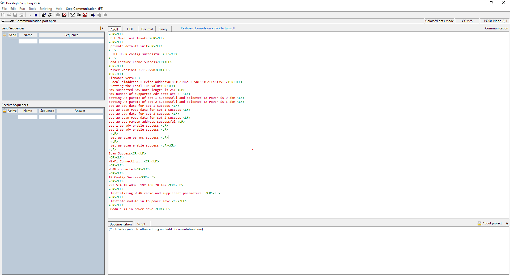

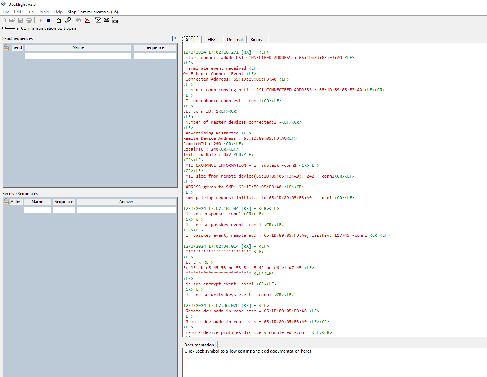

**Note:**
   Wi-Fi TCP data transfer can be enabled using the macro(TCP_DATA_TEST_CODE) in this application.
   Data stalls may occur during TCP data transfer when the module is in power-saving mode.

